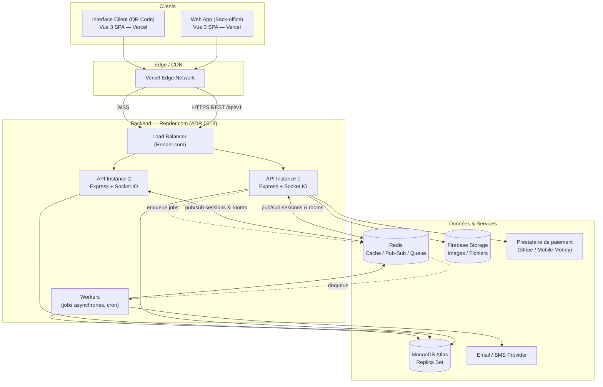
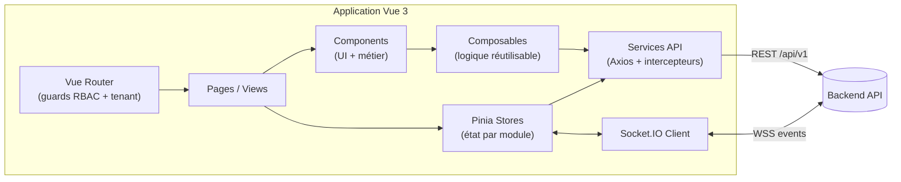
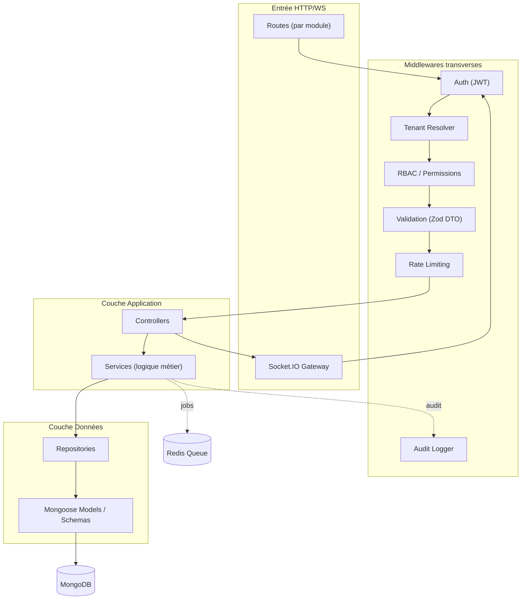
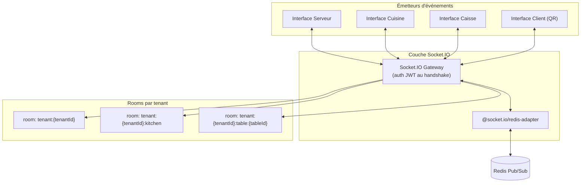
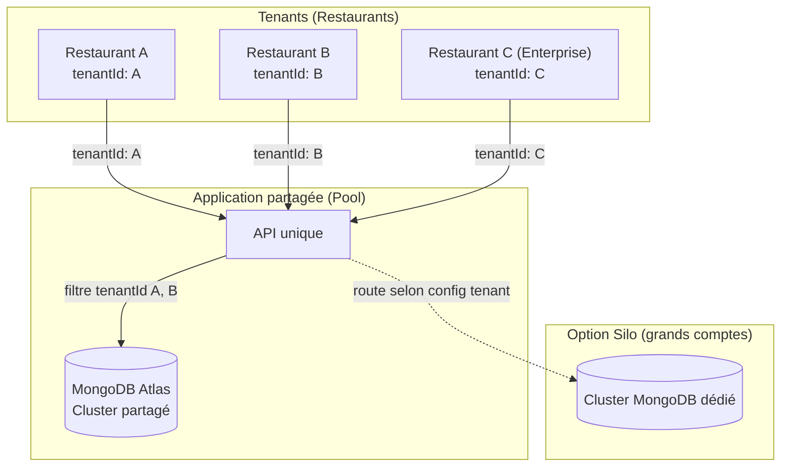
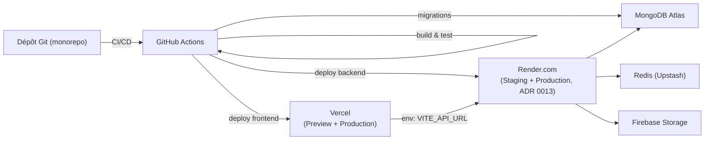

# 2. Architecture générale

## 2.1 Vue d'ensemble

QuickTable est conçu comme un **modular monolith** multi-tenant : une seule application backend Express, structurée en modules métier fortement cohésifs et faiblement couplés, partageant une base MongoDB unique (mode "Pool" — voir doc 06), avec un frontend Vue 3 SPA consommant une API REST versionnée et un canal Socket.IO pour le temps réel.

Ce choix n'est pas un compromis temporaire : c'est la bonne architecture pour la taille d'équipe et le stade du produit. Les microservices ajoutent un coût opérationnel (déploiement, observabilité distribuée, cohérence transactionnelle) qui n'est justifié qu'à partir d'un certain volume d'équipe et de trafic. La modularité interne (doc 04) est conçue pour que les modules à forte charge (Orders, Kitchen, Notifications) puissent être extraits en services séparés **plus tard, sans réécriture**, si la scalabilité l'exige (voir doc 18).

### Lecture du schéma

- **Deux fronts distincts déployés séparément mais issus du même monorepo** : le back-office (Admin/Manager/Serveur/Cuisine/Caisse) et l'interface client déclenchée par scan QR Code. Elles ont des besoins de sécurité, de performance et d'UX très différents (authentifié vs anonyme, riche vs minimaliste) — les séparer évite qu'une faille de sécurité sur l'espace public expose l'espace back-office, et permet des temps de chargement optimisés pour un client sur mobile avec un réseau restaurant faible.
- **Plusieurs instances API stateless** derrière un load balancer Render.com (ADR 0013), aucune session en mémoire locale — obligatoire pour scaler horizontalement et pour que Socket.IO fonctionne correctement en multi-instance (via l'adaptateur Redis, voir doc 10).
- **Redis** apparaît dès la Phase 1 comme brique centrale, pas comme optimisation tardive : il sert à la fois d'adaptateur Socket.IO, de cache (sessions, rate limiting, statistiques), et de broker de queue (BullMQ) pour les jobs asynchrones (emails, génération de reçus PDF, agrégations de stats, alertes de stock).
- **Workers séparés du processus API** : les tâches longues (envoi d'email, génération de rapport, recalcul de statistiques) ne doivent jamais bloquer le event-loop Node qui sert les requêtes API/Socket.IO en rush de service.

## 2.2 Architecture Frontend (vue macro)

Le détail complet (conventions, structure de dossiers, patterns) est dans le doc 11. Le principe directeur : **les composants ne parlent jamais directement à Axios ou Socket.IO** — tout passe par la couche `services/` et les `stores/`, ce qui rend les composants testables et l'API remplaçable.

## 2.3 Architecture Backend (vue macro)

### Principe des couches

- **Routes** : déclarent uniquement le mapping HTTP → controller + chaîne de middlewares. Aucune logique.
- **Middlewares transverses** : authentification, résolution du tenant courant, vérification des permissions, validation du DTO entrant, rate limiting, journalisation d'audit. Appliqués de façon déclarative et testés indépendamment.
- **Controllers** : traduisent la requête HTTP en appel de service, et le résultat du service en réponse HTTP normalisée. Aucune logique métier, aucun accès direct à la base.
- **Services** : contiennent toute la logique métier (règles, orchestration, calculs, machine à état des commandes). Ce sont les services qui appliquent les règles multi-tenant, publient les événements Socket.IO et enfilent les jobs asynchrones.
- **Repositories** : seule couche qui connaît Mongoose/MongoDB. Isole totalement la base de données du reste de l'application — permettrait de changer de moteur de persistance sans toucher aux services (principe de Clean Architecture, appliqué pragmatiquement, pas dogmatiquement).
- **Models** : schémas Mongoose (validation de structure, index, hooks).

Le détail complet est dans le doc 12.

## 2.4 Architecture Base de données

Voir le doc 05 pour le détail complet (collections, champs, index, ERD). Principe général : **MongoDB en mode multi-tenant "Pool"** — toutes les collections tenant-scoped portent un champ `tenantId` indexé en tête de tous les index composés, et aucune requête métier ne s'exécute jamais sans un filtre `tenantId` explicite (garanti par middleware, voir doc 06).

## 2.5 Architecture Temps réel

Chaque tenant possède ses propres "rooms" Socket.IO, garantissant qu'un événement (nouvelle commande, statut cuisine) n'est jamais diffusé à un autre restaurant. Détail complet dans le doc 10.

## 2.6 Architecture SaaS Multi-Tenant

QuickTable démarre en mode **Pool** (base partagée, isolation logique) pour tous les tenants, mais l'architecture prévoit dès le départ un **routage par configuration de tenant** (`tenant.dataResidency` / `tenant.clusterId`) qui permettrait de basculer un compte Enterprise vers un cluster MongoDB Atlas dédié sans changer le code applicatif — seulement la résolution de connexion. Détail complet dans le doc 06.

## 2.7 Vue de déploiement

- **Monorepo** recommandé (voir doc 03) avec deux packages déployés indépendamment (`apps/web`, `apps/api`), plus un package partagé de types TypeScript (`packages/shared-types`) généré/maintenu pour garantir la cohérence des contrats API entre front et back.
- **Environnements** : `local` → `preview` (par PR, automatique sur Vercel/Render.com) → `staging` → `production`. Aucune modification manuelle en production ; tout passe par la CI.
- **Migrations de base de données** versionnées et exécutées en étape de déploiement dédiée (voir doc 12, `scripts/migrations`), jamais au boot de l'application.
