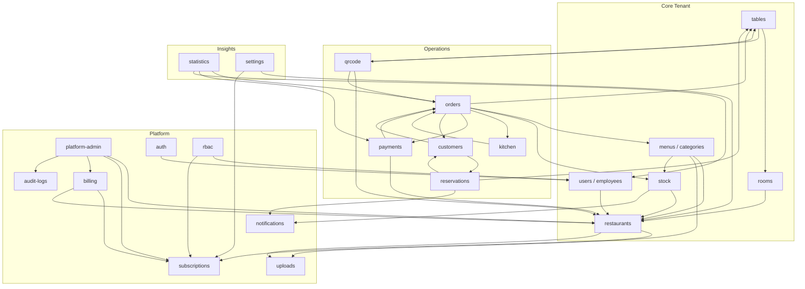

# 4. Architecture des modules

Chaque module respecte la structure décrite au doc 03 (`routes / controller / service / repository / validators / types`). La règle d'or : **un module ne peut dépendre que des modules listés explicitement en "Dépendances"**, et uniquement via leur `index.ts` public (jamais un import interne). Cette discipline est ce qui permettra une extraction future en microservice sans réécriture (voir doc 18).

Légende des dépendances : `→` signifie "dépend de".

## 4.1 Platform (hors tenant)

### Module `platform-admin` (Super Admin)
- **Responsabilités** : gestion globale de la plateforme — créer/suspendre/supprimer un restaurant (tenant), gérer les plans d'abonnement globaux, vue statistiques cross-tenants, gestion des feature flags globaux.
- **Dépendances** : `restaurants`, `subscriptions`, `billing`, `audit-logs`.
- **API exposée** : `/api/v1/platform/*` — réservé exclusivement au rôle `super_admin`, hors contexte tenant.

### Module `auth`
- **Responsabilités** : authentification (login/logout), gestion des tokens (access + refresh), reset de mot de passe, 2FA, gestion des sessions actives. Ne gère pas les permissions (délégué à `rbac`).
- **Dépendances** : `users`.
- **API exposée** : `/api/v1/auth/*`.
- Détail complet dans le doc 07.

### Module `rbac`
- **Responsabilités** : définition des rôles, des permissions, résolution "un utilisateur peut-il faire X sur Y" en tenant compte du rôle **et** du plan d'abonnement du tenant (feature gating).
- **Dépendances** : `users`, `subscriptions`.
- **API exposée** : `/api/v1/rbac/roles`, `/api/v1/rbac/permissions` (lecture seule pour la plupart des rôles, écriture réservée à `restaurant_owner`/`super_admin` pour les rôles custom).
- Détail complet dans le doc 08.

### Module `subscriptions`
- **Responsabilités** : plans d'abonnement (Starter/Business/Premium), limites associées (nb employés, nb tables, features actives), état d'abonnement d'un tenant (actif, essai, suspendu, expiré).
- **Dépendances** : aucune (module de référence).
- **API exposée** : `/api/v1/subscriptions/plans`, `/api/v1/tenants/:id/subscription`.

### Module `billing`
- **Responsabilités** : cycle de facturation SaaS du restaurant envers QuickTable (factures, moyens de paiement du tenant, relance en cas d'impayé/dunning). **Distinct** du module `payments` qui concerne les paiements des clients du restaurant.
- **Dépendances** : `subscriptions`, `restaurants`.
- **API exposée** : `/api/v1/billing/invoices`, `/api/v1/billing/payment-methods`.

### Module `audit-logs`
- **Responsabilités** : enregistrement immuable de toute action sensible (qui, quoi, quand, avant/après). Consommé en écriture par tous les autres modules via un service transverse (`AuditService`), jamais appelé directement par un controller.
- **Dépendances** : `users`.
- **API exposée** : `/api/v1/audit-logs` (lecture, filtrable, réservé aux rôles de supervision).

### Module `uploads`
- **Responsabilités** : upload de fichiers (photos plats, logos, avatars employés) vers Firebase Storage, génération d'URLs signées, validation de type/taille, suppression.
- **Dépendances** : aucune (module utilitaire consommé par `menus`, `restaurants`, `employees`, `customers`).
- **API exposée** : `/api/v1/uploads` (POST multipart, retourne l'URL Firebase).

### Module `notifications`
- **Responsabilités** : centralisation des notifications (in-app, push, email, SMS) déclenchées par les autres modules ; préférences de notification par utilisateur ; **envoi d'email via Nodemailer, relayé par Brevo** (décision Product Owner du 2026-07-13) — le module encapsule Nodemailer derrière un service `EmailSenderService` interne, seul point du code qui importe la librairie, pour ne pas coupler le reste de l'application à un choix de transport email. Credentials SMTP Brevo injectées via variables d'environnement (`SMTP_HOST`, `SMTP_PORT`, `SMTP_USER`, `SMTP_PASS`, doc 12 §12.9 / doc 13 §13.8bis).
- **Trigger de migration** (doc 18 §18.2) : si le volume dépasse le plan gratuit Brevo (300 emails/jour) ou au palier "5 000 restaurants", basculer vers Amazon SES — changement confiné à `EmailSenderService`, aucun autre module n'est affecté.
- **Prérequis infrastructure** : configuration SPF/DKIM/DMARC sur le domaine `quicktable.io` (doc 13 §13.8bis) avant l'envoi du premier email en production, indépendamment du prestataire — condition de délivrabilité, pas une option.
- **Dépendances** : `users`, `restaurants`.
- **API exposée** : `/api/v1/notifications`, `/api/v1/notifications/preferences`.
- Détail temps réel dans le doc 10. Templates email traduits par langue (doc 35 §35.4).

---

## 4.2 Core Tenant (gestion du restaurant)

### Module `restaurants`
- **Responsabilités** : CRUD du restaurant (identité, horaires, logo, coordonnées, paramètres généraux : devise, fuseau horaire, taxes par défaut). C'est le module qui matérialise le concept de "tenant".
- **Dépendances** : `subscriptions`, `uploads`.
- **API exposée** : `/api/v1/restaurants` (création réservée à `super_admin` ; lecture/modification réservée à `restaurant_owner` sur son propre tenant).

### Module `users` / `employees`
- **Responsabilités** : `users` gère l'identité générique (email, mot de passe, profil) valable pour tout acteur de la plateforme (y compris `super_admin` et `customer`). `employees` est une extension métier de `users` scoping un utilisateur à un `restaurantId` avec poste, salaire, statut, planning.
- **Dépendances** : `users` → `rbac` ; `employees` → `users`, `restaurants`.
- **API exposée** : `/api/v1/users/me`, `/api/v1/employees`.

### Module `rooms` (salles)
- **Responsabilités** : gestion des salles d'un restaurant (Salle principale, Terrasse, VIP, Bar).
- **Dépendances** : `restaurants`.
- **API exposée** : `/api/v1/rooms`.

### Module `tables`
- **Responsabilités** : gestion des tables (numéro, capacité, salle, statut : Libre/Occupée/Réservée/Nettoyage/Hors service), génération du QR Code associé (délégué à `qrcode`).
- **Dépendances** : `rooms`, `restaurants`, `qrcode`.
- **API exposée** : `/api/v1/tables`, `/api/v1/tables/:id/status`.

### Module `menus` / `categories`
- **Responsabilités** : gestion des catégories, des produits (plats/boissons/desserts), disponibilité en temps réel (couplé à `stock`), prix, photos (via `uploads`).
- **Dépendances** : `restaurants`, `uploads`, `stock` (lecture de disponibilité).
- **API exposée** : `/api/v1/categories`, `/api/v1/menu-items`.

### Module `stock`
- **Responsabilités** : ingrédients, fournisseurs, mouvements de stock, seuils d'alerte, décrément automatique après vente (écoute les événements du module `orders`).
- **Dépendances** : `restaurants`, `notifications` (alertes rupture).
- **API exposée** : `/api/v1/stock/ingredients`, `/api/v1/stock/movements`, `/api/v1/stock/suppliers`.

---

## 4.3 Opérations (cœur transactionnel)

### Module `orders`
- **Responsabilités** : cycle de vie complet d'une commande (création, ajout/retrait d'article, changement de statut Serveur → Cuisine → Prêt → Servi → Payé, transfert de table, annulation). C'est le module central du produit — la machine à état de la commande y vit exclusivement.
- **Dépendances** : `tables`, `menus`, `stock` (décrément), `kitchen` (publication d'événements), `payments`, `customers`.
- **API exposée** : `/api/v1/orders`, `/api/v1/orders/:id/items`, `/api/v1/orders/:id/status`, `/api/v1/orders/:id/transfer`.

### Module `kitchen`
- **Responsabilités** : vue agrégée des commandes pour l'écran cuisine (KDS), tri par priorité/heure/serveur/table, changement de statut d'un article (`En attente → En préparation → Prêt → Servi`), diffusion temps réel.
- **Dépendances** : `orders` (lecture/écoute), pas d'écriture directe sur `orders` — publie des événements que `orders` consomme pour rester la seule source de vérité du statut global.
- **API exposée** : `/api/v1/kitchen/tickets`, `/api/v1/kitchen/tickets/:id/status`.

### Module `payments`
- **Responsabilités** : encaissement d'une commande (espèces, carte, Mobile Money, mixte), **split bill (égal ou par article) et gestion des pourboires dès le MVP** (cadrage PO 2026-07-13, doc 21 §21.2), génération de facture/reçu, remboursement. Intègre un prestataire de paiement tiers pour tout paiement électronique — **aucune donnée de carte n'est jamais persistée par QuickTable**.
- **Amendement MVP (doc 32 §32.2)** : le module expose un `PaymentProviderAdapter` (interface, doc 28 §28.5 Domain Service) implémenté en MVP par un provider `manual` (le caissier confirme la réception du paiement sans appel API externe) — les implémentations réelles `StripeAdapter` et `MobileMoneyAdapter` sont branchées en V1 (doc 34 §34.7) **sans changement du contrat interne du module** : le service `payments.service.ts` n'appelle jamais directement un SDK de prestataire, toujours l'interface `PaymentProviderAdapter`.
- **Dépendances** : `orders`, `restaurants` (paramètres de taxe), prestataire externe (adaptateur dédié, hors modules internes).
- **API exposée** : `/api/v1/payments` (paramètres `splitCount`/`coveredItemIds` pour le split bill), `/api/v1/payments/:id/refund`, `/api/v1/payments/:id/receipt`.

### Module `reservations`
- **Responsabilités** : réservation de table (client, date, heure, nombre de personnes), détection de conflit, liste d'attente, no-show.
- **Dépendances** : `tables`, `customers`, `notifications`.
- **API exposée** : `/api/v1/reservations`.

### Module `customers`
- **Responsabilités** : profil client (côté restaurant), historique de commandes/dépenses/réservations, programme de fidélité.
- **Dépendances** : `orders` (lecture agrégée), `reservations` (lecture agrégée).
- **API exposée** : `/api/v1/customers`, `/api/v1/customers/:id/history`.

### Module `qrcode`
- **Responsabilités** : génération et validation des QR Codes de table, résolution de la route publique (menu, commande, appel serveur, demande de facture) sans authentification préalable du client.
- **Dépendances** : `tables`, `restaurants`, `orders` (appel serveur / demande de facture).
- **API exposée** : `/api/v1/public/qr/:code/menu` (namespace public distinct, voir doc 09 §"Endpoints publics").

---

## 4.4 Insights

### Module `statistics`
- **Responsabilités** : agrégation des indicateurs (chiffre d'affaires, panier moyen, meilleur plat/serveur, bénéfice, évolutions). Calculs lourds exécutés en asynchrone (worker) et mis en cache (Redis), jamais calculés à la volée sur une requête HTTP synchrone pour ne pas dégrader les performances en heure de pointe.
- **Dépendances** : `orders`, `payments`, `employees` (lecture agrégée uniquement, jamais d'écriture croisée).
- **API exposée** : `/api/v1/statistics/dashboard`, `/api/v1/statistics/revenue`, `/api/v1/statistics/top-products`.

### Module `settings`
- **Responsabilités** : paramètres transverses d'un tenant qui ne rentrent dans aucun autre module (préférences d'affichage, intégrations tierces activées, webhooks sortants pour le plan Premium).
- **Dépendances** : `restaurants`, `subscriptions`.
- **API exposée** : `/api/v1/settings`.

---

## 4.5 Diagramme de dépendances entre modules

**Lecture** : `orders` et `tables` sont les modules les plus dépendus — ce sont les candidats naturels à surveiller en premier pour la performance et à isoler en premier en cas d'extraction microservice future (voir doc 18). Aucun cycle de dépendance n'est autorisé : si un besoin de dépendance circulaire apparaît (ex. `stock` voudrait dépendre de `orders`), la communication doit passer par un **événement** plutôt qu'un appel direct, pour préserver le découplage.

**Amendement suite à la revue d'architecture (doc 19 §19.2/§19.9)** : le mécanisme événementiel évoqué ci-dessus est désormais formalisé sous la forme d'un véritable **Event Bus interne avec pattern Transactional Outbox** (doc 20), et non plus une simple mention de principe. La majorité des dépendances directes du graphe ci-dessus (`stock → notifications`, `orders → kitchen`, `payments → orders`, `reservations → notifications`, `* → statistics`) sont reclassées comme **événementielles** plutôt que comme appels directs de service — voir le tableau de transformation complet et sa justification au doc 19 §19.9. Restent des **appels directs synchrones**, par exception documentée : `orders → stock` (vérification/décrément bloquant, règle métier, doc 20 §20.5) et `rbac → subscriptions` (feature gating conditionnant une réponse HTTP immédiate, doc 08 §8.6). Cette reclassification ne change ni les modules ni leurs responsabilités décrites ci-dessus — seulement la nature du couplage entre eux.
