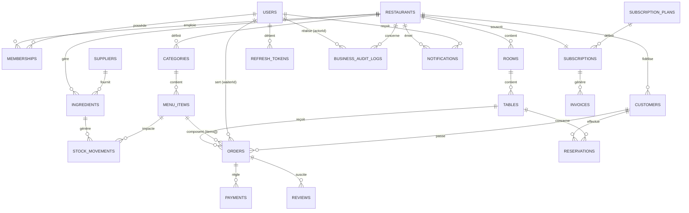

# 5. Base de données MongoDB

## 5.1 Principes de modélisation

- **Toutes les collections tenant-scoped portent un champ `tenantId` (ObjectId, référence `restaurants._id`)**, présent en première position de chaque index composé (voir doc 06). Les collections de portée plateforme (`users`, `subscriptionPlans`, `restaurants` lui-même) n'ont pas ce champ ou l'ont en tant que référence sortante, pas entrante.
- **Référencement plutôt qu'embedding** entre agrégats métier distincts (Order ↔ Table, Order ↔ MenuItem) pour éviter la duplication incontrôlée ; **embedding** pour les sous-documents qui n'ont pas d'existence propre hors de leur parent (les lignes d'une commande `order.items[]`, l'historique de statut d'un ticket cuisine).
- **Dénormalisation contrôlée et assumée** : par exemple `order.items[]` copie `name` et `price` du `menuItem` au moment de la commande — nécessaire pour la valeur légale/historique d'une facture (si le prix du plat change demain, une commande passée hier ne doit pas être recalculée).
- **Tous les documents portent `createdAt`/`updatedAt`** (timestamps Mongoose automatiques) et, pour les collections soumises à suppression logique, `deletedAt: Date | null` (plugin `softDelete`, voir doc 03).
- **Validation à deux niveaux** : schéma Mongoose (TypeScript + validators) en première ligne, complété par un **JSON Schema `$jsonSchema` au niveau de la collection MongoDB** pour les champs critiques (`tenantId`, `status`, montants) — garde-fou même en cas d'écriture hors Mongoose (script, migration).
- **Les montants sont stockés en entier (plus petite unité monétaire, ex. centimes)**, jamais en flottant, pour éviter les erreurs d'arrondi — conversion en devise d'affichage uniquement côté présentation (cohérent avec le besoin multi-devise identifié au doc 01).

## 5.2 Schéma entité-relation (vue d'ensemble)

---

## 5.3 Collections — Plateforme (non tenant-scoped)

### `users`
Identité globale, valable pour tout acteur (super admin, staff, client enregistré).

| Champ | Type | Requis | Description |
|---|---|---|---|
| `_id` | ObjectId | — | |
| `email` | string | oui | unique, normalisé lowercase |
| `passwordHash` | string | oui | Argon2id |
| `fullName` | string | oui | |
| `phone` | string | non | format E.164 |
| `avatarUrl` | string | non | URL Firebase Storage |
| `isSuperAdmin` | boolean | oui | défaut `false` |
| `twoFactorEnabled` | boolean | oui | défaut `false` |
| `twoFactorSecret` | string (chiffré AES-256) | non | secret TOTP |
| `preferredLocale` | enum `fr, en, it, es` \| null | non | surcharge individuelle de langue, `null` = hérite de `restaurants.locale` (doc 35 §35.3) |
| `status` | enum `active, suspended` | oui | défaut `active` |
| `lastLoginAt` | Date | non | |
| `deletedAt` | Date \| null | non | soft delete |
| `createdAt` / `updatedAt` | Date | oui | auto |

- **Index** : `{ email: 1 }` unique ; `{ status: 1 }`.
- **Relations** : parent de `memberships` (1 user → N memberships), `refreshTokens`, `businessAuditLogs.actorId`.
- **Validations** : email au format RFC valide ; `passwordHash` jamais retourné par l'API (exclusion explicite au niveau du schéma de sérialisation).

### `memberships`
Table de jonction Utilisateur ↔ Restaurant, porteuse du rôle. Permet à un même utilisateur d'être staff de plusieurs restaurants (multi-sites, gérant qui possède plusieurs établissements) sans dupliquer l'identité.

| Champ | Type | Requis | Description |
|---|---|---|---|
| `_id` | ObjectId | — | |
| `tenantId` | ObjectId → `restaurants` | oui | |
| `userId` | ObjectId → `users` | oui | |
| `role` | enum (voir doc 08) | oui | `restaurant_owner, manager, cashier, kitchen, waiter` |
| `permissionsOverrides` | string[] | non | permissions ajoutées/retirées au cas par cas |
| `jobTitle` | string | non | |
| `salary` | number (centimes) | non | visible uniquement par `restaurant_owner`/`manager` habilité |
| `employmentStatus` | enum `active, inactive` | oui | défaut `active` |
| `hiredAt` | Date | non | |
| `createdAt` / `updatedAt` | Date | oui | auto |

- **Index** : `{ tenantId: 1, userId: 1 }` unique ; `{ tenantId: 1, role: 1 }` ; `{ userId: 1 }`.
- **Relations** : lie `users` et `restaurants` ; référencée par `orders.waiterId` (indirectement via `userId`).
- **Validations** : un couple `(tenantId, userId)` ne peut exister qu'une fois — un même employé a un seul rôle par restaurant (les permissions fines s'ajustent via `permissionsOverrides`, pas via un second membership).

### `restaurants` (= Tenant)

| Champ | Type | Requis | Description |
|---|---|---|---|
| `_id` | ObjectId | — | **= tenantId utilisé partout ailleurs** |
| `name` | string | oui | |
| `slug` | string | oui | unique, utilisé dans les URLs publiques |
| `logoUrl` | string | non | |
| `description` | string | non | |
| `contact` | object `{ phone, email, address, city }` | non | `country` extrait en champ dédié ci-dessous (doc 35) |
| `country` | string (ISO 3166-1 alpha-2, ex. `BJ`, `FR`) | **oui** | saisi ou détecté par géolocalisation à l'inscription (doc 35 §35.2) — amendement du 2026-07-13 |
| `countryDetectionMethod` | enum `manual, geoip` | oui | traçabilité, doc 35 §35.2 |
| `locale` | enum `fr, en, it, es` | oui | dérivé de `country` via `countryDefaults` (doc 35 §35.3), modifiable |
| `timezone` | string (IANA, ex. `Africa/Porto-Novo`) | oui | dérivé de `country`, modifiable |
| `currency` | string (ISO 4217, ex. `XOF`, `EUR`) | oui | dérivé de `country`, modifiable manuellement |
| `taxSettings` | array `[{ name, rate, isDefault }]` | non | multi-taux TVA |
| `openingHours` | array `[{ day, open, close }]` | non | |
| `status` | enum `trial, active, suspended, archived` | oui | défaut `trial` |
| `clusterId` | string \| null | non | pour routage vers un cluster dédié (mode Silo, voir doc 06) |
| `settings` | object | non | préférences diverses (module `settings`) |
| `deletedAt` | Date \| null | non | soft delete |
| `createdAt` / `updatedAt` | Date | oui | auto |

- **Index** : `{ slug: 1 }` unique ; `{ status: 1 }` ; `{ country: 1 }` (statistiques plateforme par pays, doc 09 §9.3).
- **Relations** : parent logique de toutes les collections tenant-scoped ci-dessous.
- **Validations** : `currency` doit appartenir à la liste ISO 4217 supportée ; `country` doit appartenir à la liste ISO 3166-1 supportée ; `slug` doit matcher `^[a-z0-9-]+$`.

### `countryDefaults` (nouvelle collection, non tenant-scoped — doc 35 §35.3)

| Champ | Type | Requis | Description |
|---|---|---|---|
| `_id` | ObjectId | — | |
| `countryCode` | string (ISO 3166-1 alpha-2) | oui, unique | |
| `currency` | string (ISO 4217) | oui | |
| `defaultLocale` | enum `fr, en, it, es` | oui | |
| `timezoneDefault` | string (IANA) | oui | |

- **Index** : `{ countryCode: 1 }` unique.
- Éditable uniquement par `super_admin` (doc 09 §9.3 amendement) — permet d'ouvrir un nouveau pays sans déploiement.

### `subscriptionPlans`

| Champ | Type | Requis | Description |
|---|---|---|---|
| `_id` | ObjectId | — | |
| `code` | enum `starter, business, premium` | oui | unique |
| `name` | string | oui | |
| `limits` | object `{ maxEmployees, maxTables, maxSites }` | oui | `null` = illimité |
| `features` | string[] | oui | clés de feature flags (ex. `advanced_statistics`, `api_access`, `multi_site`) |
| `basePrice` | number (centimes) | oui | prix de référence, remplace `priceMonthly`/`priceYearly` uniques (amendement doc 35 §35.6) |
| `baseCurrency` | string (ISO 4217) | oui | devise de référence QuickTable (ex. `USD`), convertie à l'affichage vers `restaurants.currency` |
| `billingInterval` | enum `monthly, yearly` | oui | |
| `trialDays` | number | oui | durée d'essai configurable depuis le dashboard Super Admin (doc 35 §35.6), défaut `14` |
| `isActive` | boolean | oui | défaut `true` |

- **Index** : `{ code: 1 }` — **non unique désormais** (voir doc 22 §22.5, plusieurs versions d'un même `code` coexistent), complété par `{ code: 1, version: 1 }` unique.
- **Relations** : référencée par `subscriptions.planId`.

### `subscriptions`

| Champ | Type | Requis | Description |
|---|---|---|---|
| `_id` | ObjectId | — | |
| `tenantId` | ObjectId → `restaurants` | oui | |
| `planId` | ObjectId → `subscriptionPlans` | oui | |
| `status` | enum `trialing, active, past_due, canceled` | oui | |
| `priceLocked` | object `{ amount, currency, fxRateApplied }` | oui | prix figé au moment de la souscription, converti via le Currency Conversion Service (doc 35 §35.6) — n'évolue jamais rétroactivement avec le taux de change |
| `currentPeriodStart` / `currentPeriodEnd` | Date | oui | |
| `cancelAtPeriodEnd` | boolean | oui | défaut `false` |
| `createdAt` / `updatedAt` | Date | oui | auto |

- **Index** : `{ tenantId: 1 }` unique (un restaurant a un seul abonnement actif à la fois).
- **Relations** : parent de `invoices`.

### `invoices` (Billing SaaS — factures de QuickTable vers le restaurant)

| Champ | Type | Requis | Description |
|---|---|---|---|
| `_id` | ObjectId | — | |
| `tenantId` | ObjectId → `restaurants` | oui | |
| `subscriptionId` | ObjectId → `subscriptions` | oui | |
| `amount` | number (centimes) | oui | |
| `currency` | string | oui | |
| `status` | enum `open, paid, void, uncollectible` | oui | |
| `issuedAt` / `dueAt` / `paidAt` | Date | oui/non | |
| `pdfUrl` | string | non | |

- **Index** : `{ tenantId: 1, issuedAt: -1 }`.

### `refreshTokens` (Sessions)

| Champ | Type | Requis | Description |
|---|---|---|---|
| `_id` | ObjectId | — | |
| `userId` | ObjectId → `users` | oui | |
| `tokenHash` | string | oui | hash SHA-256 du refresh token (jamais stocké en clair) |
| `deviceInfo` | object `{ userAgent, ip, deviceLabel }` | non | |
| `expiresAt` | Date | oui | |
| `revokedAt` | Date \| null | non | |
| `createdAt` | Date | oui | |

- **Index** : `{ userId: 1 }` ; `{ tokenHash: 1 }` unique ; **TTL index** `{ expiresAt: 1 }, { expireAfterSeconds: 0 }` — purge automatique par MongoDB.

### `businessAuditLogs`

Schéma complet, index et politique de rétention détaillés au **doc 24** (référence unique — ne pas dupliquer ici pour éviter toute divergence). Résumé : collection **append-only**, tenant-scoped (`tenantId: ObjectId | null`, `null` pour les actions plateforme), alimentée par le plugin `auditable` restreint aux actions listées au doc 24 §24.3, avec un champ `expiresAt` calculé à l'écriture selon la catégorie de l'action (doc 24 §24.4) et un index TTL correspondant.

---

## 5.4 Collections — Tenant-scoped (Core)

### `rooms`

| Champ | Type | Requis |
|---|---|---|
| `_id` | ObjectId | — |
| `tenantId` | ObjectId → `restaurants` | oui |
| `name` | string | oui |
| `description` | string | non |
| `isActive` | boolean | oui, défaut `true` |
| `createdAt` / `updatedAt` | Date | oui |

- **Index** : `{ tenantId: 1, isActive: 1 }`.

### `tables`

| Champ | Type | Requis |
|---|---|---|
| `_id` | ObjectId | — |
| `tenantId` | ObjectId → `restaurants` | oui |
| `roomId` | ObjectId → `rooms` | oui |
| `number` | string | oui |
| `capacity` | number | oui |
| `status` | enum `free, occupied, reserved, cleaning, out_of_service` | oui, défaut `free` |
| `qrCodeToken` | string | oui | token opaque signé, régénérable |
| `currentOrderId` | ObjectId \| null → `orders` | non |
| `createdAt` / `updatedAt` | Date | oui |

- **Index** : `{ tenantId: 1, roomId: 1 }` ; `{ tenantId: 1, number: 1 }` unique ; `{ qrCodeToken: 1 }` unique (recherche publique par QR, sans besoin de connaître `tenantId` à l'avance).
- **Validations** : `capacity >= 1`.

### `categories`

| Champ | Type | Requis |
|---|---|---|
| `_id` | ObjectId | — |
| `tenantId` | ObjectId | oui |
| `name` | string | oui |
| `order` | number | oui, défaut `0` |
| `isActive` | boolean | oui, défaut `true` |

- **Index** : `{ tenantId: 1, order: 1 }`.

### `menuItems`

| Champ | Type | Requis |
|---|---|---|
| `_id` | ObjectId | — |
| `tenantId` | ObjectId | oui |
| `categoryId` | ObjectId → `categories` | oui |
| `name` | string | oui |
| `description` | string | non |
| `price` | number (centimes) | oui |
| `photoUrl` | string | non |
| `isAvailable` | boolean | oui, défaut `true` |
| `allergens` | string[] | non |
| `recipe` | array `[{ ingredientId, quantity, unit }]` | non | consommé par `stock` pour le décrément auto |
| `createdAt` / `updatedAt` | Date | oui |

- **Index** : `{ tenantId: 1, categoryId: 1 }` ; `{ tenantId: 1, isAvailable: 1 }`.
- **Validations** : `price >= 0`.

### `suppliers`

| Champ | Type | Requis |
|---|---|---|
| `_id` | ObjectId | — |
| `tenantId` | ObjectId | oui |
| `name` | string | oui |
| `contact` | object `{ phone, email }` | non |

- **Index** : `{ tenantId: 1 }`.

### `ingredients`

| Champ | Type | Requis |
|---|---|---|
| `_id` | ObjectId | — |
| `tenantId` | ObjectId | oui |
| `name` | string | oui |
| `unit` | enum `kg, g, l, ml, unit` | oui |
| `quantityInStock` | number | oui, défaut `0` |
| `alertThreshold` | number | oui, défaut `0` |
| `supplierId` | ObjectId → `suppliers` | non |

- **Index** : `{ tenantId: 1, name: 1 }` ; `{ tenantId: 1, quantityInStock: 1 }` (requêtes de rupture).
- **Validations** : `quantityInStock >= 0` (appliqué via opération atomique côté service, jamais de valeur négative persistée).

### `stockMovements`

| Champ | Type | Requis |
|---|---|---|
| `_id` | ObjectId | — |
| `tenantId` | ObjectId | oui |
| `ingredientId` | ObjectId → `ingredients` | oui |
| `type` | enum `in, out, adjustment` | oui |
| `quantity` | number | oui |
| `reason` | string | non |
| `relatedOrderId` | ObjectId \| null → `orders` | non |
| `createdBy` | ObjectId → `users` | oui |
| `createdAt` | Date | oui |

- **Index** : `{ tenantId: 1, ingredientId: 1, createdAt: -1 }`.
- Collection **append-only** (historique), la valeur courante vit dans `ingredients.quantityInStock`.

---

## 5.5 Collections — Tenant-scoped (Opérations)

### `orders`

| Champ | Type | Requis |
|---|---|---|
| `_id` | ObjectId | — |
| `tenantId` | ObjectId | oui |
| `tableId` | ObjectId → `tables` | non (commande à emporter possible) |
| `roomId` | ObjectId → `rooms` | non | dénormalisé depuis `tableId` pour tri cuisine sans jointure |
| `waiterId` | ObjectId → `users` | non | `null` si prise de commande directe client (QR) |
| `customerId` | ObjectId \| null → `customers` | non |
| `status` | enum `open, sent_to_kitchen, ready, served, partially_paid, paid, cancelled` | oui, défaut `open` | `partially_paid` ajouté pour le split bill, doc 21 §21.2 amendement |
| `items` | array (sous-document, voir ci-dessous) | oui |
| `subtotal` / `taxTotal` / `total` | number (centimes) | oui |
| `amountPaid` | number (centimes) | oui, défaut `0` | incrémenté atomiquement à chaque `PaymentCompleted` (doc 21 §21.2, split bill) |
| `source` | enum `waiter, qrcode` | oui |
| `openedAt` | Date | oui |
| `closedAt` | Date \| null | non |
| `createdAt` / `updatedAt` | Date | oui |

**Sous-document `items[]`** :

| Champ | Type | Requis |
|---|---|---|
| `menuItemId` | ObjectId → `menuItems` | oui |
| `name` | string | oui | dénormalisé au moment de la commande |
| `unitPrice` | number (centimes) | oui | dénormalisé |
| `quantity` | number | oui |
| `notes` | string | non |
| `status` | enum `pending, queued, preparing, ready, served, cancelled` | oui, défaut `pending` | `queued` ajouté — plat envoyé en cuisine mais annulable tant que la préparation n'a pas commencé (doc 21 §21.1, cadrage PO 2026-07-13) |
| `sentToKitchenAt` | Date \| null | non |
| `cancelledAt` / `cancelledReason` | Date \| null / string \| null | non | traçabilité de l'annulation post-envoi |

- **Index** : `{ tenantId: 1, status: 1, createdAt: -1 }` (liste des commandes actives) ; `{ tenantId: 1, tableId: 1 }` ; `{ tenantId: 1, waiterId: 1, createdAt: -1 }` ; `{ tenantId: 1, customerId: 1 }`.
- **Validations** : transition de `status` contrainte par la machine à état (doc 21 §21.1) — jamais un saut direct `open → paid` sans passer par `sent_to_kitchen`/`ready`/`served`.
- **Concurrence** : verrouillage optimiste (`If-Match`/`updatedAt`) restreint aux transitions de `status` global ; toute autre modification de `items[]` utilise des opérations atomiques MongoDB ciblées (doc 05 §5.8, doc 19 §19.4).

### `payments`

| Champ | Type | Requis |
|---|---|---|
| `_id` | ObjectId | — |
| `tenantId` | ObjectId | oui |
| `orderId` | ObjectId → `orders` | oui |
| `method` | enum `cash, card, mobile_money, mixed` | oui |
| `amount` | number (centimes) | oui |
| `splitCount` | number \| null | non | split égal — nombre de convives, `null` si non applicable (doc 21 §21.2) |
| `coveredItemIds` | ObjectId[] \| null | non | split par article — `null` si split égal ou paiement intégral |
| `tipAmount` | number (centimes) | oui, défaut `0` |
| `tipRecipientId` | ObjectId \| null → `users` | non | serveur désigné pour ce pourboire (traçabilité, doc 21 §21.2) |
| `status` | enum `pending, completed, failed, refunded` | oui |
| `providerRef` | string \| null | non | référence transaction prestataire externe |
| `receiptUrl` | string \| null | non |
| `cashierId` | ObjectId → `users` | oui |
| `createdAt` | Date | oui |

- **Index** : `{ tenantId: 1, orderId: 1 }` (non unique — plusieurs paiements par commande pour le split bill) ; `{ tenantId: 1, createdAt: -1 }` ; `{ providerRef: 1 }` sparse.
- **Validations** : la somme des `amount` des paiements `completed` d'une commande ne peut jamais dépasser `orders.total` (contrôlé en service, `422 AMOUNT_EXCEEDS_ORDER_TOTAL`) ; aucune donnée de carte (PAN/CVV) dans ce schéma — uniquement une référence tokenisée.

### `reservations`

| Champ | Type | Requis |
|---|---|---|
| `_id` | ObjectId | — |
| `tenantId` | ObjectId | oui |
| `customerId` | ObjectId → `customers` | oui |
| `tableId` | ObjectId \| null → `tables` | non | assignée à la confirmation |
| `dateTime` | Date | oui |
| `partySize` | number | oui |
| `status` | enum `pending, confirmed, seated, cancelled, no_show` | oui |
| `notes` | string | non |
| `createdAt` / `updatedAt` | Date | oui |

- **Index** : `{ tenantId: 1, dateTime: 1 }` ; `{ tenantId: 1, tableId: 1, dateTime: 1 }` (détection de conflit).

### `customers`

| Champ | Type | Requis |
|---|---|---|
| `_id` | ObjectId | — |
| `tenantId` | ObjectId | oui |
| `fullName` | string | oui |
| `phone` | string | non |
| `email` | string | non |
| `loyaltyPoints` | number | oui, défaut `0` |
| `totalSpent` | number (centimes) | oui, défaut `0` |
| `visitsCount` | number | oui, défaut `0` |
| `createdAt` / `updatedAt` | Date | oui |

- **Index** : `{ tenantId: 1, phone: 1 }` unique sparse ; `{ tenantId: 1, email: 1 }` unique sparse.

### `reviews`

| Champ | Type | Requis |
|---|---|---|
| `_id` | ObjectId | — |
| `tenantId` | ObjectId | oui |
| `customerId` | ObjectId \| null → `customers` | non |
| `orderId` | ObjectId \| null → `orders` | non |
| `rating` | number (1-5) | oui |
| `comment` | string | non |
| `isPublished` | boolean | oui, défaut `false` | modération avant publication |
| `createdAt` | Date | oui |

- **Index** : `{ tenantId: 1, isPublished: 1, createdAt: -1 }`.

---

## 5.6 Collections — Insights & Système

### `notifications`

| Champ | Type | Requis |
|---|---|---|
| `_id` | ObjectId | — |
| `tenantId` | ObjectId | oui |
| `userId` | ObjectId → `users` | oui | destinataire |
| `type` | string | oui | ex. `order.new`, `stock.low`, `reservation.created` |
| `title` / `message` | string | oui | |
| `data` | object | non | payload structuré (ex. `orderId`) |
| `isRead` | boolean | oui, défaut `false` |
| `createdAt` | Date | oui |

- **Index** : `{ tenantId: 1, userId: 1, isRead: 1, createdAt: -1 }`. TTL optionnel à 90 jours (`expireAfterSeconds`) pour éviter la croissance indéfinie.

### `dailyStatistics` (agrégats précalculés — voir doc 18 pour la stratégie de cache)

| Champ | Type | Requis |
|---|---|---|
| `_id` | ObjectId | — |
| `tenantId` | ObjectId | oui |
| `date` | string (`YYYY-MM-DD`, dans le fuseau du restaurant) | oui |
| `revenue` | number (centimes) | oui |
| `ordersCount` | number | oui |
| `averageTicket` | number (centimes) | oui |
| `tipsTotal` | number (centimes) | oui, défaut `0` | total des pourboires du jour (doc 21 §21.2) |
| `topProductId` | ObjectId \| null | non |
| `topWaiterId` | ObjectId \| null | non |
| `computedAt` | Date | oui |

- **Index** : `{ tenantId: 1, date: 1 }` unique.
- Alimentée par un worker planifié (cron nocturne) + recalcul incrémental à chaque paiement complété (voir doc 12 `workers/statistics.worker.ts`).

---

## 5.7 Résumé des index critiques multi-tenant

Toutes les collections tenant-scoped respectent la règle : **`tenantId` est toujours le premier champ de tout index composé**, ce qui permet à MongoDB de restreindre le jeu de données dès la première étape du plan d'exécution et facilite un futur sharding par `tenantId` (voir doc 06 et 18).

| Collection | Index principal |
|---|---|
| `memberships` | `{ tenantId: 1, userId: 1 }` unique |
| `tables` | `{ tenantId: 1, number: 1 }` unique, `{ qrCodeToken: 1 }` unique |
| `menuItems` | `{ tenantId: 1, categoryId: 1 }` |
| `orders` | `{ tenantId: 1, status: 1, createdAt: -1 }` |
| `payments` | `{ tenantId: 1, orderId: 1 }` |
| `reservations` | `{ tenantId: 1, dateTime: 1 }` |
| `customers` | `{ tenantId: 1, phone: 1 }` unique sparse |
| `businessAuditLogs` | `{ tenantId: 1, createdAt: -1 }`, `{ actorId: 1, createdAt: -1 }`, `{ action: 1, createdAt: -1 }`, index TTL sur `expiresAt` — schéma complet doc 24 |
| `dailyStatistics` | `{ tenantId: 1, date: 1 }` unique |

## 5.8 Transactions, verrouillage optimiste ciblé et sharding readiness (ajouté suite à la revue d'architecture, doc 19 §19.1/§19.4)

### Transactions MongoDB multi-documents

Toute opération qui touche plusieurs collections de façon atomique **doit** utiliser une session/transaction MongoDB explicite (disponible sur replica set depuis MongoDB 4.0), plutôt que des écritures séquentielles non protégées. Cas d'usage obligatoires :
- `PaymentCompleted` : mise à jour de `payments.status`, `orders.status`, insertion dans `eventOutbox` (doc 20) — une seule transaction.
- Provisioning de tenant (doc 06 §6.7) : `restaurants` + `subscriptions` + `memberships` + données de référence — déjà conçu comme transactionnel, formalisé ici comme règle générale.
- Décrément de stock à l'envoi en cuisine : `orders.status` + `ingredients.quantityInStock` (via `$inc` conditionnel) + `stockMovements` — une seule transaction, échoue proprement (`422 INSUFFICIENT_STOCK`) si la condition de stock n'est pas satisfaite.

### Verrouillage optimiste ciblé sur `orders` (amendement doc 19 §19.4)

Le verrouillage optimiste document-entier (header `If-Match` sur `updatedAt`, doc 09 §9.10) est **restreint aux transitions de `orders.status`** (rares, séquentielles, doc 21 §21.1). Toute autre modification de `orders` utilise des opérations atomiques MongoDB ciblées, sans verrou document-entier :
- Ajout d'article : `updateOne({ _id, tenantId }, { $push: { items: newItem } })`.
- Modification du statut d'un article existant : `updateOne({ _id, tenantId, "items._id": itemId }, { $set: { "items.$.status": newStatus } })`.
- Retrait d'un article `pending` : `updateOne({ _id, tenantId }, { $pull: { items: { _id: itemId, status: "pending" } } })`.

Ce changement élimine la majorité des faux conflits de concurrence identifiés en rush de service (doc 01 §1.6) sans sacrifier la cohérence là où elle compte (transition d'état globale de la commande). La section §5.5 "Concurrence" est amendée en conséquence.

### TTL — récapitulatif consolidé

| Collection | Champ TTL | Durée |
|---|---|---|
| `refreshTokens` | `expiresAt` | Variable (30 jours glissants) |
| `notifications` | `createdAt` | 90 jours |
| `eventOutbox` (doc 20) | `publishedAt` (une fois traité) | 7 jours (fenêtre de rejouabilité en cas d'incident) |

### Sharding readiness

Toutes les collections tenant-scoped (§5.4/§5.5/§5.6) sont déjà prêtes pour un sharding par `tenantId` haché (`sh.shardCollection("quicktable.orders", { tenantId: "hashed" })`) sans modification de schéma, car `tenantId` est systématiquement le premier champ de tout index composé (§5.7). Le sharding n'est **activé** qu'au palier de charge le justifiant (doc 18 §18.2, doc 18 §18.5) — l'activer prématurément ajouterait une complexité opérationnelle (choix de la shard key, rebalancing) sans bénéfice à faible volume.

### Nouvelles collections issues de la revue

Cette revue introduit plusieurs collections complémentaires, détaillées dans leurs documents respectifs plutôt que dupliquées ici : `eventOutbox` (doc 20 §20.3), `roleDefinitions` (doc 22 §22.4), `planMigrations` (doc 22 §22.5), `businessAuditLogs` (renommage de `auditLogs`, doc 24 §24.2), `processedEvents` (idempotence des handlers, doc 20 §20.7).
