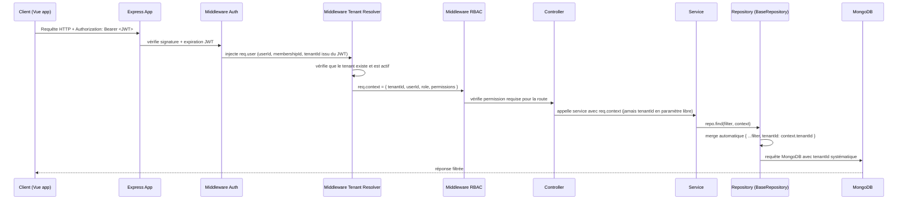
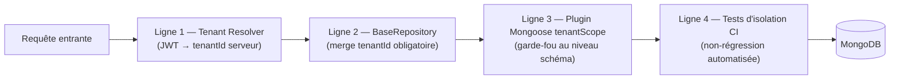
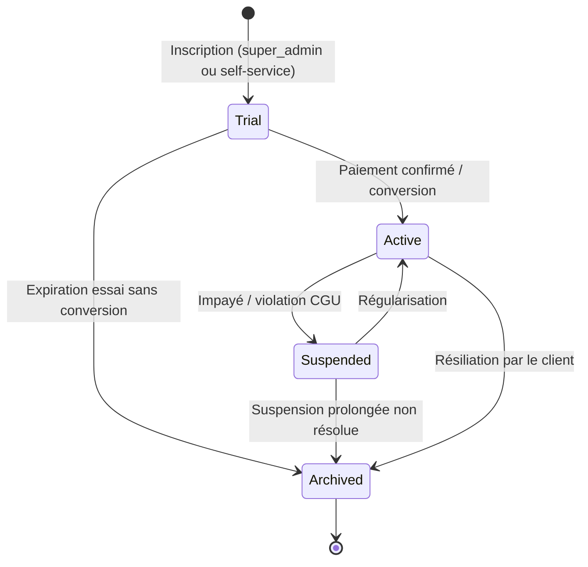

# 6. Gestion Multi-Tenant

## 6.1 Modèle retenu : Pool avec trajectoire vers Bridge/Silo

QuickTable démarre en **mode Pool** : tous les tenants (restaurants) partagent la même base MongoDB Atlas et la même application. L'isolation est **logique**, assurée par un champ `tenantId` sur chaque document, et non physique. C'est le modèle standard des SaaS B2B jusqu'à plusieurs milliers de clients (cf. AWS SaaS Tenant Isolation Strategies), pour un coût d'infrastructure minimal et une vélocité de développement maximale.

L'architecture prévoit dès le départ, sans nécessiter de refonte, une évolution vers :

- **Bridge** : certains tenants Business/Premium sur un cluster MongoDB Atlas dédié, mais même code applicatif.
- **Silo** : les plus gros comptes Enterprise avec cluster + éventuellement instance API dédiée, pour des exigences de conformité/latence spécifiques.

Ceci est rendu possible par le champ `restaurants.clusterId` (doc 05) et une **couche de résolution de connexion** (voir §6.4) qui route chaque requête vers le bon cluster selon le tenant, de façon totalement transparente pour les couches services/controllers.

## 6.2 Le `tenantId` : where it lives and how it flows

**Règle absolue : le `tenantId` n'est jamais lu depuis le body, les query params ou l'URL d'une requête cliente.** Il provient exclusivement du token JWT (claim `tenantId`, lié au membership actif) résolu côté serveur. Un utilisateur ne peut donc jamais forcer l'accès aux données d'un autre tenant en modifiant un paramètre de requête, même en cas de bug de validation ailleurs dans le code — c'est la protection de dernier recours contre l'IDOR (Insecure Direct Object Reference), la vulnérabilité n°1 en environnement multi-tenant.

## 6.3 Middleware Tenant Resolver

Rôle : à partir du JWT validé par `auth.middleware.ts`, résoudre :

1. Le `membershipId` actif (si l'utilisateur a plusieurs memberships, un claim `activeTenantId` du token détermine le contexte courant — changement de restaurant = nouveau login/refresh scoping, pas un simple paramètre).
2. Le tenant (`restaurants` document) et vérifier `status === 'active' || 'trial'` — un tenant `suspended` renvoie `403 TENANT_SUSPENDED` sur toute route sauf `/billing`.
3. L'abonnement actif et ses `features[]`/`limits` — injectés dans `req.context.subscription` pour le feature gating (voir doc 08).
4. La cible de connexion base de données (`clusterId`) si le tenant est en mode Silo.

Cas particuliers gérés explicitement :

- **Routes `platform-admin`** : bypass du Tenant Resolver, `req.context.tenantId = null`, réservé à `isSuperAdmin === true`.
- **Routes publiques QR Code** (`/api/v1/public/qr/:code/*`) : le tenant est résolu non pas depuis un JWT (le client est anonyme) mais depuis `tables.qrCodeToken` → `tables.tenantId`. Un middleware dédié `publicTenant.middleware.ts` réalise cette résolution et applique un rate limiting spécifique (voir doc 13), plus strict que les routes authentifiées, car exposé à un public non identifié.

## 6.4 Isolation au niveau de la couche de données

Trois lignes de défense indépendantes, pour qu'une seule erreur humaine ne suffise jamais à provoquer une fuite inter-tenant :

1. **BaseRepository générique** (`shared/base/BaseRepository.ts`) : toutes les méthodes (`find`, `findOne`, `updateOne`, `deleteOne`, `aggregate`) exigent un `context: { tenantId }` en paramètre obligatoire (erreur TypeScript à la compilation si omis) et fusionnent systématiquement `{ tenantId }` dans le filtre avant d'appeler Mongoose. Un repository de module ne peut pas contourner cette fusion — elle est faite dans la classe de base, pas dans chaque repository enfant. Un filtre additionnel de portée par propriétaire (ex. un serveur limité à ses propres commandes) suit le même principe de fusion obligatoire au niveau repository, jamais au niveau controller/service — voir le mécanisme dédié doc 08 §8.8.
2. **Plugin Mongoose `tenantScope`** appliqué à tous les schémas tenant-scoped : ajoute un hook `pre('find')`, `pre('findOne')`, `pre('updateOne')`, `pre('updateMany')`, `pre('deleteOne')`, `pre('aggregate')` qui **lève une exception** si aucun `tenantId` n'est présent dans la requête au moment de l'exécution — deuxième filet de sécurité au niveau ORM, indépendant du respect du BaseRepository. Couvre explicitement les 5 méthodes exposées par `BaseRepository` (point 1 ci-dessus) — `updateOne`/`deleteOne` manquaient de la liste initiale, corrigé le 2026-07-15 (incohérence détectée en implémentant le plugin, doc 17 §17.7).
3. **Tests d'isolation automatisés** (voir doc 15/16) : une suite de tests dédiée crée deux tenants de test A et B, peuple des données, et vérifie pour **chaque endpoint de l'API** qu'une requête authentifiée en tant que tenant A ne peut ni lire ni modifier une ressource de tenant B (`404`, jamais `403` avec fuite d'information sur l'existence de la ressource). Cette suite tourne en CI à chaque pull request touchant `modules/` ou `middlewares/`.

## 6.5 Sécurité spécifique multi-tenant

- **Aucun identifiant de tenant "devinable"** exposé côté client : les `_id` MongoDB (ObjectId) ne sont pas séquentiels de façon exploitable, mais on évite en plus tout endpoint qui énumérerait les tenants (`GET /restaurants` est réservé à `super_admin`).
- **Séparation stricte des JWT par contexte** : un token émis pour le contexte "restaurant A" contient `tenantId: A` signé — impossible de le "rejouer" sur le contexte B sans que la signature soit invalidée.
- **Chiffrement au repos** géré nativement par MongoDB Atlas (encryption at rest par défaut) ; envisager le **Client-Side Field Level Encryption** pour les champs `users.twoFactorSecret` et toute donnée de conformité renforcée à l'avenir.
- **Quotas et rate limiting par tenant** (pas seulement par IP) pour qu'un tenant à fort trafic (ou compromis/abusif) ne dégrade pas le service des autres tenants du même cluster partagé — voir doc 13.
- **Journalisation d'audit systématiquement taguée `tenantId`** pour permettre un export des logs d'un tenant donné en cas d'investigation ou de demande RGPD-like.

## 6.6 Performance en environnement multi-tenant

- **Index préfixés `tenantId`** sur toutes les collections (doc 05 §5.7) : MongoDB peut restreindre le jeu de données au tenant dès la première étape du plan de requête, quel que soit le nombre total de tenants dans le cluster.
- **Pas de collection par tenant** (anti-pattern "collection-per-tenant") : au-delà de quelques centaines de tenants, ce modèle explose le nombre de collections/index gérés par le cluster et complique les migrations de schéma. Le modèle "un tenant = une valeur de champ" retenu ici est celui qui scale le mieux avec MongoDB.
- **Sharding par `tenantId` (haché)** préparé mais non activé au démarrage : tant que le cluster reste sous les seuils MongoDB Atlas recommandés (quelques centaines de Go, quelques milliers d'opérations/s), un replica set suffit. Le choix de `tenantId` en tête de tous les index rend le sharding ultérieur mécanique (voir doc 18).
- **Statistiques précalculées** (`dailyStatistics`, doc 05) pour éviter que les agrégations lourdes d'un tenant à fort volume ne consomment les ressources partagées par les autres tenants au moment où un manager consulte son dashboard.
- **Alerting sur les "tenants bruyants"** (noisy neighbor) : surveillance du nombre de requêtes/documents par tenant, avec possibilité de limiter ou de migrer un tenant en mode Silo dès qu'il dépasse un seuil défini (voir doc 18).

## 6.7 Provisioning et cycle de vie d'un tenant

- La création d'un tenant (`POST /api/v1/platform/restaurants`) déclenche un **provisioning transactionnel** : création du document `restaurants`, du plan d'abonnement par défaut (`subscriptions`), du premier `membership` `restaurant_owner`, et des données de référence minimales (salle par défaut, catégories de base) — orchestré par un service dédié `TenantProvisioningService` pour garantir qu'aucun tenant "à moitié créé" ne subsiste en cas d'erreur (transaction MongoDB multi-documents).
- La **suppression** d'un tenant n'est jamais physique immédiate : passage en `archived` puis purge différée (job planifié, ex. 90 jours) conforme à une politique de rétention documentée (voir doc 13).
