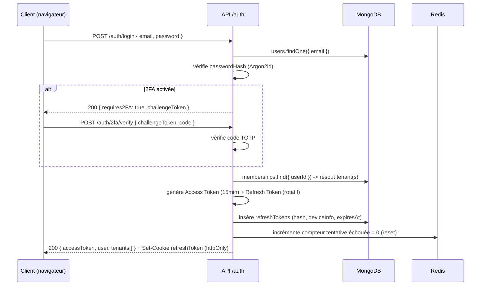
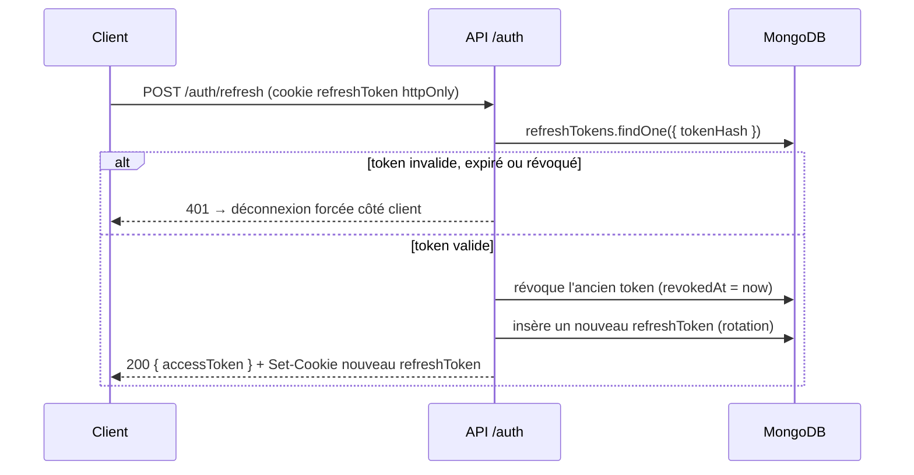

# 7. Authentification

## 7.1 Principes

- **Access Token JWT courte durée (15 min)** signé HS256/RS256, transporté en `Authorization: Bearer`, jamais stocké en `localStorage` côté client mais gardé en mémoire (store Pinia) pour limiter l'exposition XSS.
- **Refresh Token longue durée (30 jours, rotatif)**, transporté via **cookie `httpOnly`, `Secure`, `SameSite=Strict`**, jamais accessible en JavaScript — c'est la protection principale contre le vol de session par XSS.
- **Rotation systématique du refresh token à chaque utilisation** ("refresh token rotation") : l'ancien est immédiatement révoqué en base (`refreshTokens.revokedAt`). Si un refresh token déjà révoqué est présenté (signe de vol/rejeu), **toute la famille de tokens de l'utilisateur est révoquée** et une notification de sécurité est envoyée.
- **Un JWT porte le contexte tenant courant** (`sub`, `membershipId`, `tenantId`, `role`, `permissionsVersion`) pour que le Tenant Resolver (doc 06) et le RBAC (doc 08) n'aient pas besoin d'aller lire la base à chaque requête pour les informations de routage.

## 7.2 Contenu du token (claims)

**Access Token** :
```json
{
  "sub": "userId",
  "membershipId": "membershipId | null",
  "tenantId": "tenantId | null",
  "role": "restaurant_owner | manager | ... | null",
  "isSuperAdmin": false,
  "permissionsVersion": 3,
  "iat": 1234567890,
  "exp": 1234568790
}
```
- `permissionsVersion` : incrémenté à chaque modification du rôle/permissions de l'utilisateur (voir doc 08) — permet au middleware RBAC de détecter un token "stale" et de forcer un refresh sans attendre l'expiration naturelle des 15 minutes, sans avoir à interroger la base à chaque requête (comparaison avec un compteur en cache Redis `permissionsVersion:{userId}`).

**Refresh Token** : opaque côté client (UUID aléatoire haute entropie), seul son **hash SHA-256** est stocké côté serveur dans `refreshTokens` (doc 05) — même en cas de fuite de la base, les tokens ne sont pas directement réutilisables.

## 7.3 Flux de connexion



Si l'utilisateur possède **plusieurs memberships** (staff multi-restaurants), la réponse de login liste les tenants disponibles ; le choix du tenant actif déclenche un second appel `POST /auth/select-tenant` qui émet un nouvel Access Token avec `tenantId` renseigné.

## 7.4 Flux de refresh



Côté frontend, l'intercepteur Axios (`services/api/http.ts`, doc 03/11) intercepte tout `401` avec code `TOKEN_EXPIRED`, appelle `/auth/refresh` automatiquement, rejoue la requête originale, et ne déconnecte l'utilisateur que si le refresh échoue lui-même — une seule tentative de refresh en vol à la fois (verrou côté client pour éviter une tempête de refresh en cas de requêtes parallèles).

## 7.5 Mot de passe oublié

1. `POST /auth/forgot-password { email }` → génère un token à usage unique (haute entropie, hashé en base, expiration 30 min), envoie un email (via `notifications`/worker) contenant un lien `https://app.quicktable.io/reset-password?token=...`. Réponse toujours `200` identique que l'email existe ou non (anti-enumération).
2. `POST /auth/reset-password { token, newPassword }` → vérifie le hash du token et son expiration, met à jour `passwordHash`, **révoque tous les refresh tokens existants de l'utilisateur** (déconnexion de toutes les sessions actives par sécurité), envoie une notification de confirmation.

## 7.6 Double authentification (2FA — TOTP)

- Basée sur **TOTP** (RFC 6238), compatible Google Authenticator/Authy — pas de SMS (coût, fiabilité, et le SMS OTP est déconseillé par le NIST comme second facteur seul).
- Activation : `POST /auth/2fa/enable` → génère un secret, retourne un QR Code (affiché côté front pour scan par l'app d'authentification) + 10 codes de récupération à usage unique (hashés en base). Confirmation par `POST /auth/2fa/confirm { code }` avant activation effective.
- Le secret TOTP est **chiffré au repos** (AES-256-GCM, clé applicative hors base) dans `users.twoFactorSecret`.
- 2FA **obligatoire** pour les rôles `super_admin` et `restaurant_owner` (politique imposée, pas seulement recommandée) — ce sont les comptes à plus fort impact en cas de compromission.

## 7.7 Gestion des sessions

- `GET /auth/sessions` : liste les sessions actives de l'utilisateur (à partir de `refreshTokens` non révoqués), avec `deviceInfo`, IP, dernière activité.
- `DELETE /auth/sessions/:id` : révocation d'une session spécifique (ex. "déconnecter cet appareil").
- `DELETE /auth/sessions` : révocation de toutes les sessions sauf la courante ("déconnecter tous les autres appareils").
- Toute modification de mot de passe, activation/désactivation 2FA, ou changement de rôle déclenche une **révocation globale** des refresh tokens (sauf la session à l'origine de l'action, si applicable) et un email de notification de sécurité.

## 7.8 Sécurité du stockage des mots de passe

- **Argon2id** (paramètres recommandés OWASP : mémoire ≥ 19 MiB, itérations ≥ 2, parallélisme ≥ 1, à ajuster selon les benchmarks infra Railway) — supérieur à bcrypt pour la résistance aux attaques GPU/ASIC.
- Politique de complexité minimale (longueur ≥ 10, pas de mot de passe dans la liste des 10000 plus fréquents — vérification via une librairie type `zxcvbn` pour un retour qualitatif à l'utilisateur plutôt qu'une simple règle de regex).
- **Rate limiting dédié** sur `/auth/login` et `/auth/reset-password` (voir doc 13) : verrouillage progressif par couple `(email, IP)` pour contrer le brute force, indépendant du rate limiting global de l'API.

## 7.9 Authentification des connexions Socket.IO

Le handshake Socket.IO transmet l'Access Token courant (`auth: { token }`) ; le serveur valide la signature et l'expiration **avant** d'accepter la connexion (voir doc 10). Un Access Token expiré côté socket ne peut pas être "refreshé" sur le canal WS lui-même — le client doit rafraîchir via REST puis rouvrir la connexion socket avec le nouveau token (géré automatiquement par `services/socket/socket-client.ts`, doc 11).

## 7.10 Endpoints du module Auth (résumé — détail complet doc 09)

| Endpoint | Méthode | Description |
|---|---|---|
| `/api/v1/auth/login` | POST | Connexion |
| `/api/v1/auth/select-tenant` | POST | Sélection du tenant actif (multi-membership) |
| `/api/v1/auth/refresh` | POST | Rotation du token |
| `/api/v1/auth/logout` | POST | Révocation de la session courante |
| `/api/v1/auth/forgot-password` | POST | Demande de reset |
| `/api/v1/auth/reset-password` | POST | Application du nouveau mot de passe |
| `/api/v1/auth/2fa/enable` | POST | Démarre l'activation 2FA |
| `/api/v1/auth/2fa/confirm` | POST | Confirme l'activation 2FA |
| `/api/v1/auth/2fa/verify` | POST | Vérifie le code au login |
| `/api/v1/auth/2fa/disable` | POST | Désactive la 2FA (requiert mot de passe + code) |
| `/api/v1/auth/sessions` | GET | Liste des sessions actives |
| `/api/v1/auth/sessions/:id` | DELETE | Révoque une session |
