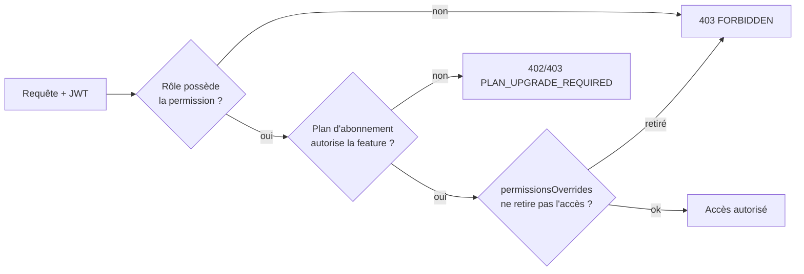

# 8. Gestion des rôles — RBAC complet

## 8.1 Modèle

RBAC **à permissions granulaires**, pas à rôles figés en dur dans le code : chaque rôle est une **collection de permissions** (`resource:action`), stockée en configuration (seed en base, table `roles` pour les rôles système + support de rôles custom par tenant en V2). Le code applicatif ne teste jamais `if (role === 'manager')` mais toujours `if (can(user, 'orders:update'))`.

**Format d'une permission** : `resource:action`, ex. `orders:create`, `payments:refund`, `employees:view_salary`.

Trois niveaux de vérification combinés à chaque requête (voir doc 06 §6.2 pour le flux complet) :
1. **Le rôle possède la permission** (matrice ci-dessous).
2. **Le plan d'abonnement du tenant autorise la fonctionnalité** (feature gating, ex. `statistics:advanced` réservé Business/Premium).
3. **`permissionsOverrides` du membership** (ajouts/retraits ponctuels, ex. un Caissier explicitement autorisé à faire des remboursements — cf. cahier des charges "encaisser (si autorisé)").

## 8.2 Rôles

| Rôle | Portée | Description |
|---|---|---|
| `super_admin` | Plateforme (hors tenant) | Équipe QuickTable — gestion de tous les restaurants, abonnements, facturation plateforme |
| `restaurant_owner` | Tenant | Propriétaire/Administrateur du restaurant — accès complet à son tenant |
| `manager` | Tenant | Supervision opérationnelle quotidienne |
| `cashier` | Tenant | Encaissement, facturation |
| `kitchen` | Tenant | Suivi et préparation des commandes |
| `waiter` | Tenant | Prise de commande en salle |
| `customer` | Public / Tenant (optionnel) | Client final, via QR Code, avec ou sans compte |

## 8.3 Catalogue des permissions par ressource

| Ressource | Permissions |
|---|---|
| `platform` | `platform:manage_restaurants`, `platform:manage_subscriptions`, `platform:view_global_statistics`, `platform:manage_billing` |
| `restaurants` | `restaurants:read`, `restaurants:update`, `restaurants:manage_settings` |
| `employees` | `employees:create`, `employees:read`, `employees:update`, `employees:delete`, `employees:view_salary` |
| `rooms` | `rooms:create`, `rooms:read`, `rooms:update`, `rooms:delete` |
| `tables` | `tables:create`, `tables:read`, `tables:update`, `tables:delete`, `tables:change_status` |
| `menus` | `menus:create`, `menus:read`, `menus:update`, `menus:delete`, `menus:toggle_availability` |
| `stock` | `stock:read`, `stock:manage_ingredients`, `stock:manage_suppliers`, `stock:record_movement` |
| `orders` | `orders:create`, `orders:read`, `orders:update`, `orders:change_status`, `orders:cancel`, `orders:transfer_table` |
| `kitchen` | `kitchen:read_tickets`, `kitchen:update_item_status` |
| `payments` | `payments:create`, `payments:read`, `payments:refund`, `payments:print_receipt` |
| `reservations` | `reservations:create`, `reservations:read`, `reservations:update`, `reservations:cancel` |
| `customers` | `customers:create`, `customers:read`, `customers:update`, `customers:view_history` |
| `statistics` | `statistics:view_basic`, `statistics:view_advanced` |
| `subscriptions` | `subscriptions:read`, `subscriptions:manage` |
| `billing` | `billing:read`, `billing:manage_payment_method` |
| `settings` | `settings:read`, `settings:update` |
| `audit-logs` | `audit-logs:read` |
| `notifications` | `notifications:read`, `notifications:manage_preferences` |
| `qrcode` | `qrcode:regenerate` |

## 8.4 Matrice des permissions par rôle

Légende : ✅ = accordé par défaut · ➖ = non applicable au rôle · 🔒 = accordé uniquement via `permissionsOverrides` explicite

| Permission | Owner | Manager | Cashier | Kitchen | Waiter |
|---|---|---|---|---|---|
| `restaurants:read` | ✅ | ✅ | ✅ | ✅ | ✅ |
| `restaurants:update` | ✅ | ➖ | ➖ | ➖ | ➖ |
| `restaurants:manage_settings` | ✅ | 🔒 | ➖ | ➖ | ➖ |
| `employees:create/update/delete` | ✅ | ✅ | ➖ | ➖ | ➖ |
| `employees:view_salary` | ✅ | 🔒 | ➖ | ➖ | ➖ |
| `rooms:*` | ✅ | ✅ | ➖ | ➖ | ➖ |
| `tables:create/update/delete` | ✅ | ✅ | ➖ | ➖ | ➖ |
| `tables:change_status` | ✅ | ✅ | ✅ | ➖ | ✅ |
| `menus:create/update/delete` | ✅ | ✅ | ➖ | ➖ | ➖ |
| `menus:toggle_availability` | ✅ | ✅ | ➖ | ✅ | ➖ |
| `stock:read` | ✅ | ✅ | ➖ | ✅ | ➖ |
| `stock:manage_ingredients/suppliers` | ✅ | ✅ | ➖ | ➖ | ➖ |
| `stock:record_movement` | ✅ | ✅ | ➖ | 🔒 | ➖ |
| `orders:create` | ✅ | ✅ | 🔒 | ➖ | ✅ |
| `orders:read` | ✅ | ✅ | ✅ | ✅ | ✅ (les siennes) |
| `orders:update` | ✅ | ✅ | ➖ | ➖ | ✅ (les siennes) |
| `orders:change_status` | ✅ | ✅ | ➖ | ✅ (cuisine) | ✅ (service) |
| `orders:cancel` | ✅ | ✅ | ➖ | ➖ | 🔒 |
| `orders:transfer_table` | ✅ | ✅ | ➖ | ➖ | ✅ |
| `kitchen:read_tickets` | ✅ | ✅ | ➖ | ✅ | ➖ |
| `kitchen:update_item_status` | ✅ | ✅ | ➖ | ✅ | ➖ |
| `payments:create` | ✅ | ✅ | ✅ | ➖ | 🔒 |
| `payments:refund` | ✅ | ✅ | 🔒 | ➖ | ➖ |
| `payments:print_receipt` | ✅ | ✅ | ✅ | ➖ | ➖ |
| `reservations:*` | ✅ | ✅ | ➖ | ➖ | 🔒 (lecture) |
| `customers:*` | ✅ | ✅ | ✅ (lecture) | ➖ | ✅ (lecture) |
| `statistics:view_basic` | ✅ | ✅ | ➖ | ➖ | ➖ |
| `statistics:view_advanced` | ✅ (si plan) | ✅ (si plan) | ➖ | ➖ | ➖ |
| `subscriptions:manage` | ✅ | ➖ | ➖ | ➖ | ➖ |
| `billing:*` | ✅ | ➖ | ➖ | ➖ | ➖ |
| `settings:*` | ✅ | 🔒 | ➖ | ➖ | ➖ |
| `audit-logs:read` | ✅ | 🔒 | ➖ | ➖ | ➖ |

Le rôle `super_admin` possède implicitement toutes les permissions `platform:*` et un accès en lecture seule cross-tenant à des fins de support (jamais un accès en écriture direct aux données opérationnelles d'un tenant, pour préserver la confiance — toute intervention support passe par une action tracée et auditée, ex. "réinitialiser le mot de passe du owner à sa demande").

## 8.5 Le rôle `customer`

Contrairement aux rôles ci-dessus, `customer` n'est pas nécessairement authentifié. Deux modes :
- **Client anonyme** (scan QR Code sans compte) : accès limité à `menu:read`, `orders:create` (commande liée à la table, pas à une identité), `reservations:create` avec juste un numéro de téléphone.
- **Client identifié** (compte optionnel) : ajoute `customers:view_own_history`, `reviews:create`, cumul de `loyaltyPoints`.

Ces permissions ne transitent **jamais par le même middleware RBAC que le back-office** : elles sont vérifiées par un middleware dédié `publicAccess.middleware.ts` avec un rate limiting propre (doc 13), car la surface d'attaque (utilisateurs non authentifiés) est différente.

## 8.6 Feature gating par abonnement

Certaines permissions accordées par le rôle restent **conditionnées à une feature du plan d'abonnement** (voir `subscriptionPlans.features[]`, doc 05) :

| Feature flag | Starter | Business | Premium |
|---|---|---|---|
| `advanced_statistics` | ❌ | ✅ | ✅ |
| `multi_site` | ❌ | ❌ | ✅ |
| `api_access` | ❌ | ❌ | ✅ |
| `custom_roles` | ❌ | ❌ | ✅ |
| `priority_support` | ❌ | ❌ | ✅ |

Le middleware RBAC combine `role → permission` **puis** `tenant.subscription.features → feature requise par la permission` (table de correspondance `permission → feature requise`, ex. `statistics:view_advanced` requiert `advanced_statistics`). Un refus pour raison de plan renvoie un code distinct (`402 PLAN_UPGRADE_REQUIRED`) d'un refus pour raison de rôle (`403 FORBIDDEN`) — distinction importante pour l'UX frontend (afficher "Passez à Business" plutôt qu'une simple erreur d'accès).

## 8.7 Implémentation côté code (vue conceptuelle, sans code applicatif)

- **Backend** : middleware `rbac.middleware.ts` prend en paramètre de route la permission requise (`requirePermission('orders:cancel')`), déclaré directement dans `orders.routes.ts` — la permission requise est donc visible et grep-able depuis les routes, jamais cachée dans un controller.
- **Frontend** : composable `usePermissions()` expose `can('orders:cancel')`, alimenté par les permissions résolues et envoyées par le backend au login (pas recalculées côté client à partir du rôle seul, pour rester synchronisé avec le feature gating serveur). Utilisé par la directive `v-permission` (doc 03/11) pour masquer les actions non autorisées dans l'UI — **rappel : ce masquage est un confort UX, jamais une mesure de sécurité** ; la vérification serveur (doc 06/08) est la seule qui compte.
