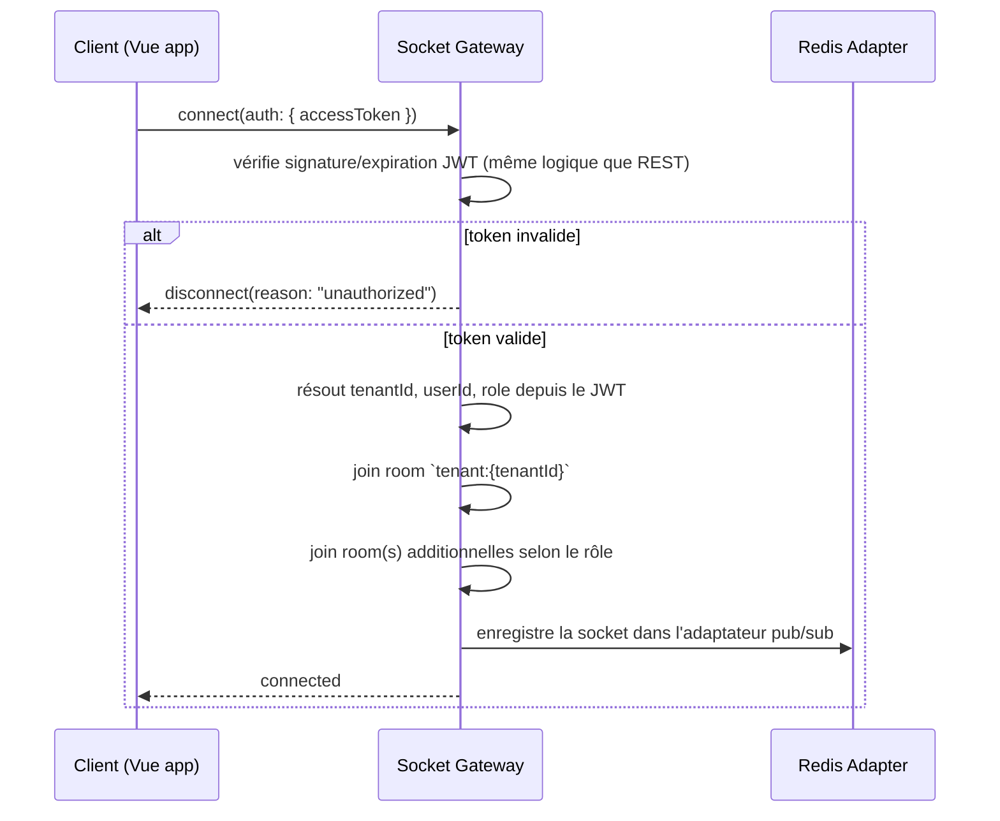
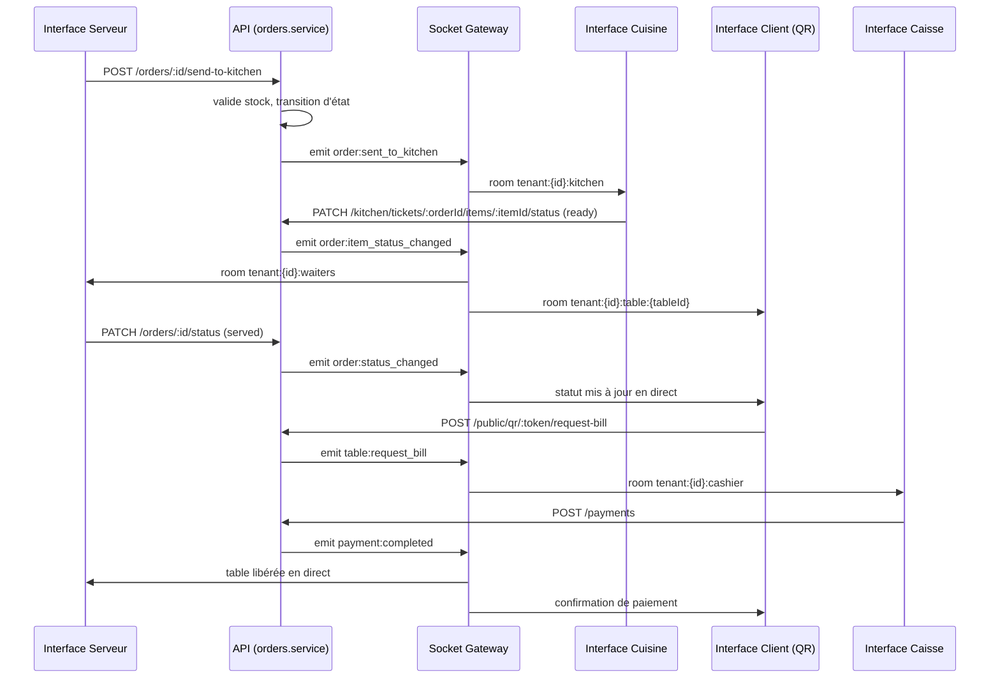
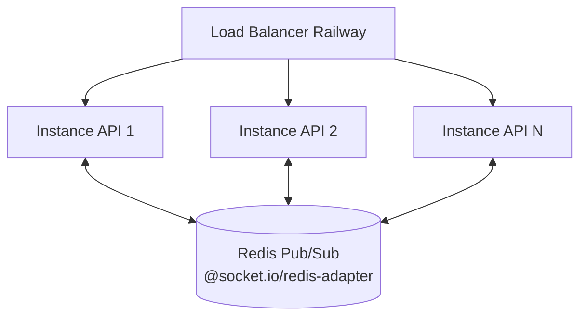

# 10. Socket.IO — Architecture temps réel

## 10.1 Rôle du temps réel dans QuickTable

Le temps réel n'est pas une fonctionnalité annexe : c'est ce qui différencie un POS moderne (Toast, Square) d'un simple CRUD. Trois flux critiques doivent être instantanés (< 500ms perçu) même en rush de service :
1. Une commande envoyée par un serveur doit apparaître en cuisine sans rechargement.
2. Un changement de statut en cuisine (plat prêt) doit remonter au serveur instantanément.
3. Un paiement complété doit libérer la table et mettre à jour le dashboard en direct.

## 10.2 Authentification et scoping au handshake

- Un client **ne peut jamais rejoindre une room manuellement par son nom** — les rooms sont attribuées côté serveur uniquement, en fonction du `tenantId` et du rôle résolus depuis le JWT, jamais depuis un paramètre envoyé par le client (même principe anti-IDOR que le REST, doc 06).
- Reconnexion automatique gérée par le client Socket.IO ; à chaque reconnexion, le token courant (potentiellement rafraîchi entre-temps) est renvoyé au handshake.
- Pour l'interface client (QR Code, non authentifiée), une **room à portée restreinte** `tenant:{tenantId}:table:{tableId}` est utilisée, résolue via le `qrCodeToken`, sans accès aux autres rooms du tenant.

## 10.3 Rooms

| Room | Membres | Usage |
|---|---|---|
| `tenant:{tenantId}` | Tout le staff connecté du tenant | Notifications générales, mise à jour dashboard |
| `tenant:{tenantId}:kitchen` | Rôles `kitchen`, `manager`, `restaurant_owner` | Tickets cuisine |
| `tenant:{tenantId}:waiters` | Rôle `waiter`, `manager` | Statuts de commande, appels serveur |
| `tenant:{tenantId}:cashier` | Rôle `cashier`, `manager` | Demandes d'addition, statuts paiement |
| `tenant:{tenantId}:table:{tableId}` | Client (QR Code) de cette table + staff assigné | Suivi de commande client, appel serveur ciblé |
| `platform:super_admin` | `super_admin` | Alertes plateforme (nouveau tenant, tenant suspendu automatiquement pour impayé) |

## 10.4 Catalogue des événements

Convention de nommage : `domaine:action` (miroir du système de permissions pour la lisibilité). Tous les événements sont enregistrés dans `sockets/events.registry.ts` (doc 03) — source unique de vérité des noms d'événements, partagée en type avec le frontend via `packages/shared-types`.

| Événement | Émis par | Diffusé à | Payload (résumé) |
|---|---|---|---|
| `order:created` | Service `orders` | `tenant:{id}` | `{ orderId, tableId, waiterId }` |
| `order:sent_to_kitchen` | Service `orders` | `tenant:{id}:kitchen` | `{ orderId, items[] }` |
| `order:item_status_changed` | Service `kitchen` | `tenant:{id}:waiters`, `tenant:{id}:table:{tableId}` | `{ orderId, itemId, status }` |
| `order:status_changed` | Service `orders` | `tenant:{id}`, `tenant:{id}:table:{tableId}` | `{ orderId, status }` |
| `order:cancelled` | Service `orders` | `tenant:{id}:kitchen`, `tenant:{id}:waiters` | `{ orderId, reason }` |
| `table:status_changed` | Service `tables` | `tenant:{id}` | `{ tableId, status }` |
| `table:call_waiter` | Endpoint public QR | `tenant:{id}:waiters` | `{ tableId }` |
| `table:request_bill` | Endpoint public QR | `tenant:{id}:cashier`, `tenant:{id}:waiters` | `{ tableId, orderId }` |
| `payment:completed` | Service `payments` | `tenant:{id}`, `tenant:{id}:table:{tableId}` | `{ paymentId, orderId, amount }` |
| `reservation:created` | Service `reservations` | `tenant:{id}` | `{ reservationId, dateTime }` |
| `stock:low_alert` | Worker `stock-alert` | `tenant:{id}` (managers/owner) | `{ ingredientId, quantityInStock }` |
| `notification:new` | Service `notifications` | `tenant:{id}` (utilisateur ciblé via room privée `user:{userId}`) | `{ notificationId, type, title }` |
| `dashboard:stats_updated` | Worker `statistics` | `tenant:{id}` (managers/owner) | `{ date, revenue, ordersCount }` |
| `platform:tenant_suspended` | Cron `subscription-expiry` | `platform:super_admin` | `{ tenantId, reason }` |

## 10.5 Diagramme de flux — cycle de vie d'une commande en temps réel

## 10.6 Scalabilité horizontale

- Sans adaptateur Redis, un événement émis depuis l'instance API1 (qui a traité la requête REST) ne serait jamais reçu par un client connecté à l'instance API2 — **l'adaptateur Redis est donc non négociable dès qu'il y a plus d'une instance**, ce qui sera le cas dès la mise en production réelle (doc 02).
- **Sticky sessions** activées sur le load balancer Railway pour Socket.IO (transport `polling` initial nécessite que les requêtes successives d'un même client atteignent la même instance avant l'upgrade en `websocket`).
- Le nombre de connexions simultanées par instance est surveillé (métrique `socket.io.connections`) avec seuil d'auto-scaling (voir doc 18).

## 10.7 Fiabilité et gestion de la perte de connexion

- **Aucune donnée métier ne transite exclusivement par Socket.IO** : chaque événement notifie un changement dont la source de vérité reste MongoDB, accessible via l'API REST correspondante. Un client qui se reconnecte après une coupure réseau **rejoue un `GET` de resynchronisation** (ex. `GET /kitchen/tickets`) plutôt que de compter sur le rattrapage des événements manqués — principe "Socket.IO notifie, REST fait foi".
- Sur reconnexion, le client émet `client:resync` avec le dernier timestamp connu ; le serveur peut optionnellement renvoyer un delta, mais le frontend ne doit jamais supposer qu'aucun événement n'a été manqué sans un `GET` de contrôle en cas de coupure > quelques secondes (géré par le composable `useSocketRoom`, doc 11).
- **Heartbeat/ping** configuré (`pingInterval`/`pingTimeout` Socket.IO) pour détecter les connexions mortes plus vite que le défaut, important pour un usage sur Wi-Fi restaurant potentiellement instable.

## 10.8 Sécurité temps réel

- Rate limiting appliqué aussi sur les événements entrants côté client (ex. `table:call_waiter` limité à 1 appel / 30s par table, pour éviter un spam involontaire ou malveillant depuis l'interface publique QR Code) — voir doc 13.
- Validation des payloads entrants côté socket avec les **mêmes schémas Zod** que les endpoints REST équivalents quand ils existent, pour ne pas dupliquer les règles de validation.
- Un événement reçu d'un client authentifié est toujours re-vérifié côté serveur vis-à-vis du RBAC (ex. un `waiter` ne peut pas émettre un événement réservé à `kitchen`), jamais fait confiance au rôle affiché côté client.
