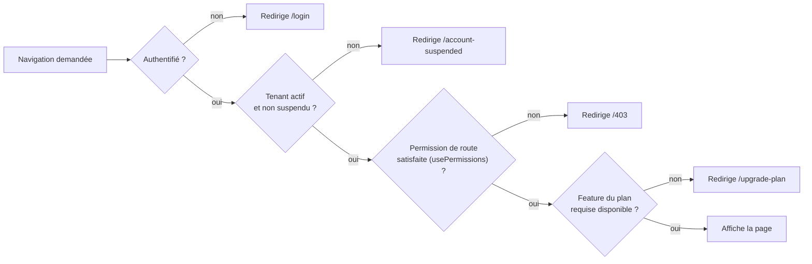

# 11. Architecture Frontend détaillée

Ce document complète l'arborescence (doc 03 §3.2) avec les conventions et patterns qui font qu'un frontend Vue 3 reste maintenable à l'échelle de 20+ modules métier.

## 11.1 Principes directeurs

1. **Feature-first, pas type-first en profondeur.** Le premier niveau (`pages`, `components`, `stores`, `services`) est organisé par type technique (nécessaire pour la lisibilité globale), mais à l'intérieur de chaque dossier, l'organisation est par module métier (`components/modules/orders/`, `stores/orders.store.ts`) — un développeur qui travaille sur "Orders" touche un ensemble de fichiers prévisible.
2. **Composants "bêtes" (dumb) vs composants "intelligents" (smart).** `components/ui/` ne connaît rien du métier (props/emits uniquement). `components/modules/*` peut lire les stores. `pages/*` orchestre. Cette séparation est ce qui permet de réutiliser `components/ui/` tel quel dans l'interface client QR Code (design system unique, doc 01 exigence "interface jolie et cohérente").
3. **Composition API exclusivement**, pas d'Options API — cohérence, meilleure inférence TypeScript, meilleure factorisation via composables.
4. **Aucun accès direct à Axios ou `window.localStorage` en dehors de `services/`** — appliqué par une règle ESLint custom (`no-restricted-imports` sur `axios` en dehors de `services/api/`).
5. **Le store Pinia est la seule source de vérité de l'état serveur côté client** ; un composant ne garde jamais en `ref()` local une donnée qui existe déjà dans un store (évite les désynchronisations, notamment critiques avec le temps réel Socket.IO qui met à jour les stores directement).

## 11.2 Gestion d'état (Pinia)

Chaque store suit la même forme :
```
state: { items, currentItem, loading, error, pagination }
getters: { sélecteurs dérivés, ex. ordersByStatus }
actions: { fetchList(), fetchOne(id), create(dto), update(id, dto), remove(id), applySocketEvent(event) }
```

- **`applySocketEvent()`** est le point d'entrée unique par lequel les événements Socket.IO (doc 10) mettent à jour l'état local — jamais un composant n'écoute Socket.IO directement ; `services/socket/handlers/*.handlers.ts` traduit l'événement réseau en appel d'action de store.
- **Store `tenant.store.ts`** est particulier : il détient le tenant courant, l'abonnement actif, et les **permissions résolues** de l'utilisateur (reçues du backend au login, doc 08 §8.7) — c'est la source de vérité consultée par `usePermissions()` et par les guards de route.
- Pas de état global mutable en dehors de Pinia (pas de singleton "manuel", pas d'event bus custom) pour garder un seul mécanisme de réactivité et de debug (Vue Devtools).

## 11.3 Routing et garde d'accès



- Chaque route déclare ses exigences en meta : `meta: { requiresAuth: true, permission: 'orders:read', feature: 'advanced_statistics' }`.
- Les gardes sont composées dans `router/index.ts` via `router.beforeEach`, chaque garde étant testée unitairement de façon isolée (doc 14).
- Layouts choisis dynamiquement selon `meta.layout` pour éviter la duplication de logique de layout dans chaque page.

## 11.4 Séparation Back-office / Interface Client (QR Code)

Bien que dans le même monorepo/app Vite (pour partager `components/ui/`, `utils/`, `types/`), les deux expériences sont **routées et bundlées séparément** :
- `router/modules/backoffice.routes.ts` (lazy-loaded, chargé seulement pour le staff authentifié).
- `router/modules/customer-app.routes.ts` (lazy-loaded, chargé seulement pour un accès `/menu/:qrToken`).

Grâce au code-splitting natif de Vite/Rollup par route (`() => import(...)`), un client qui scanne un QR Code ne télécharge jamais le bundle du back-office (dashboard, statistiques, gestion employés) — critère de performance important sur mobile/réseau restaurant faible, en lien avec l'objectif produit d'UX "dynamique et professionnelle" (doc 01).

## 11.5 Composables clés

| Composable | Rôle |
|---|---|
| `useAuth()` | État de session, login/logout, refresh |
| `usePermissions()` | `can(permission)`, `hasFeature(flag)` |
| `useSocketRoom(room)` | Abonnement/désabonnement propre à un composant (cleanup automatique sur `onUnmounted`) |
| `usePagination(fetchFn)` | Logique générique de pagination réutilisée par toutes les listes |
| `useFormValidation(schema)` | Intègre les mêmes schémas Zod que le backend (partagés via `packages/shared-types`) pour une validation client cohérente avec la validation serveur |
| `useDebounce(value, delay)` | Recherche live sans spam de requêtes |
| `useCurrency()` | Formatage monétaire selon `tenant.currency` (doc 05) |

## 11.6 Communication avec l'API

- **`services/api/http.ts`** : instance Axios unique, intercepteurs :
  - Requête : injection automatique de l'Access Token courant.
  - Réponse (erreur `401 TOKEN_EXPIRED`) : déclenche le flux de refresh (doc 07 §7.4), rejoue la requête originale une fois, sinon déconnexion.
  - Réponse (erreur `402 PLAN_UPGRADE_REQUIRED`) : déclenche une modale globale d'upgrade plutôt qu'un simple message d'erreur générique.
- **`services/api/*.api.ts`** : un fichier par module, fonctions pures typées (`getOrders(params): Promise<Order[]>`), aucun état, aucune logique — juste le contrat HTTP.
- **Génération de types partagés** : `packages/shared-types` expose les types `Order`, `MenuItem`, etc. et les enums de statut, consommés à l'identique par `apps/web` et `apps/api`, éliminant toute divergence de contrat (ex. une valeur d'enum `status` qui diffère entre front et back).

## 11.7 Design system et UI (exigence "jolie, moderne, soft, épurée")

- `components/ui/` = design system interne construit sur Tailwind CSS avec une **couche de tokens de design** (`assets/styles/variables.css` : couleurs, espacements, rayons, ombres) pour garantir la cohérence visuelle sans dupliquer des classes Tailwind partout — un changement de teinte de marque se fait à un seul endroit.
- Composants de base attendus dès la Phase 1 : `Button`, `Input`, `Select`, `Modal`, `Toast`, `Badge`, `Table`, `Card`, `Tabs`, `Skeleton` (états de chargement), `EmptyState`.
- **Accessibilité (a11y)** intégrée au design system dès le départ (focus visible, contrastes AA, `aria-*` sur les composants interactifs) — moins cher à construire dès le premier composant qu'à rattraper plus tard (gap identifié au doc 01).
- **Dark mode** anticipé via variables CSS/Tailwind `dark:` — non demandé explicitement mais standard sur ce type de produit et peu coûteux si les tokens sont bien structurés dès le départ.

## 11.8 Performance frontend

- Lazy-loading systématique des routes et des composants lourds (graphiques de statistiques, éditeurs riches).
- Virtualisation des listes longues (liste de commandes en heure de pointe, historique client) via une librairie de virtual scroll.
- Images (photos plats) servies depuis Firebase Storage avec redimensionnement/format optimisé (WebP) — géré côté `uploads` backend au moment de l'upload (doc 04), pas côté client.
- Budget de performance suivi en CI (Lighthouse CI) sur les pages critiques (Kitchen Display, prise de commande) — ce sont les écrans utilisés en continu pendant le service, leur fluidité est un critère produit, pas seulement technique.
