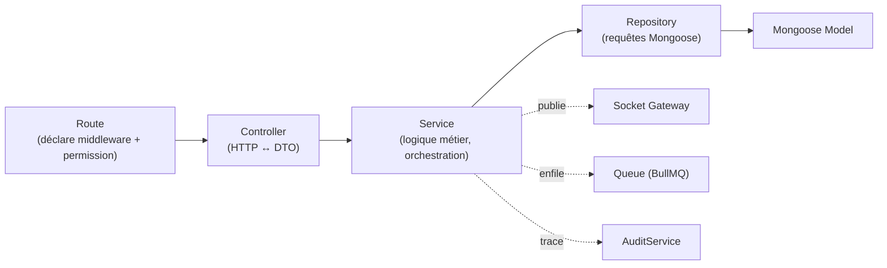

# 12. Architecture Backend détaillée

Ce document complète l'arborescence (doc 03 §3.3) et la vue macro (doc 02 §2.3) avec les conventions précises de chaque couche.

## 12.1 Anatomie d'un module

Chaque dossier `modules/<nom>/` expose **un seul point d'entrée public** `index.ts` qui réexporte uniquement ce que les autres modules ont le droit de consommer (généralement : le service, pour un appel direct in-process, et les types). Tout le reste (`*.repository.ts`, `*.controller.ts`) est privé au module — appliqué par une règle ESLint (`import/no-internal-modules`).

```
modules/orders/
├── index.ts                 # export { OrdersService } from './orders.service'
├── orders.routes.ts          # Express Router — déclare permissions requises par route
├── orders.controller.ts      # HTTP <-> Service
├── orders.service.ts         # Logique métier + machine à état + événements Socket.IO + jobs
├── orders.repository.ts      # Accès Mongoose exclusif à ce module
├── orders.validators.ts      # Schémas Zod (DTO d'entrée)
├── orders.types.ts           # Types internes + DTO
├── orders.socket.ts          # Handlers d'événements socket entrants spécifiques au module
└── orders.service.spec.ts    # Tests unitaires du service (doc 14)
```

## 12.2 Contrat entre couches



- **Controller** : ne connaît jamais Mongoose. Convertit `req` → DTO validé (déjà fait par `validate.middleware.ts` en amont, le controller lit `req.validated`), appelle **un seul** service, formate la réponse standard (doc 09 §9.1). Un controller ne dépasse jamais ~15 lignes par action.
- **Service** : contient toute règle métier (ex. la machine à état des commandes, doc 04). C'est le service qui décide qu'un événement Socket.IO doit être émis et qu'un job doit être enfilé — jamais le controller. Un service d'un module ne peut appeler que le **service public** d'un autre module (via son `index.ts`), jamais son repository.
- **Repository** : encapsule toutes les requêtes Mongoose. Hérite de `shared/base/BaseRepository` qui impose `tenantId` (doc 06). Ne contient aucune règle métier — seulement des méthodes de requêtage (`findActiveByTable`, `findWithFilters`).
- **Validators** : schémas Zod, réutilisés à la fois par `validate.middleware.ts` (validation runtime) et par `docs/openapi.ts` (génération de documentation) — un seul endroit de vérité.

## 12.3 Gestion des erreurs

- Classes d'erreurs typées dans `shared/errors/` : `AppError` (base), `NotFoundError`, `ValidationError`, `ForbiddenError`, `ConflictError`, `BusinessRuleError` — chacune porte un `code` machine-readable (doc 09 §9.1) et un `httpStatus`.
- Les services **lancent** ces erreurs (`throw new ConflictError('ORDER_ALREADY_PAID')`), ne retournent jamais de tuples `{error, data}` ni de `null` ambigu.
- `error-handler.middleware.ts` est le **seul** endroit qui traduit une erreur en réponse HTTP JSON standard, avec journalisation structurée (`logger.error` incluant `correlationId`, `tenantId`, `userId`, stacktrace complète en interne, message sanitisé au client).
- Toute erreur non typée (bug inattendu) est loggée en `500` avec alerte Sentry, jamais exposée avec détails techniques au client.

## 12.4 Middlewares transverses — ordre d'application

```mermaid
flowchart LR
    A["helmet()"] --> B["cors()"]
    B --> C["express.json() + sanitize"]
    C --> D["rate-limit (global)"]
    D --> E["correlationId middleware"]
    E --> F["auth.middleware"]
    F --> G["tenant.middleware"]
    G --> H["rbac.middleware (par route)"]
    H --> I["rate-limit (par tenant/route sensible)"]
    I --> J["validate.middleware (DTO Zod)"]
    J --> K["Controller"]
    K --> L["audit.middleware (post, asynchrone)"]
```



L'ordre est significatif : la sécurité réseau (`helmet`, `cors`) et l'hygiène de la requête (sanitize, rate limit global) s'appliquent **avant** tout travail applicatif ; l'authentification avant la résolution tenant ; le RBAC avant toute validation métier fine (inutile de valider le corps d'une requête que l'utilisateur n'a de toute façon pas le droit d'exécuter).

## 12.5 Workers et jobs asynchrones

- **Process séparé** (`workers/worker.ts`), démarré comme service Railway distinct du process API — ne partage que la connexion MongoDB/Redis, jamais le event-loop HTTP.
- Queue technology : **BullMQ** (sur Redis), avec des queues nommées par domaine (`email`, `statistics`, `stock-alerts`, `receipts`) plutôt qu'une queue générique, pour permettre des politiques de retry/concurrence différenciées (ex. l'envoi d'email tolère 5 retries espacés, le calcul de stats n'en tolère qu'1).
- Chaque job est **idempotent** (rejouable sans effet de bord dupliqué) — condition nécessaire pour la fiabilité des retries automatiques.
- Exemples de jobs : `email.worker.ts` (reset password, invitation employé, facture), `receipt-pdf.worker.ts` (génération asynchrone du PDF de reçu pour ne jamais bloquer `POST /payments`), `statistics.worker.ts` (recalcul incrémental de `dailyStatistics`, doc 05), `stock-alert.worker.ts` (détection de seuil bas → notification + événement socket).

## 12.6 Tâches planifiées (cron)

| Cron | Fréquence | Rôle |
|---|---|---|
| `daily-statistics.cron.ts` | Nocturne (par fuseau horaire du tenant) | Agrège `dailyStatistics` de la veille |
| `subscription-expiry.cron.ts` | Toutes les heures | Détecte les abonnements expirés/impayés, transitionne le tenant (doc 06 §6.7) |
| `session-cleanup.cron.ts` | Quotidien | Purge complémentaire des refresh tokens expirés (filet, le TTL Mongo fait l'essentiel) |
| `reservation-reminder.cron.ts` | Toutes les 15 min | Notifications de rappel de réservation |

Orchestré par un scheduler léger (`node-cron` ou équivalent) à l'intérieur du process `workers`, jamais dans le process API (pour éviter qu'un déploiement/redémarrage fréquent de l'API ne perturbe la planification).

## 12.7 Accès à la base de données

- **Un seul point de connexion** (`config/database.ts`), pool de connexions Mongoose dimensionné selon le nombre d'instances API × workers (voir doc 18 pour le tuning à l'échelle).
- **Plugins Mongoose transverses** (`database/models/plugins/`) :
  - `tenantScope.ts` : garde-fou multi-tenant (doc 06).
  - `softDelete.ts` : ajoute `deletedAt`, filtre automatiquement les documents supprimés des requêtes standards, expose une méthode explicite `withDeleted()` pour les cas d'audit.
  - `auditable.ts` : capture automatiquement les hooks `pre('save')`/`pre('findOneAndUpdate')` pour transmettre un diff à `AuditService` sans que chaque service ait à le faire manuellement.
  - `timestamps` (natif Mongoose) : `createdAt`/`updatedAt` automatiques.
- **Migrations** (`database/migrations/`) : chaque migration est un script versionné, exécuté par une commande CI dédiée avant le déploiement d'une nouvelle version de l'API, jamais au démarrage de l'application (évite qu'un scale-out à plusieurs instances ne déclenche la même migration N fois en parallèle).

## 12.8 Logger et observabilité

- **Logger structuré** (`logger/logger.ts`, basé sur `pino`) : chaque log est un JSON avec `correlationId`, `tenantId`, `userId`, `module`, `level`, jamais un `console.log`.
- **`correlationId`** généré au premier middleware de la chaîne (`correlationId.middleware.ts`), propagé dans les headers de réponse (`X-Correlation-Id`) pour permettre au support client de relier un ticket utilisateur à une trace serveur précise.
- Prévu pour brancher un APM (OpenTelemetry) sans changer le code métier — le logger et les middlewares sont le point d'instrumentation unique (voir doc 18).

## 12.9 Configuration et secrets

- **`config/env.ts`** valide toutes les variables d'environnement au démarrage avec un schéma Zod — l'application **refuse de démarrer** si une variable requise est absente ou mal typée (fail-fast, évite un bug de config découvert en production seulement à l'usage d'une fonctionnalité précise).
- Aucun secret (clé JWT, credentials MongoDB, clé Firebase, clé prestataire de paiement) n'est commité — gérés via les variables d'environnement Railway/Vercel, jamais de fichier `.env` en production versionné (voir doc 13).
