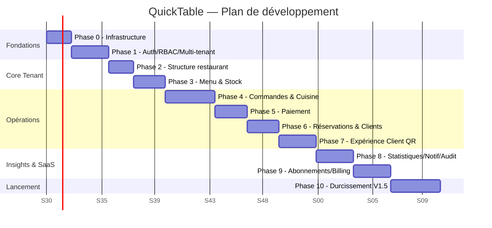

# 15. Plan de développement

Hypothèse de dimensionnement : équipe de 2 à 4 développeurs fullstack + 1 designer produit à temps partiel. Les durées sont exprimées en semaines-équipe et à ajuster selon la taille réelle de l'équipe engagée. Chaque phase se clôt par une **revue de sortie de phase** (démo + vérification de la checklist correspondante, doc 16).

**Mise à jour suite à la revue d'architecture (doc 19)** : ce document reste la référence du **séquencement calendaire** (durées, dépendances entre phases). Le contenu fonctionnel détaillé de chaque phase — désormais appelée **Epic** — est décrit au niveau Feature/User Story/Tâche dans le doc 34 (Backlog), et le périmètre produit de chaque regroupement de phases est cadré par le doc 32 (MVP/V1/V1.5/V2/V3). Les Phases 0 à 5 correspondent au périmètre **MVP** (doc 32 §32.2), les Phases 6 à 9 à la **V1** (doc 32 §32.3), la Phase 10 à la **V1.5** (doc 32 §32.4). Deux phases supplémentaires (11 et 12) sont ajoutées en fin de document pour couvrir V2 et V3, absentes de la version initiale de cette roadmap (doc 19 §19.11-14).

## Phase 0 — Fondations & Infrastructure

- **Objectifs** : mettre en place le monorepo, la CI/CD, les environnements, et tout le socle technique transverse avant d'écrire la moindre fonctionnalité métier.
- **Dépendances** : aucune.
- **Livrables** :
  - Monorepo (doc 03), workspaces configurés.
  - CI GitHub Actions (lint, test, build) sur chaque PR.
  - Déploiement automatique `apps/web` → Vercel (preview + prod), `apps/api` → Railway (staging + prod).
  - MongoDB Atlas provisionné (dev/staging/prod), Redis provisionné.
  - `config/env.ts` avec validation Zod, gestion des secrets.
  - ESLint/Prettier/Husky/Commitlint opérationnels (doc 14).
  - Logger structuré + `correlationId` middleware (doc 12).
  - Squelette des modules (doc 03) avec un module "Hello World" traversant toutes les couches pour valider le pattern.
- **Durée estimée** : 2 semaines.

## Phase 1 — Authentification, RBAC & Multi-tenant (socle sécurité)

- **Objectifs** : livrer le socle sans lequel aucun autre module ne peut être développé en confiance : identité, tenant, permissions.
- **Dépendances** : Phase 0.
- **Livrables** :
  - Modules `users`, `memberships`, `auth` (login, refresh, logout, reset password) — doc 07.
  - Middleware Tenant Resolver + 3 lignes de défense multi-tenant (doc 06).
  - Module `rbac` + matrice de permissions (doc 08), middleware associé.
  - Module `restaurants` (CRUD minimal, provisioning de tenant, doc 06 §6.7).
  - 2FA (TOTP) pour `restaurant_owner`.
  - Suite de tests d'isolation multi-tenant et de permissions RBAC (doc 14.6) — **bloquante pour la suite**.
- **Durée estimée** : 3 semaines.

## Phase 2 — Structure du restaurant

- **Objectifs** : permettre à un restaurant de configurer son espace physique et son équipe.
- **Dépendances** : Phase 1.
- **Livrables** :
  - Modules `employees`, `rooms`, `tables` (doc 04, 05, 09).
  - Génération de QR Code par table (module `qrcode`, sans encore le front public).
  - Écrans back-office correspondants (doc 11).
- **Durée estimée** : 2 semaines.

## Phase 3 — Menu & Stock (base)

- **Objectifs** : permettre la constitution du catalogue et un suivi de stock simple — sorti explicitement du statut "à venir" du cahier des charges (doc 01 §1.7 recommandation n°2).
- **Dépendances** : Phase 2 (restaurant existant).
- **Livrables** :
  - Modules `categories`, `menus`, `uploads` (intégration Firebase Storage).
  - Module `stock` version simple (ingrédients, seuils, mouvements manuels).
  - Écrans de gestion de menu avec upload photo.
- **Durée estimée** : 2,5 semaines.

## Phase 4 — Commandes & Cuisine (cœur transactionnel + temps réel)

- **Objectifs** : livrer le flux central du produit — c'est la phase la plus critique et la plus testée.
- **Dépendances** : Phases 2 et 3.
- **Livrables** :
  - Module `orders` complet (machine à état formalisée, doc 21 §21.1, avec opérations atomiques ciblées sur `items[]` plutôt qu'un verrouillage document-entier, doc 05 §5.8, doc 19 §19.4).
  - Module `kitchen` + Kitchen Display System (doc 03 layout dédié).
  - Architecture Socket.IO complète (Gateway, rooms, adaptateur Redis, doc 10) — première mise en production de la brique temps réel.
  - Décrément automatique de stock à l'envoi en cuisine, en couplage **synchrone** volontairement conservé hors Event Bus (doc 20 §20.5).
  - Premiers Domain Events du catalogue (doc 20 §20.4) publiés en mode simplifié (EventEmitter in-process sans Outbox — l'Outbox complet arrive en Phase 10, doc 34 §34.12).
  - Tests de charge ciblés sur le scénario "rush du samedi soir" (doc 01 risque, doc 31 §31.4).
- **Durée estimée** : 4 semaines.

## Phase 5 — Paiement

- **Objectifs** : permettre l'encaissement réel, avec intégration d'un prestataire tiers.
- **Dépendances** : Phase 4.
- **Livrables** :
  - Module `payments`, intégration prestataire (Stripe et/ou agrégateur Mobile Money, doc 01 §1.7 recommandation n°3).
  - Génération de reçu (worker asynchrone, doc 12 §12.5).
  - Gestion basique des remboursements.
  - Revue de sécurité dédiée (doc 13 §13.6) avant mise en production — aucune donnée de carte stockée, vérifié explicitement.
- **Durée estimée** : 2,5 semaines.

## Phase 6 — Réservations & Clients

- **Objectifs** : compléter le cycle de vie client au-delà de la commande sur place.
- **Dépendances** : Phase 2 (tables), Phase 1 (customers liés ou anonymes).
- **Livrables** :
  - Modules `reservations`, `customers` (doc 04/05/09).
  - Détection de conflit de créneau, notifications de rappel (cron, doc 12 §12.6).
  - Historique client (commandes, dépenses, réservations, fidélité basique).
- **Durée estimée** : 2,5 semaines.

## Phase 7 — Expérience Client (QR Code)

- **Objectifs** : livrer l'interface publique — la fonctionnalité la plus visible commercialement (différenciateur produit du cahier des charges).
- **Dépendances** : Phases 4, 5, 6.
- **Livrables** :
  - Namespace public `/public/qr/*` (doc 09 §9.20), middleware `publicTenant` (doc 06).
  - Front client dédié (`layouts/CustomerLayout.vue`, `pages/customer-app/*`, doc 03/11).
  - Appel serveur, demande d'addition, commande client (si activée), avis (modérés).
  - Rate limiting renforcé spécifique (doc 13 §13.8).
- **Durée estimée** : 3 semaines.

## Phase 8 — Statistiques, Notifications, Audit

- **Objectifs** : donner de la visibilité au gérant et boucler les exigences de traçabilité.
- **Dépendances** : Phases 4, 5, 6 (données à agréger).
- **Livrables** :
  - Module `statistics` + worker d'agrégation (`dailyStatistics`, doc 05/12/18).
  - Dashboard temps réel (doc 10 événement `dashboard:stats_updated`).
  - Module `notifications` complet (préférences, in-app, email).
  - Module `audit-logs` exposé en lecture (doc 09 §9.18).
- **Durée estimée** : 3 semaines.

## Phase 9 — SaaS : Abonnements, Facturation, Administration plateforme

- **Objectifs** : rendre QuickTable opérable commercialement en tant que produit SaaS auto-portant.
- **Dépendances** : Phase 1 (tenant), toutes les phases précédentes pour le feature gating.
- **Livrables** :
  - Modules `subscriptions`, `billing` (doc 04/05/09), feature gating complet activé sur toutes les routes concernées (doc 08 §8.6).
  - Module `platform-admin` (back-office Super Admin, doc 09 §9.3).
  - Cron `subscription-expiry` (doc 12 §12.6), suspension automatique.
  - Écrans self-service d'upgrade de plan.
- **Durée estimée** : 3 semaines.

## Phase 10 — Durcissement, Performance, Préparation au lancement

- **Objectifs** : passer d'un produit fonctionnellement complet à un produit commercialement fiable.
- **Dépendances** : toutes les phases précédentes.
- **Livrables** :
  - Revue de sécurité complète (checklist doc 13, pentest externe recommandé) + Secrets Management outillé (doc 13 §13.8bis).
  - Tests de charge globaux (multi-tenant simultané, doc 18, doc 31 §31.4).
  - Migration de l'Event Bus vers le pattern Transactional Outbox complet en production (doc 20 §20.3).
  - Mise en place de l'observabilité complète (logging, metrics, tracing, health checks, alerting — doc 25).
  - Généralisation du cache Redis (doc 26) et de la pagination cursor sur les listes à fort volume (doc 27 §27.5).
  - Séparation Audit Technique / Audit Métier effective (doc 24).
  - Conformité RGPD de base : export et anonymisation des données client (doc 23 §23.6).
  - Documentation utilisateur (manuel, doc 17) et documentation technique finalisée, dossier ADR à jour (doc 17 §17.3, `adr/`).
  - Plan de sauvegarde/restauration testé (doc 18).
  - Recette fonctionnelle complète (doc 16).
- **Durée estimée** : 4 semaines (allongée de 3 à 4 semaines suite à la revue, pour absorber l'Outbox et l'observabilité complète — doc 19).

## Phase 11 — V2 : Parité fonctionnelle marché (doc 32 §32.5, doc 33 §33.3)

- **Objectifs** : combler les écarts identifiés par la comparaison concurrentielle (doc 33) qui bloquent la vente sur une partie du marché.
- **Dépendances** : Phase 10 (produit durci et observé en production).
- **Livrables** : split bill, gestion des pourboires, impression ticket ESC/POS, TVA multi-taux + export comptable, API publique + Webhooks (plan Premium), mode offline, fidélité structurée, promotions/coupons (doc 34 §34.13).
- **Durée estimée** : 8-10 semaines (découpage fin à réaliser en début de phase avec le Product Owner, doc 32 §32.8).

## Phase 12 — V3 : Différenciation (doc 32 §32.6)

- **Objectifs** : dépasser la parité, exploiter les atouts structurels de l'architecture (multi-tenant natif, event-driven, doc 18 §18.9).
- **Dépendances** : Phase 11, retours clients V2 en production.
- **Livrables** : multi-langue/multi-devise, marketplace d'intégrations, app mobile native serveur, silo Enterprise, IA prévisionnelle, trajectoire SOC 2 (doc 34 §34.14).
- **Durée estimée** : non chiffrée à ce stade — dépend des priorités business à l'issue de la V2.

## Vue Gantt simplifiée (MVP → V1.5)

**Durée totale indicative (MVP → V1.5)** : ~30 semaines (≈ 7 mois et demi) pour une équipe de 2-4 développeurs, du démarrage de la Phase 0 à un produit V1.5 durci et observé en production. Les phases 4 et 7 restent les plus à risque de dépassement (doc 01 §1.6 complexités techniques). Les Phases 11 (V2) et 12 (V3) ne sont pas chiffrées dans ce Gantt : leur contenu dépend des retours du marché après le lancement V1/V1.5 et doit être re-planifié à ce moment (doc 32 §32.8).
