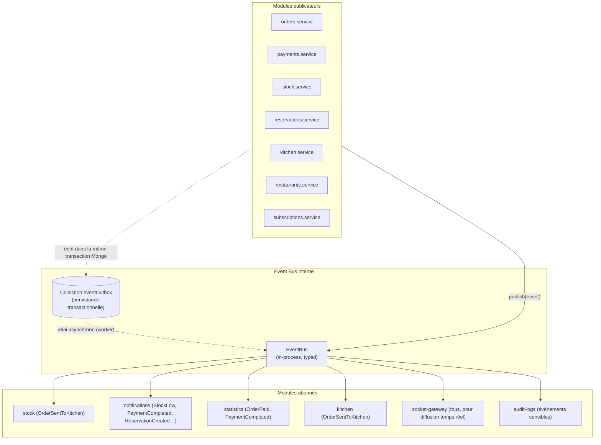

# 20. Architecture Event-Driven & Event Bus interne

## 20.1 Pourquoi (issu de la revue, doc 19 §19.2/§19.9)

Le Modular Monolith (doc 02) réduit le couplage par les frontières de module (doc 04), mais tant que les modules communiquent par **appel direct de service**, un changement dans `stock` peut casser silencieusement `orders` s'il appelle une méthode dont la signature change. L'Event Bus introduit un **découplage temporel et structurel** : un module publie un fait du passé ("ceci est arrivé"), sans savoir qui écoute ni ce qu'ils en font. C'est aussi la brique qui rapproche le plus, à coût quasi nul aujourd'hui, une future extraction en microservices (doc 18 §18.6).

## 20.2 Principe : Domain Event

Un **Domain Event** est un fait immuable, au passé, représentant un changement d'état métier significatif — distinct des événements Socket.IO (doc 10) qui sont des **notifications transport/UI**. Un Domain Event peut déclencher zéro, un ou plusieurs événements Socket.IO, mais l'inverse n'est jamais vrai (Socket.IO ne doit jamais être la source d'un traitement métier, doc 10 §10.7 renforcé ici).

**Structure standard d'un Domain Event** :
```json
{
  "eventId": "uuid",
  "eventType": "OrderCreated",
  "occurredAt": "2026-07-11T20:14:03.000Z",
  "tenantId": "…",
  "aggregateId": "…",
  "aggregateType": "Order",
  "payload": { },
  "metadata": { "correlationId": "…", "actorId": "…", "version": 1 }
}
```

## 20.3 Event Bus interne — architecture



### Le pattern Transactional Outbox

Publier un événement en mémoire (simple `EventEmitter` Node) est fragile : si le process crashe entre l'écriture MongoDB et la publication de l'événement, l'événement est perdu (ex. le stock est décrémenté mais `notifications` n'apprend jamais l'alerte de rupture). QuickTable adopte le **pattern Outbox** :
1. Le service écrit son changement d'état **et** un document dans `eventOutbox` **dans la même transaction MongoDB** (doc 05 §5.8).
2. Un worker dédié (`workers/outbox-relay.worker.ts`) lit `eventOutbox` (poll léger ou MongoDB Change Streams sur cette collection) et publie réellement l'événement sur l'`EventBus` in-process, puis marque le document comme `publishedAt`.
3. Les abonnés en cas d'échec de traitement retentent (à la charge de chaque handler, avec idempotence — un handler qui reçoit deux fois `OrderPaid` ne doit pas créditer deux fois les points de fidélité).

Ce pattern rend l'Event Bus fiable **sans introduire de message broker externe** dès le MVP (KISS, doc 14) — le passage à un vrai broker (RabbitMQ, Kafka, ou BullMQ comme bus événementiel) en cas de montée en charge (doc 18) ne change que l'implémentation d'`EventBus.publish()`, jamais les publishers/subscribers.

## 20.4 Catalogue des Domain Events

| Event | Émis par (Aggregate) | Payload clé | Abonnés |
|---|---|---|---|
| `RestaurantCreated` | Restaurant | `tenantId, ownerUserId, planCode` | notifications (email bienvenue), audit-logs |
| `RestaurantSuspended` | Restaurant | `tenantId, reason` | notifications, socket-gateway (`platform:tenant_suspended`) |
| `EmployeeInvited` | Membership | `tenantId, userId, role` | notifications (email invitation) |
| `EmployeeRoleChanged` | Membership | `tenantId, userId, oldRole, newRole` | auth (invalidation `permissionsVersion`, doc 07), audit-logs |
| `TableStatusChanged` | Table | `tenantId, tableId, status` | socket-gateway |
| `MenuItemAvailabilityChanged` | MenuItem | `tenantId, menuItemId, isAvailable` | socket-gateway, cache (doc 26, invalidation) |
| `StockLevelLow` | Ingredient | `tenantId, ingredientId, quantityInStock` | notifications, socket-gateway |
| `OrderCreated` | Order | `tenantId, orderId, tableId, source` | statistics, socket-gateway |
| `OrderSentToKitchen` | Order | `tenantId, orderId, items[]` | kitchen, stock (décrément — **exception synchrone**, voir §20.5), socket-gateway |
| `OrderItemStatusChanged` | Order | `tenantId, orderId, itemId, status` | socket-gateway |
| `OrderStatusChanged` | Order | `tenantId, orderId, status` | statistics, socket-gateway |
| `OrderCancelled` | Order | `tenantId, orderId, reason` | stock (réintégration éventuelle), socket-gateway, audit-logs |
| `PaymentCompleted` | Payment | `tenantId, paymentId, orderId, amount, method` | orders (transition `paid`), statistics, customers (fidélité), socket-gateway, audit-logs |
| `PaymentRefunded` | Payment | `tenantId, paymentId, amount` | statistics, audit-logs |
| `ReservationCreated` | Reservation | `tenantId, reservationId, dateTime` | notifications, socket-gateway |
| `ReservationCancelled` | Reservation | `tenantId, reservationId` | notifications |
| `ReservationNoShow` | Reservation | `tenantId, reservationId, customerId` | customers (historique) |
| `CustomerCalledWaiter` | Table (public) | `tenantId, tableId` | socket-gateway |
| `CustomerRequestedBill` | Table (public) | `tenantId, tableId, orderId` | socket-gateway |
| `ReviewSubmitted` | Review | `tenantId, reviewId, rating` | notifications (modération) |
| `SubscriptionRenewed` | Subscription | `tenantId, planId, periodEnd` | billing, notifications |
| `SubscriptionCancelled` | Subscription | `tenantId` | billing, notifications, restaurants (planification suspension) |
| `SubscriptionPaymentFailed` | Subscription | `tenantId, invoiceId` | billing (dunning), notifications |

## 20.5 Cas particuliers : quand NE PAS utiliser l'Event Bus

Le comité d'architecture (doc 19 §19.9) fixe une règle explicite : l'événementiel est adopté **par défaut** pour tout couplage inter-module qui tolère une latence de quelques centaines de millisecondes à quelques secondes et qui n'a pas besoin d'un résultat synchrone. Deux exceptions documentées restent des **appels directs de service** :

1. **`orders → stock` au moment de l'envoi en cuisine** : la disponibilité du stock doit être vérifiée et décrémentée de façon **synchrone et bloquante** (règle métier `422 INSUFFICIENT_STOCK`, doc 09 §9.10) — un événement asynchrone créerait une fenêtre où une commande est acceptée puis invalidée après coup, dégradant l'expérience serveur/client. Le décrément est fait par appel direct dans la même transaction MongoDB que la création de la commande (doc 05 §5.8).
2. **`rbac → subscriptions` (feature gating, doc 08 §8.6)** : la vérification doit être synchrone car elle conditionne directement l'autorisation d'une requête HTTP en cours.

Cette distinction (synchrone quand le résultat conditionne la réponse HTTP immédiate ; événementiel dès que c'est un effet de bord) est la règle de décision à appliquer pour tout nouveau couplage futur.

## 20.6 Relation avec Socket.IO (doc 10)

Le module `socket-gateway` est **un abonné de l'Event Bus comme un autre** — il traduit certains Domain Events en événements Socket.IO diffusés aux rooms concernées (doc 10 §10.4). Cette indirection (Domain Event → traduction → événement transport) permet de changer le protocole temps réel sans toucher aux services métier (cohérent avec le principe retenu en doc 19 §19.5).

## 20.7 Idempotence des handlers

Chaque abonné doit être **idempotent** : le pattern Outbox garantit "au moins une fois" (at-least-once delivery), pas "exactement une fois". Convention : chaque handler vérifie, avant d'agir, si l'effet a déjà été appliqué (ex. `statistics` vérifie que `dailyStatistics` n'a pas déjà intégré cet `eventId` via une collection `processedEvents{eventId, handler}` avec index unique `{eventId, handler}`).

## 20.8 Tests

Voir doc 31 (Architecture des tests) §31.5 : chaque Domain Event doit avoir un test qui vérifie (a) qu'il est bien publié dans l'Outbox à l'occasion attendue, (b) que chaque abonné réagit correctement, (c) qu'un handler rejoué deux fois reste idempotent.
