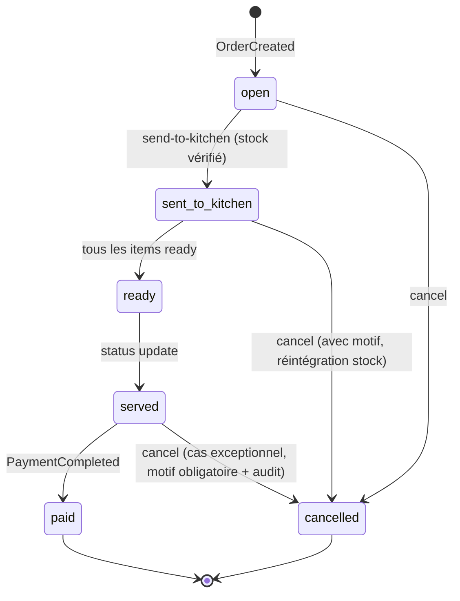
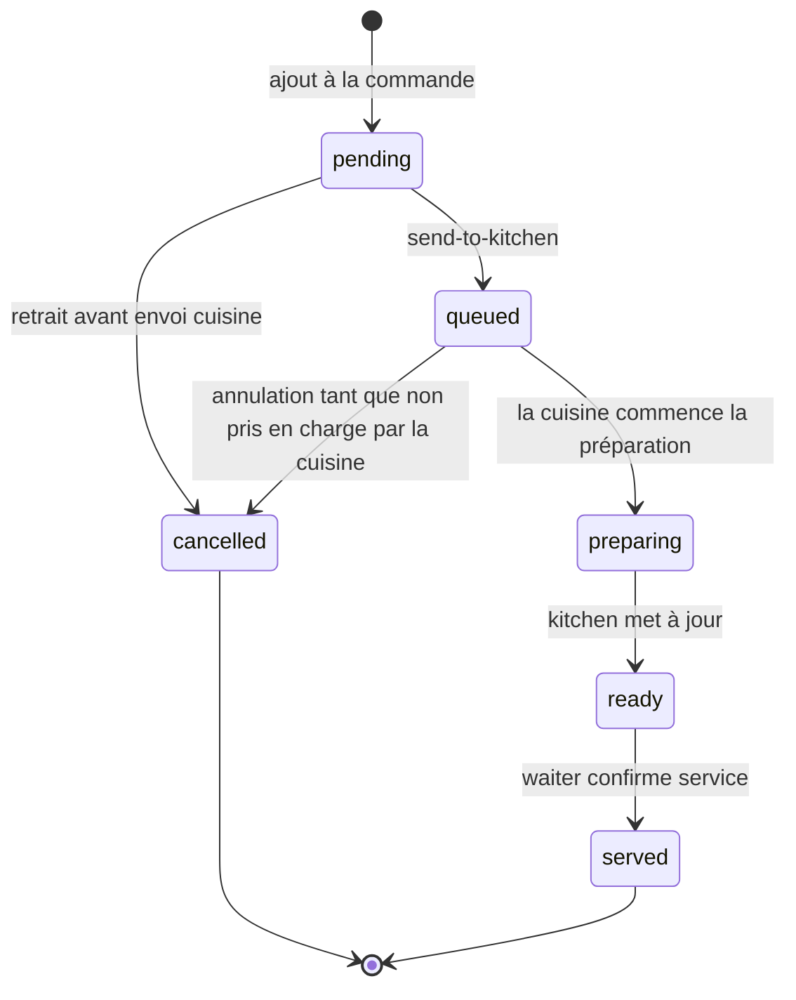
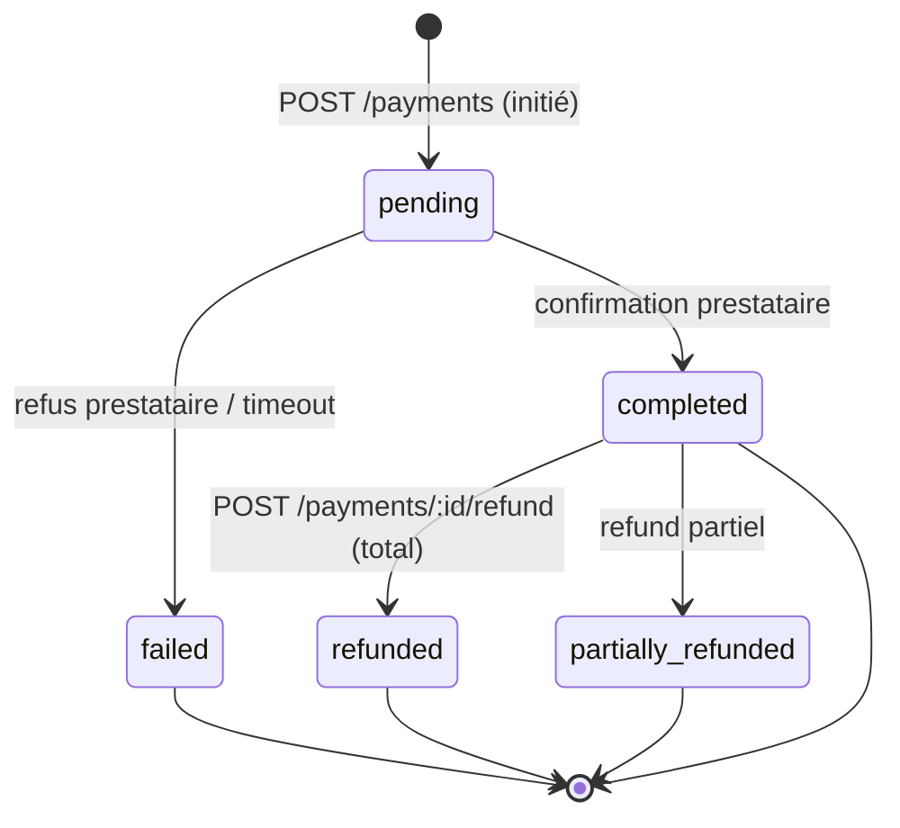
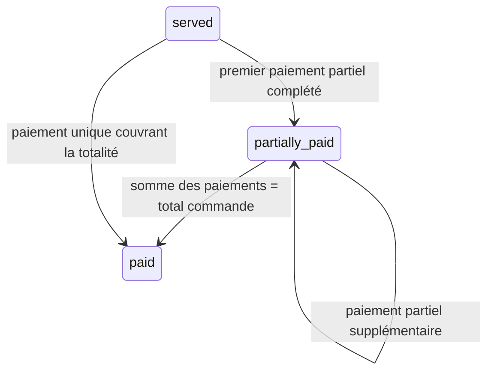
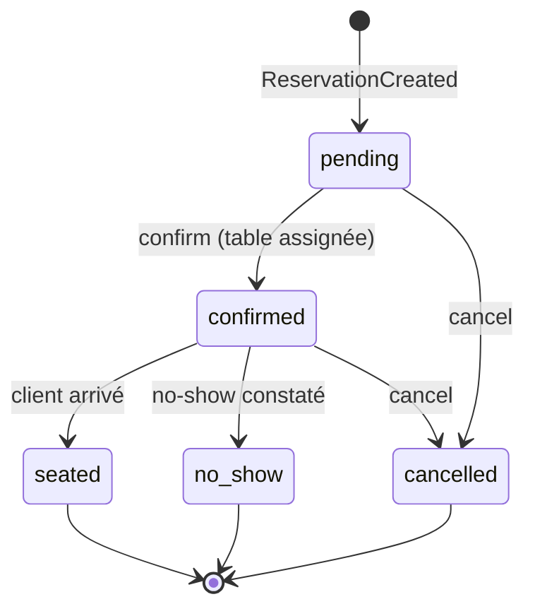
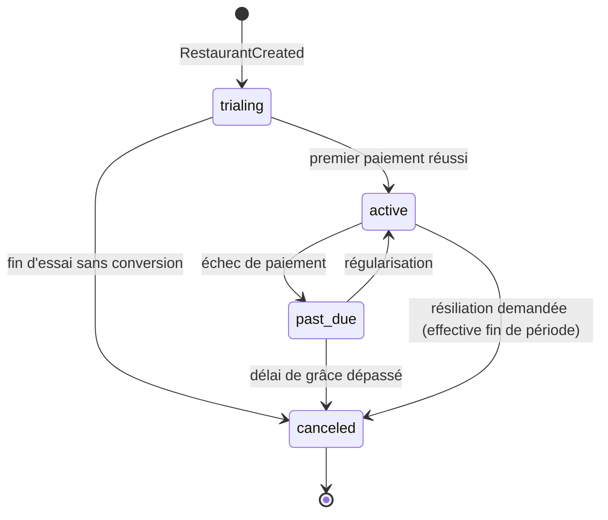
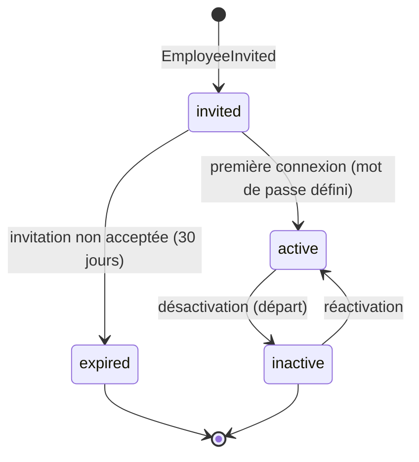
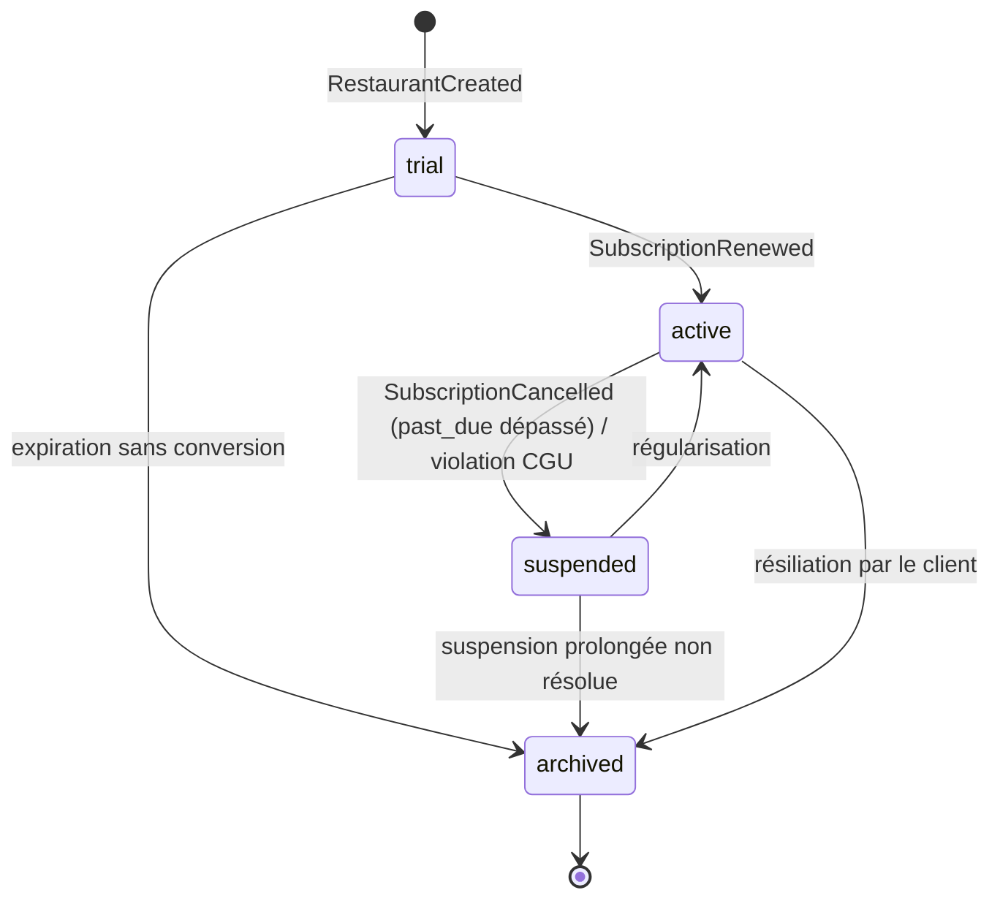
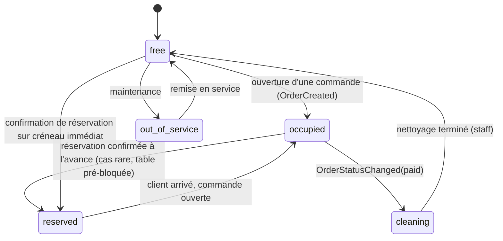

# 21. State Machines

Toute entité à cycle de vie est modélisée explicitement, avec ses transitions autorisées, l'acteur autorisé à déclencher chaque transition, et le Domain Event publié (doc 20). Une transition non listée est **interdite** et rejetée avec `409 INVALID_STATUS_TRANSITION` (doc 09 §9.1).

## 21.1 Order (Commande)

| Transition | Déclencheur | Rôle autorisé | Garde | Event publié |
|---|---|---|---|---|
| `[*] → open` | `POST /orders` | waiter, manager, owner, public (QR si activé) | table libre ou commande à emporter | `OrderCreated` |
| `open → sent_to_kitchen` | `POST /orders/:id/send-to-kitchen` | waiter, manager, owner | stock suffisant (sinon `422`) | `OrderSentToKitchen` |
| `open → cancelled` | `POST /orders/:id/cancel` | waiter (si owner de la commande), manager, owner | — | `OrderCancelled` |
| `sent_to_kitchen → ready` | Agrégation automatique quand `items[].status = ready` pour tous | Système (déclenché par `kitchen`) | tous les items non annulés sont `ready` | `OrderStatusChanged` |
| `sent_to_kitchen → cancelled` | `POST /orders/:id/cancel` | manager, owner (waiter avec `permissionsOverrides`) | motif requis | `OrderCancelled` |
| `ready → served` | `PATCH /orders/:id/status` | waiter, manager, owner | — | `OrderStatusChanged` |
| `served → paid` | Automatique sur `PaymentCompleted` | Système | montant du paiement = total commande | `OrderStatusChanged` |
| `served → cancelled` | `POST /orders/:id/cancel` | manager, owner uniquement | motif obligatoire, entrée audit métier (doc 24) | `OrderCancelled` |

**Sous-machine `items[].status`** (doc 19 §19.4 — opérations atomiques ciblées, pas de verrou document entier) — **corrigée suite au cadrage Product Owner du 2026-07-13** : un plat reste annulable après envoi en cuisine tant que la cuisine n'a pas commencé sa préparation. L'état intermédiaire `preparing` ne se déclenche donc plus automatiquement à `send-to-kitchen`, mais uniquement lorsque la cuisine marque explicitement le plat comme pris en charge :

| Transition | Déclencheur | Rôle autorisé | Garde |
|---|---|---|---|
| `pending → cancelled` | `DELETE /orders/:id/items/:itemId` | waiter, manager, owner | Article pas encore envoyé en cuisine |
| `pending → queued` | `POST /orders/:id/send-to-kitchen` | waiter, manager, owner | Stock vérifié (doc 20 §20.5) |
| `queued → cancelled` | `POST /orders/:id/items/:itemId/cancel` (nouveau, doc 09 amendement) | waiter, manager, owner | **Statut strictement `queued`** — refusé (`409 ITEM_ALREADY_IN_PREPARATION`) dès que la cuisine est passée à `preparing`. Réintègre le stock décrémenté (`StockLevelLow`/mouvement `adjustment`, doc 20). |
| `queued → preparing` | `PATCH /kitchen/tickets/:orderId/items/:itemId/status` | kitchen | Action explicite du cuisinier — ne se déclenche jamais automatiquement à l'envoi |
| `preparing → ready` | idem | kitchen | — |
| `ready → served` | `PATCH /orders/:id/status` (niveau article) | waiter, manager, owner | — |

Ce correctif remplace la version initiale de cette section (qui faisait passer un article directement de `pending` à `preparing` lors de l'envoi en cuisine, sans fenêtre d'annulation possible) — amendement tracé dans le rapport de revue (doc 99bis, mise à jour) et répercuté dans le schéma `orders.items[].status` (doc 05 §5.5, enum étendu à `pending, queued, preparing, ready, served, cancelled`) et dans le catalogue d'événements (doc 20 §20.4, nouvel événement `OrderItemCancelled`).

## 21.2 Payment (Paiement)

| Transition | Déclencheur | Garde | Event publié |
|---|---|---|---|
| `[*] → pending` | `POST /payments` | header `Idempotency-Key` requis | — |
| `pending → completed` | Callback/réponse synchrone prestataire | montant = `order.total` | `PaymentCompleted` |
| `pending → failed` | Callback prestataire négatif | — | — (log technique, pas de Domain Event métier) |
| `completed → refunded` | `POST /payments/:id/refund` | rôle `payments:refund`, montant = montant payé | `PaymentRefunded` |
| `completed → partially_refunded` | `POST /payments/:id/refund` avec montant partiel | montant < montant payé | `PaymentRefunded` |

Un paiement `failed` n'est **jamais retenté automatiquement** sur le même `Idempotency-Key` — un nouveau paiement (`pending`) doit être initié explicitement, pour ne jamais masquer un échec à l'utilisateur.

### Split Bill et pourboires (ajouté suite au cadrage Product Owner du 2026-07-13, confirmé en scope MVP)

Une commande peut être réglée par **plusieurs paiements** plutôt qu'un seul — `payments.orderId` n'a jamais été contraint à l'unicité (doc 05 §5.5), ce qui rend le split bill possible sans changement de schéma sur `payments`. Deux modes :

- **Split égal** : le montant total est divisé par le nombre de convives (`splitCount`), chaque paiement porte `amount = total / splitCount` (arrondi au dernier paiement pour absorber les centimes résiduels).
- **Split par article** : chaque paiement porte `coveredItemIds: ObjectId[]` référençant les `items[]` de la commande qu'il couvre — la somme des articles couverts par l'ensemble des paiements d'une commande doit égaler l'intégralité de `items[]` avant que la commande puisse passer à `paid`.

**Amendement à la state machine `Order`** (§21.1) : un état intermédiaire est ajouté pour représenter un règlement partiel :

`orders.amountPaid` (nouveau champ, doc 05 §5.5 amendement) est incrémenté atomiquement (`$inc`) à chaque `PaymentCompleted` — la transition `partially_paid → paid` se déclenche quand `amountPaid >= total`, jamais par un calcul recalculé à la volée sur l'ensemble des paiements (évite une requête d'agrégation sur le chemin critique du paiement, cohérent avec doc 29 §29.2).

**Pourboires** : `payments.tipAmount` existait déjà dans le schéma initial (doc 05 §5.5) — confirmé en usage dès le MVP. Le pourboire n'entre **pas** dans le calcul de `amountPaid`/`total` de la commande (qui reste le prix des articles + taxes) : il est comptabilisé séparément dans les statistiques (`dailyStatistics.tipsTotal`, amendement doc 05 §5.6) et peut être crédité à un serveur nommément désigné (`payments.tipRecipientId`, nouveau champ optionnel → `users`) pour un usage futur de répartition des pourboires (hors scope MVP, simple champ de traçabilité pour l'instant).

## 21.3 Reservation (Réservation)

| Transition | Déclencheur | Rôle | Event publié |
|---|---|---|---|
| `[*] → pending` | `POST /reservations` | staff, ou public si activé | `ReservationCreated` |
| `pending → confirmed` | `PATCH /reservations/:id/confirm` | manager, owner (waiter avec override) | — |
| `pending/confirmed → cancelled` | `POST /reservations/:id/cancel` | staff habilité, ou client (si lien de gestion envoyé) | `ReservationCancelled` |
| `confirmed → seated` | Mise à jour manuelle ou automatique à l'ouverture d'une commande liée | staff | — |
| `confirmed → no_show` | `PATCH /reservations/:id/no-show` | manager, owner | `ReservationNoShow` |

## 21.4 Subscription (Abonnement SaaS)

| Transition | Déclencheur | Event publié |
|---|---|---|
| `[*] → trialing` | Provisioning tenant (doc 06 §6.7) | `RestaurantCreated` |
| `trialing → active` | Paiement de facturation SaaS réussi | `SubscriptionRenewed` |
| `trialing → canceled` | Cron `subscription-expiry` (doc 12 §12.6), fin d'essai | `SubscriptionCancelled` |
| `active → past_due` | Échec du prélèvement récurrent | `SubscriptionPaymentFailed` |
| `past_due → active` | Nouveau moyen de paiement validé | `SubscriptionRenewed` |
| `past_due → canceled` | Délai de grâce dépassé (ex. 14 jours) | `SubscriptionCancelled` → `RestaurantSuspended` |
| `active → canceled` | `POST /subscriptions/me/cancel` | `SubscriptionCancelled` |

Ce state machine est le pendant du cycle de vie du tenant (doc 06 §6.7, `trial/active/suspended/archived`) — **les deux ne sont pas la même machine** : `subscriptions.status` reflète la relation contractuelle/facturation, `restaurants.status` reflète l'accès effectif à la plateforme. Une transition `past_due → canceled` **déclenche** (via l'Event Bus, doc 20) la transition de `restaurants.status` vers `suspended`, mais elles restent deux agrégats distincts (voir doc 28, DDD).

## 21.5 Employee / Membership

| Transition | Déclencheur | Event publié |
|---|---|---|
| `[*] → invited` | `POST /employees` | `EmployeeInvited` |
| `invited → active` | Activation du compte par l'employé | — |
| `invited → expired` | Cron de nettoyage (30 jours sans activation) | — |
| `active → inactive` | `DELETE /employees/:id` | `EmployeeRoleChanged` (à `null`) — révocation immédiate des sessions (doc 07 §7.7) |
| `inactive → active` | `PATCH /employees/:id` (réactivation) | `EmployeeInvited` (nouvelle invitation si mot de passe à redéfinir) |

## 21.6 Restaurant (Tenant)

Voir doc 06 §6.7 pour le diagramme complet (`trial → active → suspended → archived`), inchangé par cette revue — repris ici pour centraliser la vue d'ensemble des machines à état :

## 21.7 Table

Cette machine est **dérivée** d'événements d'autres agrégats (`Order`, `Reservation`) plus que pilotée par des actions directes de l'utilisateur sur la table elle-même — cohérent avec le statut de `TableStatusChanged` comme événement largement automatique (doc 20 §20.4).

## 21.8 Principe transverse

Chaque state machine est implémentée dans le **service** de son module (jamais dans le controller ni dans un hook Mongoose, doc 12 §12.2), sous la forme d'une fonction pure `canTransition(from, to, context): boolean` testée unitairement pour chaque paire de statuts, y compris les paires **interdites** (doc 31 §31.2 exige un test négatif par transition interdite, pas seulement les transitions valides).
