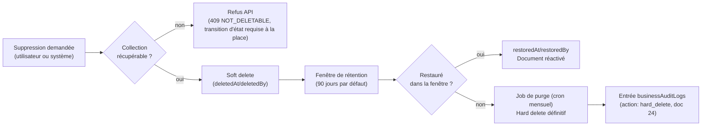

# 23. Politique globale de Soft Delete

## 23.1 Constat de la revue (doc 19 §19.11-3)

Le plugin Mongoose `softDelete` (doc 12 §12.7) posait `deletedAt` mais restait incomplet : pas de traçabilité de *qui* a supprimé/restauré, pas de politique homogène de purge définitive, pas de distinction entre collections qui doivent être récupérables et celles qui ne le doivent jamais être (ex. `refreshTokens`, `businessAuditLogs`).

## 23.2 Champs standard (plugin `softDelete` v2)

| Champ | Type | Description |
|---|---|---|
| `deletedAt` | Date \| null | Horodatage de suppression logique |
| `deletedBy` | ObjectId \| null → `users` | Acteur ayant supprimé (`null` si suppression système, ex. cron d'expiration) |
| `deletionReason` | string \| null | Motif optionnel (obligatoire pour `employees`, `restaurants`) |
| `restoredAt` | Date \| null | Horodatage de restauration, le cas échéant |
| `restoredBy` | ObjectId \| null → `users` | Acteur ayant restauré |

Toute requête standard (`find`, `findOne` via `BaseRepository`, doc 12 §12.2) filtre implicitement `deletedAt: null`. L'accès aux enregistrements supprimés exige un appel explicite `withDeleted()` — jamais un oubli de filtre par défaut (protection symétrique à celle du `tenantId`, doc 06 §6.4).

## 23.3 Classification des collections

| Classe | Comportement | Collections concernées |
|---|---|---|
| **Récupérable** (soft delete + restauration possible) | `deletedAt`/`deletedBy`/`restoredAt`/`restoredBy`, purge différée | `restaurants`, `employees` (memberships), `rooms`, `tables`, `categories`, `menuItems`, `customers`, `reservations` |
| **Append-only, jamais supprimable** | Aucune suppression possible, ni logique ni physique, hors purge légale programmée | `businessAuditLogs` (doc 24), `stockMovements`, `orders` (une commande n'est jamais supprimée, seulement `cancelled`, doc 21), `payments` |
| **Expiration technique (TTL natif Mongo)** | Purge automatique par MongoDB, pas de notion de restauration | `refreshTokens` (doc 05), `notifications` (TTL 90j) |
| **Suppression physique immédiate autorisée** | Pas de valeur légale/historique | `eventOutbox` une fois publié + traité (doc 20), fichiers temporaires d'upload orphelins |

## 23.4 Politique d'archivage et de purge définitive (hard delete)

- **Fenêtre de rétention par défaut : 90 jours**, ajustable par catégorie légale (voir §23.6 RGPD). Pendant cette fenêtre, un document soft-deleted reste visible via `withDeleted()` pour les rôles habilités (`audit-logs:read` a minima).
- **Hard delete = suppression physique irréversible**, exécutée uniquement par un job planifié (`workers/hard-delete-purge.cron.ts`, doc 12 §12.6), jamais en synchrone sur une requête API — évite qu'une suppression accidentelle en cascade se produise dans le chemin critique.
- Toute opération de hard delete génère une entrée dans `businessAuditLogs` (doc 24) **avant** l'exécution effective (log-then-delete, pour ne jamais perdre la trace même si le process crashe pendant la purge).

## 23.5 Cas particulier : suppression d'un tenant (`restaurants`)

Le cycle de vie complet (`active → archived`, doc 06 §6.7, doc 21 §21.6) est plus long qu'un soft delete standard :
1. `archived` (soft delete du tenant, `deletedAt` posé) : toutes les données du tenant restent en base mais l'accès applicatif est bloqué (`403 TENANT_ARCHIVED` sur toute route hors export de données).
2. **Fenêtre de récupération étendue : 30 jours** (contractuelle, à confirmer avec le Product Owner, voir rapport final) — un tenant archivé par erreur ou qui change d'avis peut être restauré par un `super_admin`.
3. À l'issue de la fenêtre, un job de purge **en cascade contrôlée** supprime définitivement toutes les collections tenant-scoped de ce `tenantId` (ordre inverse du graphe de dépendances, doc 04 §4.5, pour respecter les contraintes de référence), **à l'exception** des `businessAuditLogs` et `invoices` (billing), conservés pour obligations légales/comptables (rétention distincte, voir doc 24 §24.4).

## 23.6 RGPD et droits de la personne concernée (gap comblé, doc 19 §19.11-16)

- **Droit à l'effacement (client final)** : un `customer` (doc 05) peut demander la suppression de ses données personnelles. Traitement : anonymisation plutôt que suppression physique des documents liés (`orders.customerId`, `payments`) qui doivent être conservés pour obligations comptables — remplacement de `fullName`/`phone`/`email` par des valeurs anonymisées (`"Client supprimé #<id>"`), conservation des montants/dates à des fins statistiques et légales. Documenté comme nouvel endpoint `DELETE /customers/:id/personal-data` (à ajouter au doc 09 lors de l'implémentation, référencé dans le backlog Epic "Conformité", doc 34).
- **Droit à la portabilité** : export JSON structuré des données personnelles d'un client sur demande (`GET /customers/:id/export`).
- Ce sujet est un **point à valider avec le Product Owner** avant développement (juridiction cible, obligations locales applicables — voir rapport final de cette revue) : le comportement exact (anonymisation vs suppression) dépend de la réglementation du marché de lancement.
