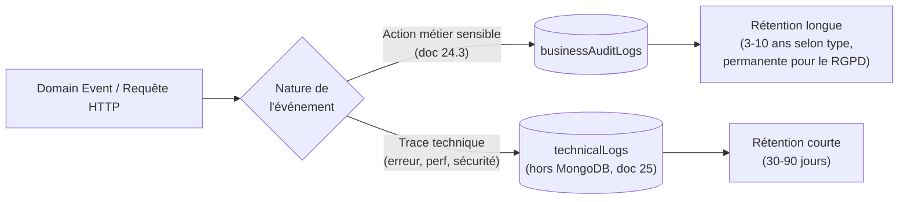

# 24. Audit — Technique vs Métier

## 24.1 Constat de la revue (doc 19 §19.11-4)

La collection unique `auditLogs` (doc 05/13) mélangeait deux publics et deux besoins de rétention différents :
- **Audit métier** : "qui a remboursé cette commande, qui a changé le rôle de cet employé" — consulté par le restaurateur/support client, rétention longue (obligations légales/comptables), jamais purgé automatiquement avant l'échéance légale.
- **Audit technique** : "quelle requête a échoué, quelle latence a eu cet appel prestataire de paiement" — consulté par l'équipe d'ingénierie pour le debug/l'observabilité, rétention courte (30-90 jours), volumétrie bien plus élevée (chaque requête peut potentiellement générer une trace).

Les fusionner dans une seule collection aurait fait grossir `auditLogs` avec du bruit technique, dégradant les performances des requêtes d'audit métier (doc 05 §5.7) et complexifiant la politique de rétention.

## 24.2 Séparation retenue

### `businessAuditLogs` (remplace `auditLogs`, doc 05 — renommage + précision de schéma)

| Champ | Type | Description |
|---|---|---|
| `_id` | ObjectId | |
| `tenantId` | ObjectId \| null | `null` pour actions plateforme |
| `actorId` | ObjectId → `users` | |
| `actorRole` | string | rôle au moment de l'action (dénormalisé, car le rôle peut changer après coup) |
| `action` | string | ex. `payment.refunded`, `employee.role_changed`, `restaurant.suspended` |
| `resource` / `resourceId` | string / ObjectId | |
| `before` / `after` | object \| null | diff métier (valeurs significatives, pas tous les champs techniques) |
| `reason` | string \| null | motif saisi par l'utilisateur si applicable (ex. annulation, remboursement) |
| `ip` | string | |
| `createdAt` | Date | |
| `expiresAt` | Date \| null | calculé à l'écriture = `createdAt` + durée de rétention de la catégorie de `action` (§24.4) ; `null` pour les catégories à rétention permanente (RGPD) |

- **Index** : `{ tenantId: 1, createdAt: -1 }`, `{ actorId: 1, createdAt: -1 }`, `{ action: 1, createdAt: -1 }`, index **TTL** sur `expiresAt` (`expireAfterSeconds: 0`) pour la purge automatique.
- **Append-only strict** (doc 23 §23.3), rétention **différenciée par catégorie** (§24.4, décidée avec le Product Owner le 2026-07-13) — de 3 à 10 ans selon la nature de l'action, portée par le champ `expiresAt` calculé au moment de l'écriture (un unique index TTL global n'aurait pas permis des durées différentes par catégorie sur une même collection).
- Alimentée par le plugin `auditable` (doc 12 §12.7) **restreint** aux actions listées en §24.3 (pas toute mutation Mongoose comme dans la version initiale — trop bruyant).

### Le "technical audit" n'est pas une collection MongoDB

Amendement important de cette revue : la demande de séparer "audit technique" ne signifie pas dupliquer une seconde collection Mongo à fort volume (mauvais choix de stockage pour des logs applicatifs à très haute cardinalité). Le **log technique structuré** (doc 12 §12.8, `correlationId`) est envoyé au pipeline d'observabilité (doc 25 — Grafana Cloud, décision Product Owner du 2026-07-13), **pas à MongoDB**. C'est une correction volontaire vis-à-vis de la demande initiale : stocker des millions d'entrées de debug dans le cluster transactionnel MongoDB Atlas dégraderait les performances et le coût du cluster qui sert le trafic client — un anti-pattern qu'un Staff Engineer Data (doc 19, comité) aurait signalé immédiatement.

## 24.3 Catalogue des actions couvertes par l'audit métier

| Domaine | Actions tracées |
|---|---|
| Identité & Accès | `user.login_failed` (après N échecs), `user.password_reset`, `user.2fa_disabled`, `employee.invited`, `employee.role_changed`, `employee.deactivated` |
| Restaurant & Plateforme | `restaurant.created`, `restaurant.suspended`, `restaurant.reactivated`, `restaurant.archived`, `settings.updated` |
| Commandes | `order.cancelled`, `order.item_cancelled_after_kitchen` |
| Paiement | `payment.completed`, `payment.refunded`, `payment.failed` (répété/suspect) |
| Stock | `stock.manual_adjustment` (mouvement de type `adjustment`, distinct des mouvements automatiques) |
| Abonnement/Facturation | `subscription.plan_changed`, `subscription.cancelled`, `invoice.payment_failed` |
| Données personnelles (RGPD, doc 23 §23.6) | `customer.personal_data_exported`, `customer.personal_data_anonymized` |
| Sécurité | `session.revoked_all`, `permission.override_granted` |

## 24.4 Rétention par catégorie (décidée avec le Product Owner le 2026-07-13)

Le marché de lancement prioritaire étant le Bénin (doc 35), la catégorie comptable/fiscale s'aligne sur l'**Acte uniforme OHADA relatif au droit comptable et à l'information financière (AUDCIF)**, dont le Bénin est État membre : conservation des pièces justificatives et documents comptables **10 ans**. Les catégories restantes, sans texte comptable applicable, sont regroupées sur une rétention par défaut **3 ans**, retenue comme compromis raisonnable entre besoin de support client et volumétrie de la collection.

| Catégorie | Rétention | Justification |
|---|---|---|
| Actions comptables/fiscales (`payment.*`, `invoice.*`) | **10 ans** (120 mois) | Art. 23 AUDCIF (OHADA) — conservation des pièces comptables, applicable au Bénin |
| Actions RH (`employee.*`) | 5 ans après désactivation | Litiges prud'homaux potentiels (variable selon juridiction — à réévaluer si expansion hors zone OHADA) |
| Actions de sécurité (`session.*`, `permission.*`) | **3 ans** (36 mois) | Rétention par défaut — enquête de sécurité a posteriori |
| Actions RGPD (`customer.personal_data_*`) | Permanente (`expiresAt: null`) | Preuve de conformité, démontrable en cas de contrôle |
| Autres actions métier | **3 ans** (36 mois) par défaut | Rétention par défaut — support client courant |

Cette classification reste une recommandation d'architecture alignée sur le droit comptable OHADA ; elle ne remplace pas une revue par un conseil juridique local si QuickTable est un jour amené à traiter des volumes ou des litiges significatifs.

## 24.5 Exposition

- `GET /audit-logs` (doc 09 §9.18) interroge désormais `businessAuditLogs`, filtrage inchangé côté API.
- Un futur portail "Trust & Compliance" (doc 18 §18.11) pourra exposer un export de `businessAuditLogs` par tenant à la demande, pour les clients Business/Premium ayant des obligations de conformité propres.
