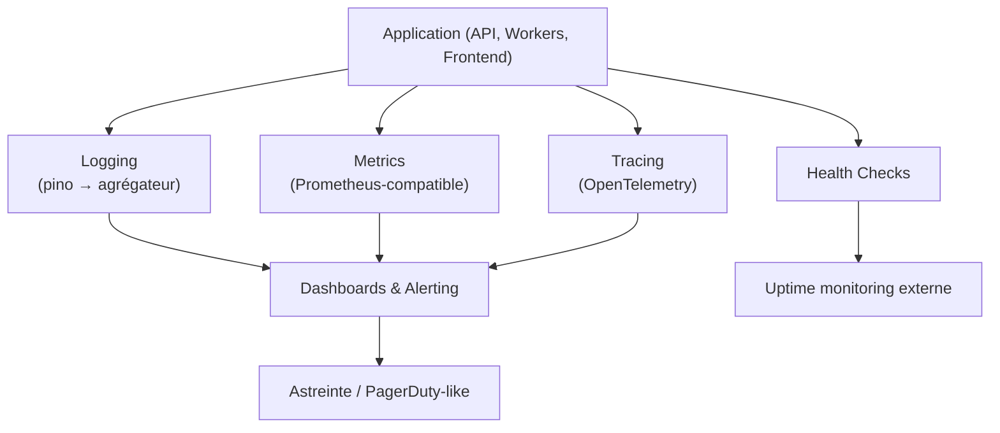

# 25. Observabilité

Complète doc 12 §12.8 (logger applicatif) et doc 18 §18.7 (observabilité à grande échelle) avec une spécification concrète, exploitable dès la Phase 0 (doc 15).

## 25.1 Les quatre piliers

## 25.1bis Outillage retenu (décision Product Owner du 2026-07-13, budget serré priorisé pour un lancement bootstrap)

- **Grafana Cloud** (plan gratuit) pour les logs (Loki), métriques (Mimir/Prometheus) et traces (Tempo) — un seul fournisseur pour trois des quatre piliers, dashboards et alerting unifiés (§25.8), coût nul jusqu'à un volume significatif de restaurants actifs.
- **Sentry** (plan gratuit) dédié au suivi d'erreurs applicatives (frontend + backend), complémentaire aux logs structurés : regroupement automatique des exceptions, alerting immédiat sur nouvelle erreur ou régression, avec le `correlationId` (§25.4) attaché à chaque événement pour retrouver la trace complète.
- Migration réévaluable vers Datadog (offre plus complète mais payante dès les premiers mois) si le volume dépasse les paliers gratuits ou si une astreinte 24/7 formelle (palier "5 000 restaurants", doc 18 §18.2) exige des fonctionnalités supplémentaires.

## 25.2 Logging

- **Format** : JSON structuré (pino, doc 12 §12.8), un événement par ligne, jamais de log multi-ligne.
- **Champs obligatoires** : `timestamp, level, message, correlationId, tenantId, userId, module, environment`.
- **Niveaux** : `trace` (dev uniquement), `debug`, `info` (défaut prod), `warn`, `error`, `fatal`.
- **Destination** : stdout (convention 12-factor), collecté par l'agrégateur de la plateforme d'hébergement (Railway logs) puis exporté vers **Grafana Cloud (Loki)** — voir §25.1bis — dès que le volume dépasse la rétention gratuite de Railway.
- **Ce qui ne doit jamais être loggé** : mot de passe, token JWT complet, secret 2FA, numéro de carte — une règle de lint custom (`no-sensitive-log`) scanne les appels `logger.*` pour détecter les clés sensibles courantes.

## 25.3 Metrics

Exposées au format Prometheus (`/internal/metrics`, endpoint non public, accessible uniquement depuis le réseau interne Railway ou protégé par un token) :

| Catégorie | Métriques |
|---|---|
| HTTP | `http_requests_total{route,method,status}`, `http_request_duration_seconds{route}` (histogram) |
| Socket.IO | `socket_connections_active`, `socket_events_emitted_total{event}`, `socket_room_size{room_type}` |
| MongoDB | `mongo_query_duration_seconds{collection,operation}`, `mongo_connection_pool_used` |
| Queue (BullMQ) | `queue_jobs_waiting{queue}`, `queue_jobs_failed_total{queue}`, `queue_job_duration_seconds{queue}` |
| Métier | `orders_created_total{tenantId}` (agrégé, pas cardinalité illimitée en prod — voir §25.6), `payments_completed_total`, `tenant_active_count` |
| Système | CPU/mémoire/event-loop lag (via `prom-client` `collectDefaultMetrics`) |

## 25.4 Tracing distribué

- **OpenTelemetry** instrumenté sur : middleware Express (span par requête HTTP), appels MongoDB (span par requête Mongoose), appels sortants (prestataire de paiement, Firebase, email/SMS), traitement de job BullMQ.
- **Propagation du `correlationId`** (doc 12 §12.8) comme `trace_id` OpenTelemetry — unifie logs et traces sur le même identifiant, permettant de passer d'une ligne de log à la trace complète de la requête en un clic dans l'outil de visualisation.
- Utile dès la Phase 0 en mode single-instance (comprendre où le temps est passé dans une requête `POST /orders/:id/send-to-kitchen` qui touche `orders`, `stock`, l'Event Bus, Socket.IO) ; devient **indispensable** dès l'extraction d'un module en service séparé (doc 18 §18.6).

## 25.5 Health Checks

| Endpoint | Vérifie | Usage |
|---|---|---|
| `GET /health/live` | Le process répond (liveness) | Railway redémarre l'instance si échec répété |
| `GET /health/ready` | MongoDB joignable, Redis joignable, migrations à jour | Le load balancer ne route pas le trafic tant que non prêt |
| `GET /health/deep` | + vérifie la latence MongoDB, l'espace des queues BullMQ, le quota Firebase | Dashboard interne, pas exposé publiquement |

`/health/live` et `/health/ready` répondent en < 50ms sans dépendance lourde (pas de requête d'agrégation) ; `/health/deep` est réservé au monitoring interne (rate limité, non déclenché à chaque probe de load balancer).

## 25.6 Cardinalité et coût (point de vigilance Staff Engineer)

Une métrique labellisée par `tenantId` brut (ex. `orders_created_total{tenantId="..."}`) explose en cardinalité dès quelques milliers de tenants et rend le système de métriques inutilisable/coûteux (leçon classique Prometheus). Règle retenue : **aucune métrique n'est labellisée par `tenantId` individuel** en production — le détail par tenant passe par les logs structurés (filtrables `tenantId`) et par `dailyStatistics` (doc 05), pas par le système de métriques. Les métriques agrègent au maximum par `planCode` (Starter/Business/Premium) ou par `region` si le multi-région est activé (doc 18 §18.9).

## 25.7 Alerting

| Alerte | Seuil indicatif | Sévérité |
|---|---|---|
| Taux d'erreur HTTP 5xx | > 1% sur 5 min | Critique |
| Latence P95 `POST /orders/*` | > 800ms sur 5 min | Élevée |
| `health/ready` en échec | Toute occurrence > 1 min | Critique |
| File BullMQ `critical` en retard | > 100 jobs en attente | Élevée |
| Connexions Socket.IO en chute brutale | -30% en 2 min (suspicion de coupure Redis adapter) | Critique |
| Échecs de login répétés (doc 13 §13.2) | > seuil rate limiting, pattern distribué | Sécurité — investigation |
| Tenant "noisy neighbor" (doc 18 §18.7) | > seuil de requêtes/min soutenu | Modérée — revue capacité |
| Espace disque / connexions MongoDB Atlas | > 80% des quotas du tier | Élevée — action infra |

Canal d'alerting : intégration Slack/Email pour la Phase 0-9 (équipe réduite), migration vers un outil d'astreinte formel (PagerDuty/Opsgenie) au palier "5 000 restaurants" (doc 18 §18.2) quand une astreinte 24/7 devient nécessaire.

## 25.8 Dashboards de référence à produire

1. **Dashboard Ops global** : taux d'erreur, latence, débit, santé des queues, connexions Socket.IO actives.
2. **Dashboard Rush de service** : commandes créées/min, temps moyen `sent_to_kitchen → served`, alertes stock en temps réel — le dashboard le plus consulté pendant le service, doit rester lisible en un coup d'œil (aligné avec l'exigence UX du Kitchen Display, doc 11 §11.7).
3. **Dashboard Business** (interne QuickTable, distinct du dashboard client, doc 09 §9.15) : tenants actifs, MRR, taux de churn, usage par plan.
4. **Dashboard Sécurité** : échecs d'authentification, révocations de session, actions sensibles (`businessAuditLogs`, doc 24).
