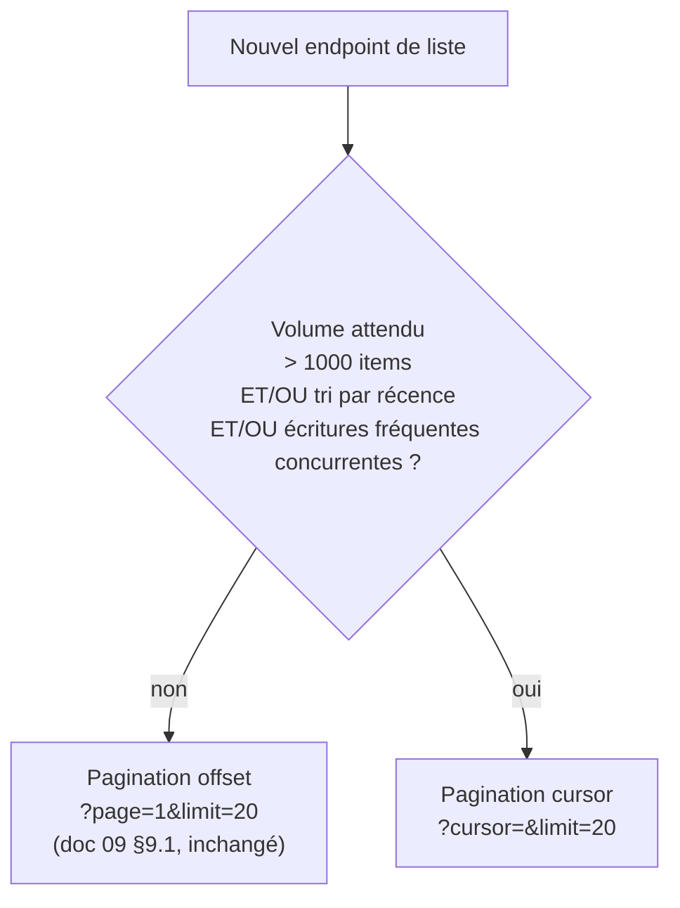

# 27. Stratégie de recherche

## 27.1 Périmètre

Trois familles de besoins de recherche, avec des exigences différentes :
1. **Recherche textuelle simple** (menu, clients) — MongoDB Text Search suffit, pas besoin d'un moteur dédié au MVP.
2. **Autocomplétion** (recherche client par téléphone/nom pendant la prise de commande, recherche produit) — nécessite une latence très faible (< 100ms perçu).
3. **Listes filtrées/triées à fort volume** (historique de commandes, notifications) — nécessite une pagination adaptée (doc 19 §19.10).

## 27.2 MongoDB Text Search

- **Index texte composé** sur `menuItems` (`name`, `description`) et `customers` (`fullName`, `phone`, `email`) : `db.menuItems.createIndex({ name: "text", description: "text" }, { weights: { name: 10, description: 1 } })` — pondération plus forte sur le nom.
- Requête : `$text: { $search: "..." }` combiné systématiquement avec le filtre `tenantId` (doc 06) — l'index texte ne dispense jamais du filtre multi-tenant, vérifié par la même suite de tests d'isolation (doc 06 §6.4).
- **Limite assumée** : MongoDB Text Search ne gère pas la tolérance aux fautes de frappe (fuzzy matching) ni le scoring avancé façon Elasticsearch. Accepté pour le MVP (doc 32) — un moteur dédié (Meilisearch, Algolia, Elasticsearch) n'est introduit que si le volume/l'exigence UX le justifie (voir §27.5, trigger de migration).

## 27.3 Autocomplétion

- **Recherche client par téléphone/nom** pendant la prise de commande (cas d'usage le plus fréquent et le plus sensible à la latence) : index préfixe dédié `{ tenantId: 1, phone: 1 }` (déjà présent, doc 05) pour une recherche par préfixe exacte (`^` regex ancré, qui utilise l'index), complété par l'index texte pour la recherche par nom.
- **Cache Redis** (`search:autocomplete:{tenantId}:{scope}:{query_hash}`, doc 26 §26.2) sur les requêtes d'autocomplétion les plus fréquentes, TTL court (5 min) — le volume de requêtes d'autocomplétion pendant un rush de service est élevé (une requête par caractère tapé, débouncée côté front via `useDebounce`, doc 11 §11.5) et bénéficie fortement du cache.
- **Debounce obligatoire côté frontend** (250ms, `useDebounce`) avant tout appel réseau d'autocomplétion — évite de saturer l'API pour un gain de latence perçue négligeable.

## 27.4 Filtres et tri

- Convention uniforme héritée du doc 09 §9.1 : `?filter[status]=open&sort=-createdAt`.
- Chaque endpoint de liste documente sa liste blanche de champs filtrables/triables (`allowedFilters`, `allowedSorts` déclarés dans le validator Zod du endpoint, doc 12 §12.2) — **jamais de filtre/tri sur un champ arbitraire fourni par le client**, pour éviter qu'une requête non indexée ne dégrade les performances ou ne fuite un champ sensible via le tri (ex. trier par `salary`, doc 08).
- Tout champ de filtre/tri autorisé doit être couvert par un index (doc 05 §5.7) — vérifié en revue de code (doc 14 §14.8) à chaque nouvel endpoint de liste.

## 27.5 Pagination — offset vs cursor (correction de l'incohérence doc 19 §19.10)

**Pagination offset (`page`/`limit`)** — conservée comme mode par défaut pour les listes de configuration bornées : `employees`, `rooms`, `tables`, `categories`, `suppliers`, `ingredients`. Avantage : permet de sauter directement à une page donnée (utile en back-office de configuration). Volume typiquement < quelques centaines d'items par tenant.

**Pagination cursor (nouveau, appliquée à)** : `orders` (historique), `payments` (historique), `notifications`, `audit-logs` (`businessAuditLogs`, doc 24), résultats de recherche menu/clients à fort volume.
- Le curseur est un identifiant **opaque** encodé en base64 contenant `{ lastId, lastSortValue }`, jamais un simple numéro de page.
- Requête MongoDB : `{ createdAt: { $lt: cursor.lastSortValue } }` (ou `$gt` selon le sens de tri) avec `sort({ createdAt: -1, _id: -1 })` et `limit(n)` — coût constant quel que soit l'enfoncement dans la liste, contrairement à `skip(n)` qui dégrade linéairement.
- Réponse : `{ data: [...], meta: { nextCursor: "...", hasMore: true } }` — remplace `meta.page/total` pour ces endpoints spécifiquement (le total exact n'est délibérément pas calculé à chaque requête, coûteux sur de gros volumes ; un compteur approximatif est acceptable si affiché, ex. "1000+ résultats").
- **Amendement au doc 09** : la convention générale de pagination (§9.1) est mise à jour pour documenter les deux modes et préciser, endpoint par endpoint, lequel s'applique (déjà répercuté dans le tableau des endpoints concernés, doc 09).

## 27.6 Recherche publique (menu client, QR Code)

- Recherche/filtrage du menu côté client (par catégorie, allergène) : effectuée **côté frontend** sur le payload déjà chargé et mis en cache (`menu:public:{tenantId}`, doc 26 §26.2) — un menu de restaurant est petit (quelques dizaines à ~200 items), aucune requête serveur supplémentaire nécessaire par frappe, meilleure latence perçue possible.

## 27.7 Trigger de migration vers un moteur de recherche dédié

Comme documenté au doc 18 (principe des paliers de scalabilité), l'introduction d'un moteur dédié (Meilisearch en priorité — open-source, léger à opérer, bon compromis coût/fonctionnalité vs Elasticsearch) est déclenchée par l'un de ces signaux, pas par anticipation :
1. Demande explicite de tolérance aux fautes de frappe / recherche "fuzzy" par les utilisateurs (feedback produit).
2. Volume de `menuItems`/`customers` par tenant dépassant quelques milliers d'entrées (rare pour un restaurant, plus probable pour `customers` d'une grosse chaîne).
3. Besoin de recherche cross-tenant pour le back-office `platform-admin` (doc 09 §9.3) à un volume de tenants rendant `$text` insuffisant.

Migration prévue comme un projet de synchronisation (MongoDB Change Streams → index Meilisearch), sans changement du contrat API côté frontend (les endpoints de recherche restent les mêmes, seule l'implémentation du repository change — cohérent avec le principe de Clean Architecture pragmatique, doc 14 §14.3).
