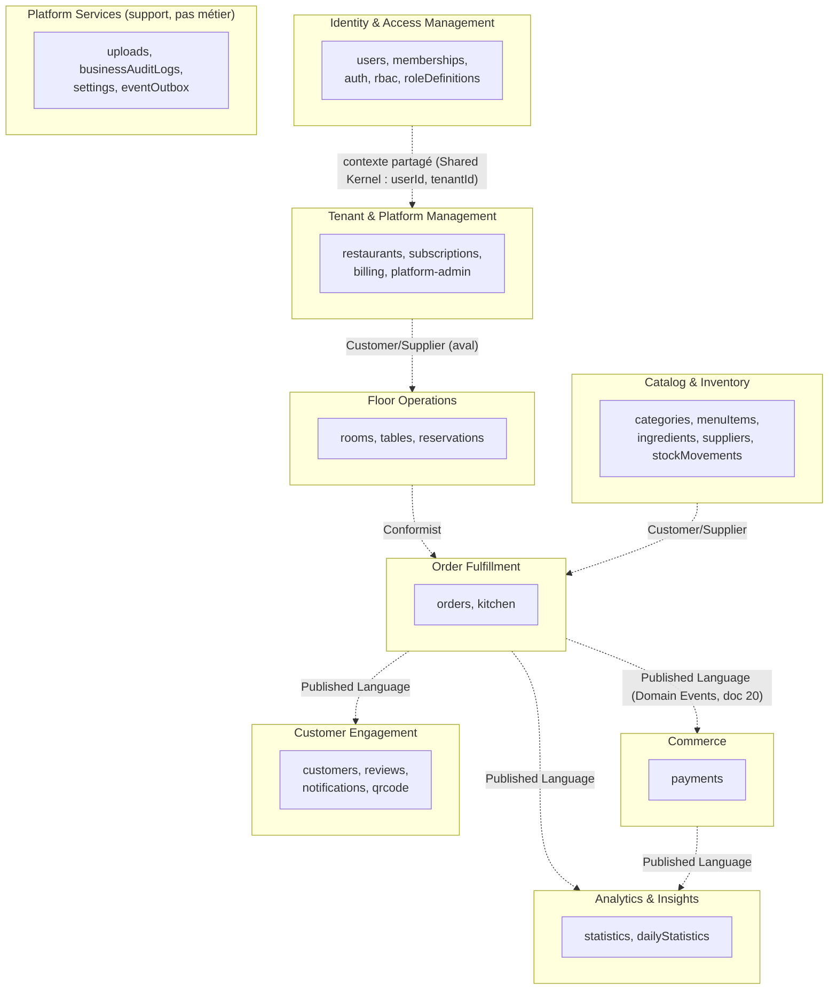

# 28. Domain-Driven Design — Bounded Contexts

## 28.1 Pourquoi formaliser le DDD maintenant (doc 19 §19.11-8)

Le découpage en modules (doc 04) a été fait de façon pragmatique et s'avère, a posteriori, très proche d'un découpage DDD instinctif. Le formaliser maintenant sert un but concret : donner un **vocabulaire précis et partagé** qui aurait accéléré plusieurs des arbitrages de cette revue (ex. doc 19 §19.4 sur `Order` comme Aggregate Root, §19.9 sur les frontières de Bounded Context qui légitiment l'Event Bus).

## 28.2 Cartographie des Bounded Contexts

**Relations entre contextes (patterns DDD standard)** :
- **Shared Kernel** entre `IAM` et tous les autres contextes : `userId`/`tenantId` sont des identifiants partagés dont la définition ne peut être modifiée unilatéralement par un seul contexte.
- **Customer/Supplier** : `Floor Operations` et `Catalog & Inventory` sont "fournisseurs" d'`Order Fulfillment` (qui dépend d'eux, doc 04 §4.5) — un changement de leur modèle impacte le consommateur, qui doit être consulté.
- **Published Language** (le plus fréquent ici) : `Order Fulfillment → Commerce/Analytics/Customer Engagement` communiquent exclusivement via les Domain Events (doc 20) — aucun couplage de schéma direct, c'est le contrat d'événement qui fait foi.
- **Platform Services** n'est **pas un contexte métier** — c'est une collection de services transverses (upload de fichiers, audit technique, configuration) consommés par tous les contextes sans porter de règle métier propre.

## 28.3 Aggregates, Entities, Value Objects par contexte

### Identity & Access Management
- **Aggregate Root : `User`** — Entities : aucune sous-entité forte. Value Objects : `Email` (validation format), `PasswordHash`, `TwoFactorSecret`.
- **Aggregate Root : `Membership`** — représente la relation Utilisateur↔Tenant↔Rôle. Value Object : `PermissionSet` (dérivé de `roleDefinitions` + `permissionsOverrides`, doc 22 §22.4).

### Tenant & Platform Management
- **Aggregate Root : `Restaurant`** — Value Objects : `Address`, `OpeningHours`, `TaxSettings` (`{name, rate}`), `Money` (montant + devise, jamais un nombre nu — cohérent avec doc 05 "montants en centimes").
- **Aggregate Root : `Subscription`** — Entities : aucune. Value Object : `BillingPeriod` (`{start, end}`).

### Floor Operations
- **Aggregate Root : `Room`** — Entity enfant : aucune (les `Table` ne sont pas des entités enfants de `Room`, elles sont un Aggregate Root séparé référençant `roomId`, car une table a un cycle de vie et une concurrence d'accès propres, distincts de la salle).
- **Aggregate Root : `Table`** — Value Object : `Capacity`.
- **Aggregate Root : `Reservation`** — Value Object : `TimeSlot` (`{dateTime, durationEstimate}`), `PartySize`.

### Catalog & Inventory
- **Aggregate Root : `MenuItem`** — Entity enfant : `Recipe` (liste d'ingrédients + quantités, n'a pas d'identité propre hors du `MenuItem`). Value Objects : `Money` (prix), `Allergen[]`.
- **Aggregate Root : `Ingredient`** — Value Object : `StockQuantity` (quantité + unité, jamais un nombre nu — évite les bugs de confusion d'unité).

### Order Fulfillment (le contexte le plus critique, doc 01 §1.6)
- **Aggregate Root : `Order`** — Entity enfant : `OrderItem` (a une identité au sein de la commande — `itemId` — et un cycle de vie propre, doc 21 §21.1 sous-machine, mais n'existe jamais hors d'un `Order`). Value Objects : `Money` (subtotal/taxTotal/total), `OrderStatus`.
- **Règle d'Aggregate (DDD)** : toute modification d'un `OrderItem` passe **exclusivement** par l'Aggregate Root `Order` (le repository `orders.repository.ts`, doc 12, n'expose jamais de méthode `updateOrderItem` indépendante de son agrégat parent) — cohérent avec l'amendement doc 19 §19.4 (opérations atomiques ciblées **au sein** de l'agrégat `Order`, pas un accès direct à une collection `orderItems` séparée).
- **Domain Service : `StockAvailabilityChecker`** — logique qui ne "vit" naturellement ni dans `Order` ni dans `Ingredient` seul (elle croise les deux agrégats) : vérifie si les ingrédients requis par les `MenuItem` d'une commande sont disponibles. Implémenté comme service explicite (pas une méthode d'un des deux agrégats) — exemple canonique de Domain Service DDD.

### Commerce
- **Aggregate Root : `Payment`** — Value Object : `Money`, `PaymentMethod` (enum + métadonnées selon le mode).

### Customer Engagement
- **Aggregate Root : `Customer`** — Value Objects : `LoyaltyPoints`, `ContactInfo`.
- **Aggregate Root : `Review`** — indépendant de `Order` bien que lié (référence, pas embedding — un avis a un cycle de vie de modération propre).

### Analytics
- **Pas d'Aggregate au sens DDD** — `dailyStatistics` est un modèle de **projection en lecture seule** (CQRS-lite, doc 18 §18.5), jamais modifié par une commande utilisateur directe, uniquement recalculé par des Domain Event handlers (doc 20).

## 28.4 Factories

- **`TenantProvisioningFactory`** (doc 06 §6.7) : construit un `Restaurant` + `Subscription` + `Membership` (owner) + données de référence minimales en une opération transactionnelle — exemple classique de Factory DDD quand la construction d'un agrégat implique plusieurs invariants inter-agrégats.
- **`OrderFactory`** : construit un `Order` différemment selon l'origine (`waiter` vs `qrcode`, doc 05 champ `source`) — encapsule la logique de valeurs par défaut différente selon le canal (ex. une commande QR Code sans `waiterId`).

## 28.5 Domain Services (au sens strict DDD — logique qui ne appartient à aucun agrégat seul)

| Domain Service | Rôle | Agrégats croisés |
|---|---|---|
| `StockAvailabilityChecker` | Vérifie la disponibilité avant envoi en cuisine | `Order`, `Ingredient` |
| `ReservationConflictDetector` | Détecte un chevauchement de créneau | `Reservation`, `Table` |
| `PricingService` | Calcule `subtotal`/`taxTotal`/`total` selon `TaxSettings` du restaurant | `Order`, `Restaurant` |
| `FeatureGateResolver` | Combine rôle + plan d'abonnement (doc 08 §8.6) | `Membership`, `Subscription` |
| `TenantSuspensionPolicy` | Décide si un tenant doit être suspendu (cron, doc 12 §12.6) | `Subscription`, `Restaurant` |

Ces services sont **sans état**, injectés dans les Application Services (les `*.service.ts` du doc 12 — qui jouent le rôle des "Application Services" DDD, orchestrant Domain Services + Repositories) et testés unitairement de façon isolée (doc 31 §31.2).

## 28.6 Repositories (rappel du mapping avec doc 12)

Un repository par **Aggregate Root uniquement** — jamais de repository pour une Entity enfant (`OrderItem` n'a pas de `orderItems.repository.ts`) ni pour un Value Object. Ce principe, déjà appliqué de facto au doc 12 §12.1 (un repository par module), est désormais une règle DDD explicite et vérifiable en revue de code (doc 14 §14.8) : si un développeur crée un repository pour une Entity enfant, c'est un signal que sa frontière d'agrégat est probablement incorrecte.

## 28.7 Ce que ce vocabulaire change concrètement

Rien dans le code n'est renommé à cause de ce document (`orders.service.ts` reste `orders.service.ts`) — le vocabulaire DDD est un **outil de raisonnement pour les revues d'architecture futures** (doc 17 §17.3, ADR), pas une couche de nommage à appliquer littéralement au code (éviter l'over-engineering "Repository/Factory/Entity" en dur si l'équipe reste petite, cohérent avec doc 14 §14.3 Clean Architecture pragmatique).
