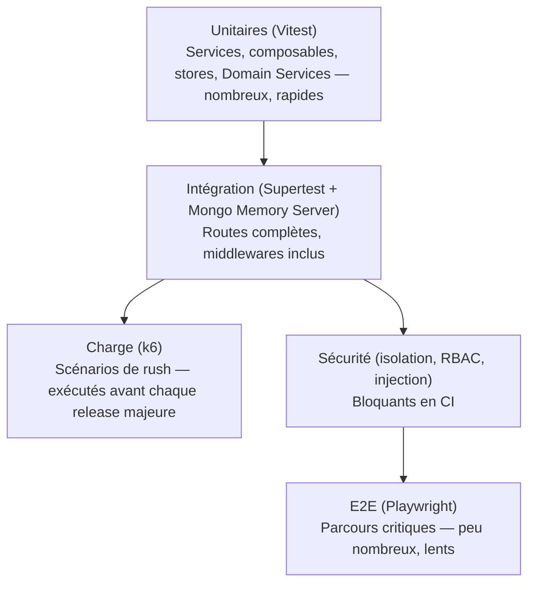

# 31. Architecture des tests

Ce document est la référence unique de la stratégie de tests (le doc 14 §14.6 y renvoie désormais plutôt que de dupliquer le détail, doc 19 §19.11-11).

## 31.1 Pyramide de tests QuickTable

Répartition indicative de l'effort : 60% unitaires, 25% intégration, 10% sécurité/isolation dédiés, 5% E2E — les tests E2E coûtent cher à maintenir et ne couvrent que les parcours vraiment critiques (doc 15).

## 31.2 Tests unitaires

- **Cible** : Application Services (`*.service.ts`), Domain Services (doc 28 §28.5), composables (doc 11 §11.5), stores Pinia, machines à état (doc 21 — chaque `canTransition()` testé pour **toutes** les paires valides ET pour un échantillon représentatif de paires invalides).
- **Aucun accès réseau ni base de données réelle** — les repositories sont mockés (interface TypeScript, doc 14 §14.4 Dependency Inversion) pour isoler la logique métier pure.
- **Convention** : `*.spec.ts` colocalisé avec le fichier testé (doc 03/12).

## 31.3 Tests d'intégration

- **Cible** : chaque route de l'API (doc 09), avec ses middlewares réels (auth, tenant resolver, RBAC, validation) — seule la base est une instance MongoDB en mémoire (`mongodb-memory-server`), pas mockée, pour valider les index et contraintes réels.
- **Un cas nominal + au minimum un cas d'erreur par endpoint** (doc 14 §14.6, renforcé) : `401` sans token, `403` permission insuffisante, `404` hors tenant, `400` payload invalide, `409`/`422` selon la règle métier de l'endpoint (doc 09 §9.1).
- **Tests de l'Event Bus** (doc 20 §20.8) : vérifier qu'un service publie bien l'événement attendu dans `eventOutbox`, et que chaque handler abonné réagit correctement de façon isolée (le handler est testé indépendamment du publisher, en lui injectant un événement synthétique).

## 31.4 Tests de charge

- **Outil** : k6 (scriptable en JS, s'intègre bien en CI).
- **Scénario de référence "Rush du samedi soir"** (doc 01 §1.6, doc 15 Phase 4) : simulation de N tenants actifs simultanément, chacun avec plusieurs serveurs créant des commandes, la cuisine mettant à jour des statuts, et des paiements concurrents — mesure de la latence P95/P99 (doc 29) et du taux d'erreur sous charge.
- **Scénario "Multi-tenant simultané"** (doc 18) : simulation de charge répartie sur des centaines de tenants distincts en parallèle pour détecter un "noisy neighbor" (doc 06 §6.6) avant qu'il ne se produise en production.
- **Fréquence** : avant chaque mise en production majeure (doc 15 Phase 10) et de façon continue (nightly, sous-échelle) une fois en production.
- **Seuil de non-régression** : un test de charge qui dégrade les cibles du doc 29 de plus de 15% par rapport à la dernière baseline bloque la release (pas la CI de chaque PR, trop coûteux — géré en pipeline séparé).

## 31.5 Tests de sécurité

Distincts des tests fonctionnels, exécutés comme une suite dédiée non contournable (doc 13 §13.9) :

| Suite | Vérifie |
|---|---|
| Isolation multi-tenant (doc 06 §6.4) | Aucun endpoint ne laisse fuiter une ressource d'un autre tenant (`404` systématique, jamais de `200`/`403` révélant l'existence) |
| RBAC (doc 08) | Chaque permission de la matrice testée pour chaque rôle — accès accordé quand attendu, refusé sinon |
| Injection | Tentatives d'injection d'opérateurs Mongo (`$where`, `$gt`) dans chaque champ de `body`/`query` accepté par un schéma Zod, doit être rejeté avant d'atteindre Mongoose (doc 13 §13.4) |
| Authentification | Token expiré, token falsifié (signature invalide), token d'un autre tenant rejoué, refresh token déjà révoqué (doc 07) |
| Rate limiting | Dépassement de seuil déclenche bien `429` (doc 13 §13.2) sur chaque route sensible listée |
| Upload | Rejet des types MIME non whitelistés, rejet des fichiers surdimensionnés (doc 09 §9.19) |
| Secrets | Scan automatisé (`gitleaks` ou équivalent) en CI pour détecter un secret committé par erreur (doc 32 lien Secrets Management) |

Un échec de cette suite est traité avec la même sévérité qu'un échec de build — aucune exception, aucun "on corrigera plus tard" (doc 13 §13.9).

## 31.6 Tests Socket.IO

- **Client de test dédié** (`socket.io-client` en mode test) connecté à une instance serveur de test, avec un JWT synthétique.
- Vérifications systématiques par événement du catalogue (doc 10 §10.4, doc 20 §20.4) :
  1. L'événement n'est reçu **que** par les rooms attendues (test négatif : un client d'un autre tenant/rôle ne le reçoit pas — doc 10 §10.2, même rigueur que l'isolation REST).
  2. Le payload respecte le schéma attendu.
  3. Un client qui rejoint une room après l'émission ne reçoit pas l'événement passé (pas de replay implicite — cohérent avec "Socket.IO ne fait jamais foi", doc 10 §10.7).
- **Test de reconnexion** : simulation de coupure réseau (déconnexion forcée du client de test), vérification que le mécanisme de resynchronisation (`client:resync`, doc 10 §10.7) restaure un état cohérent.
- **Test multi-instance** (avant chaque release majeure) : deux instances API de test connectées au même Redis adapter, événement émis sur l'instance A doit être reçu par un client connecté à l'instance B (doc 10 §10.6) — le seul moyen de vraiment valider l'adaptateur Redis en conditions représentatives de la production.

## 31.7 Tests End-to-End (E2E)

Parcours couverts en priorité (doc 15) :
1. Connexion → création de commande → envoi en cuisine → changement de statut → paiement → table libérée.
2. Scan QR Code → consultation menu → appel serveur → suivi de commande.
3. Invitation d'un employé → première connexion → activation 2FA (pour `restaurant_owner`).
4. Création de réservation → confirmation → conflit détecté sur un second essai.
5. Upgrade de plan d'abonnement → vérification qu'une fonctionnalité auparavant bloquée devient accessible (`402 → 200`).

Chaque parcours inclut au moins un cas d'échec attendu (ex. paiement refusé, stock insuffisant) — un E2E qui ne teste que le chemin heureux a une valeur limitée.

## 31.8 CI — ce qui bloque un merge

| Vérification | Bloquant sur PR | Bloquant sur release |
|---|---|---|
| Lint + format | ✅ | ✅ |
| Tests unitaires | ✅ | ✅ |
| Tests d'intégration (module modifié) | ✅ | ✅ |
| Tests d'isolation multi-tenant + RBAC | ✅ (si middlewares/modules touchés) | ✅ (suite complète) |
| Tests Socket.IO (module modifié) | ✅ | ✅ (+ test multi-instance) |
| Tests E2E | ➖ (trop lents pour chaque PR) | ✅ |
| Tests de charge | ➖ | ✅ (release majeure uniquement, doc 31.4) |
| Scan de sécurité (dépendances, secrets) | ✅ | ✅ |
