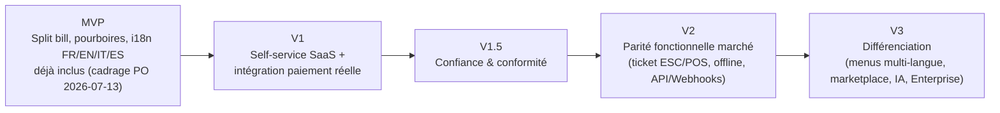

# 33. Comparaison marché

**Avertissement méthodologique** : les positionnements ci-dessous sont basés sur la connaissance générale et publique du positionnement de ces produits (catégories de fonctionnalités, marché cible), pas sur un audit contractuel à jour de chaque offre — à vérifier/rafraîchir avec une veille concurrentielle formelle avant toute communication commerciale s'appuyant sur ce tableau (point à valider avec le Product Owner, voir rapport final).

## 33.1 Positionnement des acteurs comparés

| Produit | Segment principal | Force reconnue |
|---|---|---|
| **Toast POS** | Restaurants US, du indépendant à la chaîne, POS matériel + logiciel intégré | Écosystème matériel propriétaire, profondeur fonctionnelle, intégrations tierces nombreuses |
| **Square for Restaurants** | Indépendants et petites chaînes, fort ancrage retail/restauration généraliste | Simplicité, écosystème de paiement Square unifié, tarification transparente |
| **Lightspeed Restaurant** | Restaurants avec besoins multi-sites, hospitality haut de gamme | Reporting avancé, gestion multi-sites, intégrations comptables |
| **GloriaFood** | Petits restaurants, focus commande en ligne/à emporter | Gratuit en entrée de gamme, simplicité de mise en place de la commande en ligne |
| **Loyverse** | Très petits commerces/restaurants, marchés émergents | Gratuit, léger, fonctionne bien avec peu de connectivité |

QuickTable, avec son ambition multi-tenant SaaS "cloud-native" et son ciblage initial incluant les marchés à forte adoption Mobile Money (doc 01 §1.3), se positionne à l'intersection de Square (simplicité, self-service) et de Loyverse/GloriaFood (accessibilité, marchés émergents), avec une architecture technique (doc 02-31) visée pour scaler vers la profondeur fonctionnelle de Toast/Lightspeed à terme (doc 32, V2/V3).

## 33.2 Grille comparative fonctionnelle

| Fonctionnalité | Toast | Square | Lightspeed | GloriaFood | Loyverse | QuickTable (état après cette revue) |
|---|---|---|---|---|---|---|
| Gestion de tables/salles | ✅ | ✅ | ✅ | ➖ (focus à emporter) | Partiel | ✅ (MVP, doc 32 §32.2) |
| Prise de commande serveur | ✅ | ✅ | ✅ | ➖ | ✅ | ✅ (MVP) |
| KDS (écran cuisine) temps réel | ✅ | ✅ | ✅ | ➖ | Partiel | ✅ (MVP, doc 10) |
| QR Code menu/commande client | ✅ | ✅ | ✅ | ✅ (spécialité) | ➖ | ✅ (MVP, extension V1) |
| Paiement intégré (carte) | ✅ (matériel propriétaire) | ✅ (écosystème Square) | ✅ | Via partenaires | ✅ | ✅ (MVP, prestataire tiers tokenisé) |
| Mobile Money / paiements locaux marchés émergents | ➖ | ➖ | ➖ | ➖ | Partiel (selon marché) | ✅ (MVP — différenciateur potentiel, doc 01) |
| Split bill / addition partagée | ✅ | ✅ | ✅ | ➖ | Partiel | ✅ **MVP** (cadrage PO 2026-07-13, doc 32 §32.2) |
| Gestion des pourboires | ✅ | ✅ | ✅ | ➖ | Partiel | ✅ **MVP** |
| Impression ticket physique (ESC/POS) | ✅ (natif matériel) | ✅ | ✅ | Via imprimante tierce | ✅ | ❌ → **V2** |
| Gestion de stock/inventaire | ✅ | ✅ | ✅ (fort) | ➖ | ✅ | ✅ (MVP, version simple) |
| Réservations | ✅ (souvent via partenaire) | Partiel | ✅ | ➖ | ➖ | ✅ (**V1**, doc 32 §32.3) |
| Programme de fidélité | ✅ | ✅ | Partiel | ➖ | ✅ | Basique en **V1**, structuré en **V2** |
| Statistiques/reporting avancé | ✅ (fort) | ✅ | ✅ (fort, multi-site) | ➖ | Partiel | ✅ (**V1** basique, avancé selon plan) |
| Multi-site / multi-établissement | ✅ | ✅ | ✅ (fort) | ➖ | Partiel | Plan Premium (**V1**), Silo dédié (**V3**) |
| Mode offline | ✅ | ✅ | Partiel | ➖ | ✅ | ❌ → **V2** (doc 01 §1.3 gap identifié dès l'origine) |
| API publique / Webhooks | ✅ | ✅ | ✅ | Partiel | Partiel | ❌ → **V2** (plan Premium, doc 09 §9.16) |
| Multi-langue (FR/EN/IT/ES) / multi-devise par pays | ✅ | ✅ | ✅ | ✅ | ✅ | ✅ **MVP** (cadrage PO 2026-07-13, doc 35) — différenciateur dès le lancement plutôt qu'un rattrapage V3 |
| Modèle tarifaire | Abonnement + matériel propriétaire | Abonnement + commission paiement | Abonnement (plusieurs paliers) | Gratuit + commission | Gratuit + add-ons payants | Abonnement SaaS multi-tenant (Starter/Business/Premium, doc 08) |
| Architecture SaaS multi-tenant cloud-native "from day one" | Historiquement non (matériel-first) | Partiel | Partiel | Oui (léger) | Oui (léger) | ✅ (doc 06 — **avantage structurel**) |

## 33.3 Écarts critiques à combler avant une commercialisation large (issus de doc 01 §1.4, mis à jour suite au cadrage PO du 2026-07-13)

Par ordre de priorité produit (à valider avec le Product Owner) — **le split bill et les pourboires sont retirés de cette liste, confirmés en scope MVP** (doc 32 §32.2) :
1. **Impression physique de tickets** — critique pour l'adoption cuisine dans les établissements sans tablette murale.
2. **Mode offline** — différenciateur de fiabilité perçue, surtout sur les marchés à connectivité variable où QuickTable vise justement à se différencier (Mobile Money, doc 01 §1.3), particulièrement pertinent pour le marché de lancement (Bénin).
3. **API/Webhooks** — condition d'entrée pour le segment "chaînes" qui exigent une intégration à leur outil comptable/ERP existant.

## 33.4 Axes de différenciation potentiels de QuickTable (au-delà de la parité)

1. **Paiements locaux natifs (Mobile Money)** dès le MVP (UI/flux) puis l'intégration réelle en V1 — angle mort de tous les acteurs listés ci-dessus sur les marchés visés, opportunité réelle de différenciation précoce plutôt que de rattrapage (doc 01 §1.2 "objectifs", doc 32 §32.2/§32.3).
2. **Multi-langue et multi-devise dès le MVP** (doc 35) — aucun des acteurs comparés n'a été conçu autour d'une devise dynamique par pays dès l'inscription du tenant ; QuickTable part du Bénin mais est structurellement prêt pour une expansion FR/EN/IT/ES immédiate.
3. **Architecture multi-tenant SaaS cloud-native dès la conception** (doc 02-06) — Toast et Lightspeed portent un historique technique plus lourd (matériel propriétaire, architectures plus anciennes) ; QuickTable peut itérer plus vite sur le logiciel pur.
4. **Tarification accessible** pour le segment indépendant/petite chaîne des marchés émergents, à l'image de Loyverse/GloriaFood mais avec une profondeur fonctionnelle supérieure grâce à l'architecture posée dans ce dossier.
5. **Event-Driven + observabilité dès la conception** (doc 20, 25) — base technique pour une fiabilité perçue supérieure une fois à l'échelle, argument de vente pour le segment "chaînes" sensible aux SLA (doc 29 §29.6).

## 33.5 Roadmap d'évolution (résumé, détail dans doc 32)

## 33.6 Point à valider avec le Product Owner

**Tranché le 2026-07-13** : marché de lancement prioritaire = **Bénin**, avec une architecture mondiale dès le départ (multi-langue FR/EN/IT/ES, devise par pays, doc 35). Reste ouvert : l'ordre exact des fonctionnalités restantes de V2 (§33.3) — impression ticket vs mode offline vs API en premier — à prioriser selon le retour des restaurants pilotes béninois du MVP.
