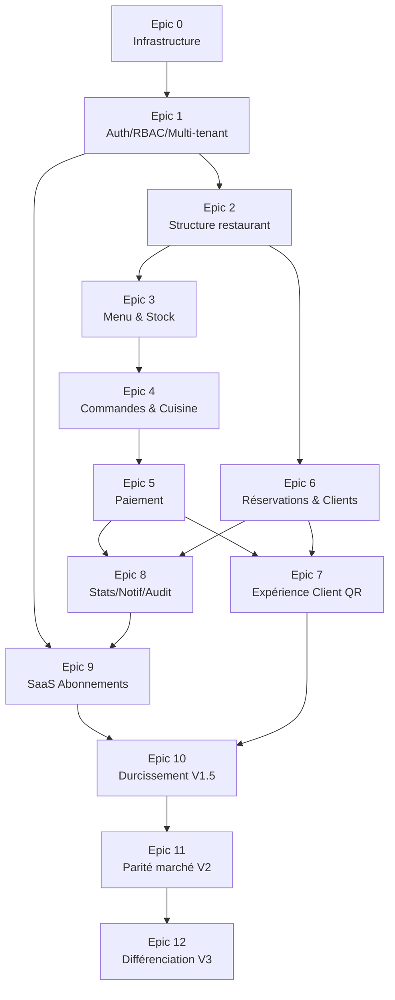

# 34. Backlog détaillé — Epics, Features, User Stories, Tâches

## 34.1 Méthode et granularité

- **Epic** = correspond à une Phase (doc 15) ou une Version (doc 32).
- **Feature** = un module ou sous-module (doc 04).
- **User Story** = format `En tant que <rôle> je veux <action> afin de <bénéfice>`, avec critères d'acceptation.
- **Tâche technique** = ≤ 1 jour-développeur, assignable à une seule personne.

**Mise à jour du 2026-07-13** : à la demande du Product Owner, le découpage descend désormais au niveau tâche ≤1 jour pour **l'intégralité du backlog** (Epics 0-12), organisé par **module** (doc 04) à l'intérieur de chaque Epic, chaque Epic portant lui-même la **priorité** (MVP → V1 → V1.5 → V2 → V3, doc 32). Pour les Epics 11-12 (V2/V3), dont le contenu exact n'est pas encore validé avec le Product Owner (doc 32 §32.8), les tâches sont marquées **provisoires** — à confirmer au moment du cadrage détaillé de chaque feature plutôt qu'à réécrire intégralement, ce qui reste un gain net par rapport à l'absence de découpage.

---

## 34.2 Epic 0 — Infrastructure & Fondations (MVP, doc 15 Phase 0)

### Feature 0.1 — Monorepo & CI/CD

| Tâche | Estimation |
|---|---|
| Initialiser le monorepo (workspaces `apps/`, `packages/`) | 0,5j |
| Configurer ESLint + Prettier + config partagée `packages/config` | 0,5j |
| Configurer Husky (pre-commit, commit-msg, pre-push) + lint-staged | 0,5j |
| Configurer Commitlint (Conventional Commits) | 0,25j |
| Écrire le pipeline CI GitHub Actions (lint + test + build) | 1j |
| Configurer déploiement auto Vercel (`apps/web`, preview + prod) | 0,5j |
| Configurer déploiement auto Railway (`apps/api`, staging + prod) | 0,5j |

### Feature 0.2 — Infrastructure de données

| Tâche | Estimation |
|---|---|
| Provisionner MongoDB Atlas (dev/staging/prod) | 0,5j |
| Provisionner Redis (dev/staging/prod) | 0,25j |
| Configurer Firebase Storage + règles d'accès | 0,5j |
| Implémenter `config/env.ts` avec validation Zod fail-fast | 0,5j |
| Implémenter `config/database.ts` (connexion Mongoose, pool) | 0,5j |

### Feature 0.3 — Socle applicatif

| Tâche | Estimation |
|---|---|
| Implémenter le logger structuré (pino) + middleware `correlationId` | 0,5j |
| Implémenter `error-handler.middleware.ts` + classes d'erreurs typées (doc 12 §12.3) | 1j |
| Implémenter `BaseRepository` générique avec `tenantId` obligatoire (doc 06/12) | 1j |
| Implémenter les plugins Mongoose transverses (`tenantScope`, `timestamps`) | 1j |
| Implémenter les health checks `/health/live`, `/health/ready` (doc 25 §25.5) | 0,5j |
| Créer un module de référence traversant toutes les couches (validation du pattern, doc 12) | 1j |

### Feature 0.4 — Internationalisation, socle (ajouté suite au cadrage PO 2026-07-13, doc 35)

| Tâche | Estimation |
|---|---|
| Configurer Vue I18n (`plugins/i18n.plugin.ts`) + scaffolding des fichiers `fr.json`/`en.json`/`it.json`/`es.json` | 0,5j |
| Implémenter `i18n.middleware.ts` backend (résolution de locale, catalogue de messages d'erreur) | 1j |
| Modéliser et seeder la collection `countryDefaults` (doc 05, doc 35 §35.3) — au minimum Bénin, France, Italie, Espagne, USA | 0,5j |
| Implémenter le service de géolocalisation IP (`GET /restaurants/detect-location`, doc 09 §9.4) | 1j |

**Critère de sortie Epic 0** : un module "Hello World" déployé en staging, health checks verts, CI bloquante fonctionnelle, sélecteur de langue FR/EN/IT/ES opérationnel sur un écran de test.

---

## 34.3 Epic 1 — Authentification, RBAC & Multi-tenant (MVP, doc 15 Phase 1)

### Feature 1.1 — Identité (`users`, `memberships`)

| User Story | Critères d'acceptation |
|---|---|
| En tant que futur utilisateur, je veux créer un compte afin d'accéder à la plateforme | Email unique, mot de passe Argon2id, validation Zod |
| En tant qu'owner, je veux que mon employé soit rattaché à mon restaurant avec un rôle afin de contrôler ses accès | `membership` créé avec `tenantId`, `role` valide (doc 08) |

| Tâche | Estimation |
|---|---|
| Modéliser et implémenter le schéma `users` (doc 05) | 0,5j |
| Modéliser et implémenter le schéma `memberships` (doc 05) | 0,5j |
| Implémenter `users.repository.ts` / `memberships.repository.ts` | 0,5j |
| Implémenter la validation Zod des DTO `users`/`memberships` | 0,5j |

### Feature 1.2 — Authentification (doc 07)

| Tâche | Estimation |
|---|---|
| Implémenter `POST /auth/login` (vérification mot de passe, émission JWT) | 1j |
| Implémenter la rotation de refresh token + `POST /auth/refresh` | 1j |
| Implémenter `POST /auth/logout` + révocation de session | 0,5j |
| Implémenter `POST /auth/forgot-password` + `POST /auth/reset-password` | 1j |
| Implémenter l'envoi d'email (worker, Nodemailer + relais SMTP Brevo, doc 04 §4.1) | 1j |
| Configurer SPF/DKIM/DMARC sur `quicktable.io` + compte Brevo (plan gratuit) | 0,5j |
| Implémenter la 2FA TOTP (enable/confirm/verify/disable) | 1j |
| Implémenter `GET/DELETE /auth/sessions` | 0,5j |
| Tests d'intégration complets du module `auth` (doc 31 §31.3) | 1j |

### Feature 1.3 — Multi-tenant (doc 06)

| Tâche | Estimation |
|---|---|
| Implémenter `tenant.middleware.ts` (résolution depuis JWT) | 1j |
| Implémenter le plugin Mongoose `tenantScope` (garde-fou ORM) | 0,5j |
| Implémenter `TenantProvisioningService` (transaction multi-documents) | 1j |
| Écrire la suite de tests d'isolation multi-tenant (doc 31 §31.5) — infrastructure de test | 1j |
| Écrire les tests d'isolation pour les endpoints Epic 1 | 0,5j |

### Feature 1.4 — RBAC (doc 08)

| Tâche | Estimation |
|---|---|
| Modéliser `roleDefinitions` (doc 22 §22.4) et seed des rôles système | 0,5j |
| Implémenter `rbac.middleware.ts` (`requirePermission`) | 1j |
| Implémenter la résolution combinée rôle + `permissionsOverrides` | 0,5j |
| Implémenter le cache Redis `rbac:resolved:{membershipId}` (doc 26 §26.2) | 0,5j |
| Écrire les tests de la matrice de permissions (doc 31 §31.5) | 1j |

**Critère de sortie Epic 1** : suites de tests isolation + RBAC vertes et bloquantes en CI (doc 15 checklist Phase 1).

---

## 34.4 Epic 2 — Structure du restaurant (MVP, doc 15 Phase 2)

### Feature 2.1 — Restaurants

| Tâche | Estimation |
|---|---|
| Modéliser/implémenter `restaurants` (CRUD, doc 05/09) avec `country`/`locale`/`currency` dérivés | 1j |
| Implémenter la dérivation automatique devise/langue/fuseau depuis `countryDefaults` à la création (doc 35 §35.3) | 0,5j |
| Écran d'inscription : saisie manuelle du pays **ou** confirmation de la détection automatique (doc 35 §35.2) | 1j |
| Écran back-office : création/édition restaurant (horaires, logo, coordonnées) | 1j |

### Feature 2.2 — Employés

| Tâche | Estimation |
|---|---|
| Implémenter `POST/GET/PATCH/DELETE /employees` | 1j |
| Implémenter la limite `maxEmployees` du plan (`409`) | 0,5j |
| Implémenter le flux d'invitation employé (email + activation) | 1j |
| Écran back-office : liste et gestion des employés | 1j |

### Feature 2.3 — Salles & Tables

| Tâche | Estimation |
|---|---|
| Implémenter `rooms` CRUD | 0,5j |
| Implémenter `tables` CRUD + statuts | 1j |
| Implémenter la génération de QR Code (token opaque + image) | 1j |
| Implémenter `POST /tables/:id/qrcode/regenerate` | 0,5j |
| Écran back-office : gestion des salles et tables (vue plan) | 1,5j |

**Critère de sortie Epic 2** : un restaurant peut être entièrement configuré (équipe, salles, tables, QR codes) via le back-office.

---

## 34.5 Epic 3 — Menu & Stock (MVP, doc 15 Phase 3)

### Feature 3.1 — Uploads

| Tâche | Estimation |
|---|---|
| Implémenter `POST /uploads` (SDK Firebase, validation type/taille) | 1j |
| Implémenter `DELETE /uploads/:fileId` | 0,5j |

### Feature 3.2 — Catalogue

| Tâche | Estimation |
|---|---|
| Implémenter `categories` CRUD + ordonnancement | 0,5j |
| Implémenter `menuItems` CRUD (doc 05, avec `recipe[]`) | 1j |
| Implémenter `PATCH /menu-items/:id/availability` | 0,25j |
| Écran back-office : gestion du menu avec upload photo | 1,5j |

### Feature 3.3 — Stock simple

| Tâche | Estimation |
|---|---|
| Implémenter `ingredients`/`suppliers` CRUD | 1j |
| Implémenter `POST /stock/movements` (mouvements manuels) | 0,5j |
| Implémenter le Domain Event `StockLevelLow` (doc 20) + alerte | 1j |
| Écran back-office : gestion du stock et seuils | 1j |

**Critère de sortie Epic 3** : un menu complet avec photos et stock associé est configurable et consultable.

---

## 34.6 Epic 4 — Commandes & Cuisine (MVP, doc 15 Phase 4 — le plus critique)

### Feature 4.1 — Cycle de vie de la commande (doc 21 §21.1)

| Tâche | Estimation |
|---|---|
| Implémenter `POST /orders` (création, `OrderCreated`) | 0,5j |
| Implémenter `POST/PATCH/DELETE /orders/:id/items` (opérations atomiques ciblées, doc 19 §19.4) | 1j |
| Implémenter `POST /orders/:id/send-to-kitchen` + vérification stock synchrone (transition `pending → queued`) | 1j |
| Implémenter `POST /orders/:id/items/:itemId/cancel` (annulation post-envoi tant que `queued`, cadrage PO 2026-07-13, doc 21 §21.1) + réintégration stock | 1j |
| Implémenter `PATCH /orders/:id/status` + verrouillage optimiste `If-Match` | 1j |
| Implémenter `POST /orders/:id/transfer` | 0,5j |
| Implémenter `POST /orders/:id/cancel` (avec réintégration stock) | 1j |
| Implémenter le décrément automatique de stock (couplage synchrone, doc 20 §20.5) | 1j |
| Tests unitaires de la machine à état `Order`/`OrderItem` (toutes transitions + interdictions, y compris `queued → cancelled` vs `preparing → cancelled` refusé, doc 31 §31.2) | 1j |

### Feature 4.2 — Cuisine (KDS)

| Tâche | Estimation |
|---|---|
| Implémenter `GET /kitchen/tickets` (agrégation, tri) | 1j |
| Implémenter `PATCH /kitchen/tickets/:orderId/items/:itemId/status` | 0,5j |
| Écran Kitchen Display System (layout dédié, doc 11 §11.7) | 1,5j |

### Feature 4.3 — Temps réel (doc 10)

| Tâche | Estimation |
|---|---|
| Implémenter le Socket Gateway (auth handshake, doc 10 §10.2) | 1j |
| Configurer l'adaptateur Redis Socket.IO | 0,5j |
| Implémenter la gestion des rooms par tenant/rôle (doc 10 §10.3) | 1j |
| Implémenter les événements `order:*`, `table:*` (doc 10 §10.4) | 1j |
| Implémenter le mécanisme de resynchronisation client (`client:resync`, doc 10 §10.7) | 1j |
| Intégrer Socket.IO côté frontend (`services/socket/`, doc 11 §11.6) | 1j |
| Tests Socket.IO (doc 31 §31.6), y compris test multi-instance | 1j |

### Feature 4.4 — Validation de charge

| Tâche | Estimation |
|---|---|
| Écrire le scénario k6 "Rush du samedi soir" (doc 31 §31.4) | 1j |
| Exécuter et documenter les résultats vs cibles doc 29 | 0,5j |

**Critère de sortie Epic 4** : parcours complet commande → cuisine → service validé en E2E et sous charge.

---

## 34.7 Epic 5 — Paiement (MVP, doc 15 Phase 5)

**Rescopé suite au cadrage Product Owner du 2026-07-13** : les deux prestataires (Stripe et Mobile Money) sont retenus, mais **seule l'UI/le flux de paiement sont construits en MVP** — l'intégration API réelle est différée à l'Epic 5bis (V1). Le split bill et les pourboires sont en revanche confirmés dès le MVP.

### Feature 5.1 — Encaissement, split bill, pourboires (MVP)

| User Story | Critères d'acceptation |
|---|---|
| En tant que caissier, je veux encaisser une commande en espèces afin de clôturer le service | Montant = total commande, `PaymentCompleted` publié, aucune dépendance externe |
| En tant que caissier, je veux enregistrer un paiement carte/Mobile Money confirmé manuellement, afin de clôturer le service avant que l'intégration réelle des prestataires soit branchée | `providerRef` saisi manuellement, `providerToken` absent, aucun appel API externe |
| En tant que serveur/caissier, je veux diviser l'addition (également ou par article) afin que plusieurs convives paient séparément | Somme des paiements = `orders.total`, `orders.status` passe par `partially_paid` puis `paid` (doc 21 §21.2) |
| En tant que caissier, je veux ajouter un pourboire à un encaissement afin de le tracer pour le serveur concerné | `payments.tipAmount`/`tipRecipientId` renseignés, exclu du calcul de `amountPaid` |
| En tant que caissier, je veux rembourser un paiement afin de corriger une erreur | Remboursement total/partiel tracé en audit métier |

| Tâche | Estimation |
|---|---|
| Définir l'interface `PaymentProviderAdapter` + implémentation `ManualProviderAdapter` (doc 04 §4.1 amendement) | 1j |
| Implémenter `POST /payments` avec `Idempotency-Key`, support `splitCount`/`coveredItemIds` (doc 09 §9.12) | 1,5j |
| Implémenter l'incrément atomique `orders.amountPaid` + transition `served → partially_paid → paid` (doc 21 §21.2) | 1j |
| Implémenter la gestion des pourboires (`tipAmount`, `tipRecipientId`) | 0,5j |
| Implémenter `POST /payments/:id/refund` | 1j |
| Implémenter la génération de reçu (worker asynchrone), avec détail du split le cas échéant | 1j |
| Écran caisse : sélection du mode de paiement, saisie split égal/par article, saisie pourboire | 2j |
| Tests d'intégration paiement (nominal, split égal, split par article, `AMOUNT_EXCEEDS_ORDER_TOTAL`) | 1j |
| Tests unitaires de la machine à état `Order` avec `partially_paid` (doc 31 §31.2) | 0,5j |

**Critère de sortie Feature 5.1 = fin du MVP (doc 32 §32.2)** : un restaurant pilote peut faire tourner un service complet de bout en bout, split bill et pourboires inclus, paiement électronique enregistré manuellement.

### Feature 5.2 — Intégration réelle des prestataires de paiement (V1, doc 32 §32.3)

| Tâche | Estimation |
|---|---|
| Sélectionner le compte Stripe (mode production) — dépend de la décision Product Owner sur l'entité légale de facturation | 0,5j |
| Implémenter `StripeAdapter` (implémente `PaymentProviderAdapter`, tokenisation, doc 13 §13.6) | 1,5j |
| Sélectionner et implémenter `MobileMoneyAdapter` pour le marché béninois via **FedaPay** (décision Product Owner du 2026-07-13, doc adr/0011) — couvre MTN MoMo + Moov Money + cartes | 2j |
| Basculer `POST /payments` du provider `manual` vers `stripe`/`mobile_money` selon `method`, sans changement de contrat API | 0,5j |
| Revue de sécurité dédiée paiement (doc 13 §13.6) — vérifier qu'aucune donnée de carte ne transite par le backend QuickTable | 0,5j |
| Tests d'intégration avec sandbox Stripe + sandbox Mobile Money | 1j |

---

## 34.8 Epic 6 — Réservations & Clients (V1, doc 15 Phase 6)

### Feature 6.1 — Module `reservations`

| User Story | Critères d'acceptation |
|---|---|
| En tant que manager, je veux créer une réservation afin de bloquer une table à l'avance | `status: pending`, `dateTime`, `partySize` requis |
| En tant que manager, je veux être bloqué si je réserve une table déjà prise sur le créneau afin d'éviter un double-booking | `409 TABLE_ALREADY_RESERVED`, message actionnable (doc 08, écran 08) |

| Tâche | Estimation |
|---|---|
| Modéliser le schéma `reservations` (doc 05) | 0,5j |
| Implémenter le Domain Service `ReservationConflictDetector` (doc 28 §28.5) | 1j |
| Implémenter `POST/GET/PATCH /reservations` | 1j |
| Implémenter `PATCH /reservations/:id/confirm` (assignation table) | 0,5j |
| Implémenter `POST /reservations/:id/cancel` | 0,5j |
| Implémenter `PATCH /reservations/:id/no-show` | 0,25j |
| Implémenter le cron `reservation-reminder.cron.ts` (doc 12 §12.6) | 1j |
| Publier les Domain Events `ReservationCreated`/`Cancelled`/`NoShow` (doc 20 §20.4) | 0,5j |
| Tests de la state machine `Reservation` (doc 21 §21.3, doc 31 §31.2) | 0,5j |
| Écran back-office Réservations — vue du jour + tiroir de conflit (doc 08, écran 08) | 1,5j |

### Feature 6.2 — Module `customers`

| Tâche | Estimation |
|---|---|
| Modéliser le schéma `customers` (doc 05) | 0,5j |
| Implémenter `POST/GET/PATCH /customers` | 1j |
| Implémenter `GET /customers/:id/history` (agrégation commandes + réservations) | 1j |
| Implémenter l'incrément de `loyaltyPoints`/`totalSpent`/`visitsCount` sur `PaymentCompleted` (doc 20) | 1j |
| Écran back-office Clients — liste + fiche détail avec ligne sélectionnée (doc 09, écran 09) | 1,5j |

**Critère de sortie Epic 6** : un client peut être identifié, son historique consulté, et une réservation créée sans conflit possible sur une table déjà prise.

---

## 34.9 Epic 7 — Expérience Client QR (V1, doc 15 Phase 7)

### Feature 7.1 — Namespace public (module `qrcode`)

| Tâche | Estimation |
|---|---|
| Implémenter `publicTenant.middleware.ts` (résolution via `qrCodeToken`, doc 06 §6.2) | 1j |
| Implémenter le rate limiting dédié aux routes publiques (doc 13 §13.2/§13.8) | 0,5j |
| Implémenter `GET /public/qr/:token/menu` + cache Redis `menu:public:{tenantId}` (doc 26 §26.2) | 1j |
| Implémenter `POST /public/qr/:token/call-waiter` (Domain Event `CustomerCalledWaiter`) | 0,5j |
| Implémenter `POST /public/qr/:token/request-bill` (Domain Event `CustomerRequestedBill`) | 0,5j |
| Gérer les erreurs `410 QR_CODE_REVOKED` / `423 TABLE_OUT_OF_SERVICE` (doc 09 §9.20) | 0,5j |

### Feature 7.2 — Commande client directe (si activée)

| Tâche | Estimation |
|---|---|
| Implémenter le paramètre `restaurants.settings.allowCustomerOrdering` (toggle back-office) | 0,25j |
| Implémenter `POST /public/qr/:token/orders` (réutilise le service `orders`, doc 04 §4.1) | 1j |
| Implémenter `GET /public/qr/:token/orders/:orderId` (suivi, vocabulaire simplifié) | 0,5j |

### Feature 7.3 — Avis (`reviews`)

| Tâche | Estimation |
|---|---|
| Modéliser le schéma `reviews` (doc 05) | 0,5j |
| Implémenter `POST /public/qr/:token/reviews` | 0,5j |
| Implémenter la modération back-office (`isPublished` toggle) | 0,5j |

### Feature 7.4 — Front client (`apps/web`, layout dédié)

| Tâche | Estimation |
|---|---|
| Implémenter `CustomerLayout.vue` + code-splitting dédié (doc 11 §11.4) | 1j |
| Écran Accueil après scan (doc 06, écran 06) | 1j |
| Écran Menu — filtres allergènes, actions flottantes sémantiques (doc 06, corrigé doc AUDIT-UX) | 1,5j |
| Écran Suivi de commande | 1j |
| Écran Avis (notation accessible en `radiogroup`, doc AUDIT-UX §1.1) | 0,5j |
| Écran Réservation client | 0,5j |
| Sélecteur de langue FR/EN/IT/ES sur l'interface client (doc 35 §35.4) | 0,5j |

**Critère de sortie Epic 7** : un client scanne un QR Code, consulte le menu dans sa langue, appelle le serveur ou demande l'addition, sans jamais voir le back-office.

---

## 34.10 Epic 8 — Statistiques, Notifications, Audit (V1, doc 15 Phase 8)

### Feature 8.1 — Module `statistics`

| Tâche | Estimation |
|---|---|
| Modéliser `dailyStatistics` (doc 05) | 0,5j |
| Implémenter le worker `statistics.worker.ts` (recalcul incrémental sur `OrderPaid`/`PaymentCompleted`, doc 12 §12.5) | 1,5j |
| Implémenter le cron `daily-statistics.cron.ts` (agrégation nocturne par fuseau horaire du tenant) | 1j |
| Implémenter `GET /statistics/dashboard`, `/revenue`, `/top-products`, `/top-waiters` | 1j |
| Implémenter `GET /statistics/profitability` (feature gating Business+, doc 08 §8.6) | 1j |
| Implémenter `GET /statistics/trends?granularity=` | 0,5j |
| Écran Statistiques détaillées — graphique + panneau verrouillé par plan (doc 10, écran 10) | 1,5j |

### Feature 8.2 — Module `notifications`

| Tâche | Estimation |
|---|---|
| Modéliser `notifications` (doc 05, TTL 90 jours) | 0,5j |
| Implémenter `GET/PATCH /notifications` (+ `read-all`) | 1j |
| Implémenter `GET/PATCH /notifications/preferences` | 0,5j |
| Implémenter le panneau de notifications frontend (composant canonique, doc 00 §notif-panel) | 1j |
| Brancher les handlers Domain Event → notification (`StockLevelLow`, `ReservationCreated`, `PaymentCompleted`, doc 20) | 1j |

### Feature 8.3 — Module `audit-logs`

| Tâche | Estimation |
|---|---|
| Modéliser `businessAuditLogs` (doc 05, doc 24 §24.2) | 0,5j |
| Implémenter le plugin Mongoose `auditable` restreint aux actions du doc 24 §24.3 | 1j |
| Implémenter `GET /audit-logs` (filtrable acteur/action/ressource/date) | 0,5j |
| Écran Journal d'audit — liste + détail avant/après (doc 11, écran 11) | 1,5j |

**Critère de sortie Epic 8** : le gérant voit ses statistiques, reçoit des notifications pertinentes, et toute action sensible est tracée et consultable.

---

## 34.11 Epic 9 — SaaS : Abonnements, Billing, Plateforme (V1, doc 15 Phase 9)

### Feature 9.1 — Module `subscriptions` & feature gating

| Tâche | Estimation |
|---|---|
| Modéliser `subscriptionPlans`/`subscriptions` versionnées (doc 22 §22.5) | 1j |
| Implémenter le Domain Service `FeatureGateResolver` (doc 28 §28.5) | 1j |
| Implémenter le middleware de feature gating (`402 PLAN_UPGRADE_REQUIRED`) sur toutes les routes concernées | 1j |
| Implémenter `GET /subscriptions/plans`, `/subscriptions/me`, `PATCH` upgrade/downgrade | 1j |
| Écran Abonnement & Billing — comparatif de plans (doc 11, écran 11) | 1,5j |

### Feature 9.2 — Module `billing`

| Tâche | Estimation |
|---|---|
| Modéliser `invoices` (doc 05) | 0,5j |
| Implémenter `GET /billing/invoices`, `/billing/payment-methods` | 1j |
| Implémenter le cron `subscription-expiry.cron.ts` (suspension automatique, doc 12 §12.6) | 1j |

### Feature 9.3 — Module `platform-admin`

| Tâche | Estimation |
|---|---|
| Implémenter `GET/POST/PATCH /platform/restaurants` (provisioning, suspend/reactivate, doc 06 §6.7) | 1,5j |
| Implémenter `GET/POST/PATCH /platform/subscription-plans` (CRUD versionné, confirmé Product Owner 2026-07-13, doc 35 §35.6) | 1,5j |
| Implémenter `GET/POST/PATCH /platform/country-defaults` | 1j |
| Implémenter le Currency Conversion Service + cache Redis `fx:rate:*` + cron de rafraîchissement (doc 35 §35.6) | 1,5j |
| Implémenter `GET /platform/statistics` (cross-tenant) | 1j |
| Écrans Platform Admin — restaurants, plans, pays, statistiques globales (doc 12, écrans 12) | 2j |

**Critère de sortie Epic 9 = fin de la V1 complète (doc 32 §32.3)** : un restaurant peut s'inscrire, payer et s'auto-gérer sans intervention humaine de l'équipe QuickTable ; le Super Admin pilote toute la tarification depuis son dashboard.

---

## 34.12 Epic 10 — Durcissement V1.5 (doc 32 §32.4)

### Feature 10.1 — Event-Driven en production (doc 20)

| Tâche | Estimation |
|---|---|
| Modéliser la collection `eventOutbox` + `EventBus.publish()` transactionnel (doc 20 §20.3) | 1j |
| Implémenter le worker `outbox-relay.worker.ts` | 1j |
| Migrer les couplages événementiels du doc 19 §19.9 de l'EventEmitter simplifié vers l'Outbox réel | 2j |
| Implémenter l'idempotence des handlers (`processedEvents`, doc 20 §20.7) | 1j |

### Feature 10.2 — Observabilité (doc 25)

| Tâche | Estimation |
|---|---|
| Implémenter les métriques Prometheus `/internal/metrics` (doc 25 §25.3) | 1j |
| Implémenter le tracing OpenTelemetry (propagation `correlationId`, doc 25 §25.4) | 1,5j |
| Implémenter `GET /health/deep` (doc 25 §25.5) | 0,5j |
| Configurer les alertes (doc 25 §25.7) sur l'outil retenu | 1j |

### Feature 10.3 — Cache & Recherche (doc 26, 27)

| Tâche | Estimation |
|---|---|
| Généraliser le cache Redis (menu public, `rbac:resolved`, statistiques) à tous les modules restants | 1j |
| Implémenter la pagination cursor sur `orders`/`payments`/`notifications`/`audit-logs` (doc 27 §27.5) | 1,5j |
| Implémenter MongoDB Text Search sur `menuItems`/`customers` (doc 27 §27.2) | 1j |

### Feature 10.4 — Conformité & sécurité renforcée

| Tâche | Estimation |
|---|---|
| Implémenter `DELETE /customers/:id/personal-data` (export/anonymisation, doc 23 §23.6) | 1j |
| Outiller le Secrets Management (doc 13 §13.8bis) | 1j |
| Implémenter le multi-site pour le plan Premium (doc 08 §8.6) | 1,5j |
| Pentest externe + corrections | *hors granularité 1j — dépend des findings* |

**Critère de sortie Epic 10 = V1.5 (doc 32 §32.4)** : SLA 99,9 % tenu sur 3 mois, pentest sans faille critique ouverte.

---

## 34.13 Epic 11 — Parité marché V2 (doc 32 §32.5, doc 33 §33.3)

**Correction du 2026-07-13** : le split bill et les pourboires, initialement prévus ici, ont été remontés au MVP (Epic 5, cadrage Product Owner) — retirés de cette liste. Contenu restant, **provisoire** (doc 32 §32.8, à confirmer avec le Product Owner avant le cadrage détaillé de cette phase) :

### Feature 11.1 — Impression ticket physique (ESC/POS)

| Tâche | Estimation *(provisoire)* |
|---|---|
| Étudier le protocole ESC/POS et sélectionner le mode d'intégration (réseau vs Bluetooth) | 1j |
| Implémenter le service d'impression cuisine (déclenché sur `OrderSentToKitchen`) | 1,5j |
| Implémenter l'impression de reçu caisse (déclenchée sur `PaymentCompleted`) | 1j |
| Écran Paramètres — configuration imprimante(s) | 1j |

### Feature 11.2 — TVA multi-taux & export comptable

| Tâche | Estimation *(provisoire)* |
|---|---|
| Étendre `restaurants.taxSettings[]` pour supporter plusieurs taux par catégorie de produit | 1j |
| Implémenter le calcul de taxe par ligne de commande (Domain Service `PricingService`, doc 28 §28.5) | 1j |
| Implémenter l'export comptable (format à définir avec le Product Owner) | 1,5j |

### Feature 11.3 — API publique & Webhooks (plan Premium)

| Tâche | Estimation *(provisoire)* |
|---|---|
| Générer la documentation OpenAPI publique depuis les schémas Zod (doc 12 §12.2) | 1j |
| Implémenter la gestion de clés API (scoping, rate limiting dédié) | 1,5j |
| Implémenter le système de webhooks sortants (signature HMAC, retry, doc 18 §18.9) | 2j |

### Feature 11.4 — Mode offline / resynchronisation

| Tâche | Estimation *(provisoire)* |
|---|---|
| Étudier la stratégie de synchronisation (Service Worker + IndexedDB côté Serveur mobile) | 1j |
| Implémenter la file d'actions en attente (queue locale) | 2j |
| Implémenter la résolution de conflit à la reconnexion | 1,5j |

### Feature 11.5 — Fidélité structurée & Promotions

| Tâche | Estimation *(provisoire)* |
|---|---|
| Modéliser les paliers de fidélité et règles de récompense | 1j |
| Implémenter le moteur de promotions/coupons/happy hours | 2j |
| Écrans back-office correspondants | 1,5j |

---

## 34.14 Epic 12 — Différenciation V3 (doc 32 §32.6)

**Contenu provisoire** (doc 32 §32.8) — dépend directement des retours du marché après la V2, découpage à gros grain uniquement :

| Feature | Tâches indicatives *(provisoire, à raffiner)* |
|---|---|
| Menus multi-langue | Traduction du contenu métier (pas seulement l'UI, doc 35 §35.4) — modèle de données, interface de traduction, sélection de langue côté menu client (~4-5j) |
| Marketplace d'intégrations | Registre d'intégrations tierces (comptabilité, terminaux de paiement) au-dessus de l'API publique de l'Epic 11 (~5j+) |
| App mobile native serveur | Au-delà du PWA responsive existant — projet à part entière (React Native/Flutter à évaluer) |
| Silo Enterprise | Routage par `clusterId` (déjà prévu doc 06 §6.1) + automatisation du provisioning dédié (~3j) |
| IA prévisionnelle | Prévision de la demande à partir de `dailyStatistics` — projet data science à part entière |
| Certification SOC 2 | Démarche de conformité organisationnelle, pas uniquement technique — hors granularité de développement |

---

## 34.15 Dépendances inter-epics (vue synthétique)

Cette vue remplace/complète le Gantt du doc 15 §"Vue Gantt simplifiée" avec la granularité Epic — le doc 15 reste la référence des durées calendaires, ce document la référence du contenu fonctionnel.
