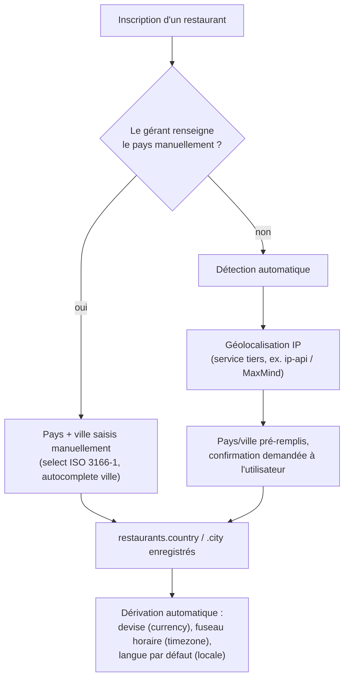
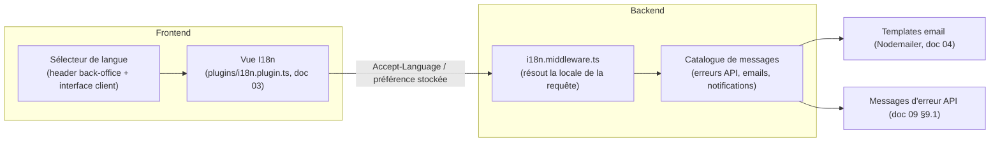

# 35. Internationalisation, géolocalisation & multi-devise

## 35.1 Pourquoi ce document (décisions Product Owner, 2026-07-13)

Le marché de lancement prioritaire est le Bénin, mais QuickTable est conçu comme un **outil mondial** dès le départ : langues Français/Anglais/Italien/Espagnol, devise dépendante du pays de chaque restaurant, détection automatique du pays/ville à l'inscription si non renseigné. Ce n'est plus une extension V3 (doc 32 initial) mais une exigence **MVP/V1** — ce document formalise l'architecture correspondante et **prévaut** sur les mentions antérieures de "multi-langue/multi-devise en V3" dans les docs 18, 32 et 33 (mises à jour en conséquence).

## 35.2 Détection et saisie du pays à l'inscription

- **Détection automatique** : géolocalisation par adresse IP au moment du formulaire d'inscription (service tiers à sélectionner — ex. `ip-api.com`, MaxMind GeoLite2 embarqué pour éviter une dépendance réseau tierce en production). Résultat **toujours présenté comme pré-rempli et modifiable**, jamais appliqué silencieusement — un faux positif de géolocalisation (VPN, proxy d'entreprise) ne doit jamais assigner le mauvais pays à un tenant sans confirmation.
- **Saisie manuelle** : toujours possible et prioritaire sur la détection automatique si le gérant la renseigne explicitement (doc §35.1, exigence PO explicite).
- **Champ requis, jamais nul** : `restaurants.country` (ISO 3166-1 alpha-2, ex. `BJ`, `FR`, `US`) devient un champ **obligatoire** dans le schéma (amendement doc 05, voir §35.5).

## 35.3 Dérivation automatique devise / fuseau horaire / langue par défaut

À partir du `country` (manuel ou détecté), le provisioning de tenant (doc 06 §6.7, `TenantProvisioningFactory` doc 28 §28.4) dérive automatiquement, via une table de référence pays → {devise ISO 4217, fuseau horaire IANA, langue par défaut} :

| Pays (exemples) | Devise par défaut | Langue par défaut |
|---|---|---|
| Bénin (`BJ`) | XOF | Français |
| France (`FR`) | EUR | Français |
| Italie (`IT`) | EUR | Italien |
| Espagne (`ES`) | EUR | Espagnol |
| États-Unis (`US`) | USD | Anglais |
| Royaume-Uni (`GB`) | GBP | Anglais |
| *(autre pays non listé)* | USD (repli) | Anglais (repli) |

Cette table de référence est une **collection de configuration** (`countryDefaults`, nouvelle collection légère, non tenant-scoped) plutôt qu'une constante codée en dur — permet au Super Admin de l'étendre sans déploiement quand QuickTable s'ouvre à un nouveau pays (cohérent avec doc 22 §22.6 "configuration versionnée par horodatage").
- **`restaurants.currency`** (déjà existant, doc 05) reste **modifiable manuellement** après dérivation automatique (un restaurant pourrait facturer dans une devise différente de son pays de résidence, cas rare mais à ne pas bloquer).
- **`restaurants.locale`** (nouveau champ, voir §35.5) pilote la langue par défaut de l'interface pour le staff de ce restaurant et pour l'interface client QR Code servie à ses clients ; chaque utilisateur individuel garde la possibilité de surcharger sa propre langue (`users.preferredLocale`).

## 35.4 Architecture i18n (frontend + backend)

- **Frontend** : Vue I18n (déjà anticipé dans l'arborescence, doc 03 §3.2 `plugins/i18n.plugin.ts`), fichiers de traduction `fr.json`, `en.json`, `it.json`, `es.json` sous `apps/web/src/locales/`. Langue résolue par ordre de priorité : préférence utilisateur explicite (`users.preferredLocale`) → `restaurants.locale` → langue du navigateur (`Accept-Language`) → défaut `en`.
- **Backend** : les **messages d'erreur** de l'enveloppe API (doc 09 §9.1, champ `error.message`) sont désormais traduits — `error.code` (machine-readable, ex. `ORDER_NOT_FOUND`) reste stable et non traduit pour l'intégration technique (doc 09 §9.16 API publique), seul le `message` humain varie. Un middleware `i18n.middleware.ts` résout la locale depuis le header `Accept-Language` ou le JWT (`locale` ajouté au claim, doc 07 §7.2) et sélectionne le message correspondant dans un catalogue de clés (`en.json`/`fr.json`/...).
- **Emails** (Nodemailer, doc 04 §4.1 amendement) : templates dupliqués par langue, sélectionnés selon `users.preferredLocale` du destinataire.
- **Contenu généré par l'utilisateur** (noms de plats, descriptions de menu) n'est **jamais traduit automatiquement** — reste dans la langue saisie par le restaurant. Seule l'**interface** (labels, boutons, messages système) est traduite. Un besoin de menu multi-langue (traduction du contenu métier lui-même) est noté comme extension V2+ si demandé par le marché (à ne pas construire par anticipation, doc 14 §14.5 KISS).

## 35.5 Impact sur le schéma de données (amendement doc 05)

| Collection | Champ ajouté | Type | Note |
|---|---|---|---|
| `restaurants` | `country` | string (ISO 3166-1 alpha-2) | **Obligatoire**, saisi ou détecté (§35.2) |
| `restaurants` | `locale` | enum `fr, en, it, es` | Dérivé à la création, modifiable |
| `restaurants` | `countryDetectionMethod` | enum `manual, geoip` | Traçabilité de la fiabilité de la donnée (utile pour le support) |
| `users` | `preferredLocale` | enum `fr, en, it, es` \| null | Surcharge individuelle, `null` = hérite de `restaurants.locale` |
| *(nouvelle collection)* `countryDefaults` | `{ countryCode, currency, defaultLocale, timezoneDefault }` | — | Table de référence pays → devise/langue/fuseau, éditable par `super_admin` |

## 35.6 Multi-devise pour les plans d'abonnement SaaS (lien avec point 7 du cadrage PO)

Le Product Owner a confirmé que la grille tarifaire est **entièrement pilotée depuis le dashboard Super Admin** (doc 09 §9.3, amendement) et que **le prix d'un plan est converti automatiquement selon la devise du pays du restaurant**.

### Modèle retenu

- `subscriptionPlans.basePrice` (centimes) et `subscriptionPlans.baseCurrency` (ex. `USD` ou `EUR` — devise de référence unique choisie par QuickTable, à confirmer) restent la **source de vérité du prix**, éditable par `super_admin` depuis le dashboard (doc 09 §9.3, endpoints CRUD ajoutés — voir amendement doc 09).
- Un **Currency Conversion Service** (nouveau Domain Service, doc 28 §28.5) convertit `basePrice`/`baseCurrency` vers `restaurants.currency` au moment de l'affichage et de la facturation, à partir d'un taux de change récupéré via une API tierce (ex. `exchangerate-api.io`, `Open Exchange Rates`) et **caché** (`Redis`, clé `fx:rate:{from}:{to}`, TTL 6h — doc 26 §26.2 amendement) — un taux de change n'a pas besoin d'être temps réel pour de l'affichage de prix SaaS, un rafraîchissement toutes les 6h est largement suffisant et réduit le coût d'appel API.
- **Le prix affecté à une souscription est figé au moment de la souscription** (`subscriptions.priceLocked`, montant + devise + taux appliqué), cohérent avec le principe déjà retenu au doc 22 §22.5 ("un tenant reste sur les termes de la version à laquelle il a souscrit") — une fluctuation de change ne doit jamais faire varier une facture déjà émise.
- Un job planifié (`workers/fx-rate-refresh.cron.ts`, doc 12 §12.6) rafraîchit le cache de taux de change ; en cas d'indisponibilité de l'API tierce, le **dernier taux connu en cache est utilisé** (jamais de blocage de l'inscription faute de taux de change disponible).

### Endpoints ajoutés (amendement doc 09 §9.16)

| Méthode | Endpoint | Description | Permission |
|---|---|---|---|
| GET | `/platform/subscription-plans` | Liste des plans (édition) | `platform:manage_subscriptions` |
| POST | `/platform/subscription-plans` | Création d'un plan (prix de base, devise de référence, `trialDays`, `limits`, `features[]`) | `platform:manage_subscriptions` |
| PATCH | `/platform/subscription-plans/:id` | Modification (crée une nouvelle version, doc 22 §22.5 — jamais d'édition en place d'un plan déjà souscrit) | `platform:manage_subscriptions` |
| GET | `/subscriptions/plans?currency=auto` | Plans convertis dans la devise du tenant courant (ou paramètre explicite) | Public authentifié |

## 35.7 Ce qui reste hors périmètre (à ne pas construire maintenant)

- Traduction automatique du contenu généré par les restaurants (menus, avis) — hors scope, cf. §35.4.
- Facturation multi-devise réelle côté prestataire de paiement (encaisser réellement en XOF vs EUR selon le pays) — dépend du prestataire de paiement retenu (doc 34 §34.7, actuellement en conception UI seule) ; le Currency Conversion Service (§35.6) ne gère que l'**affichage/la tarification SaaS**, pas l'encaissement réel multi-devise des clients finaux du restaurant (module `payments`, doc 04), qui reste une question ouverte tant que l'intégration réelle des prestataires n'est pas faite.
- Ajout de nouvelles langues au-delà de FR/EN/IT/ES — l'architecture (fichiers de traduction + `countryDefaults`) est conçue pour en ajouter facilement, mais ce n'est pas un chantier du MVP.
