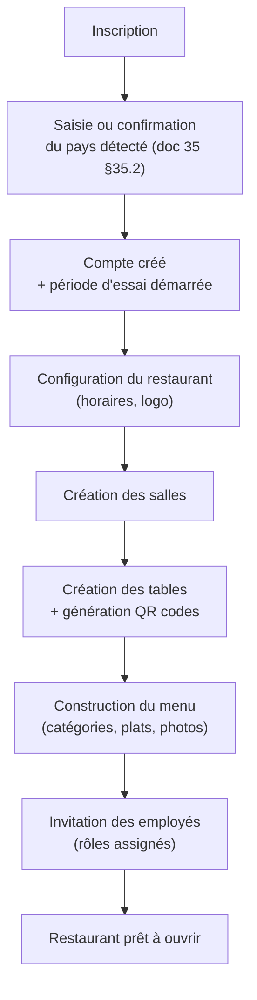
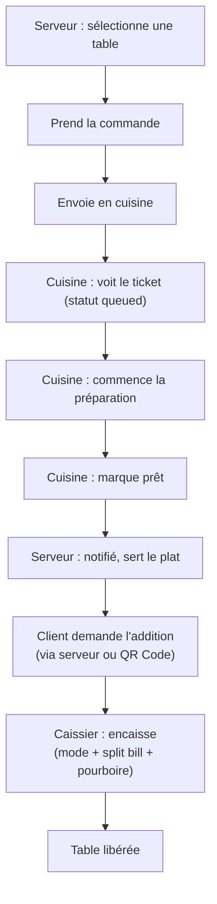
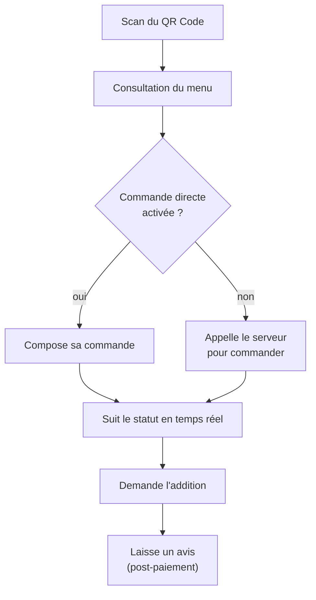
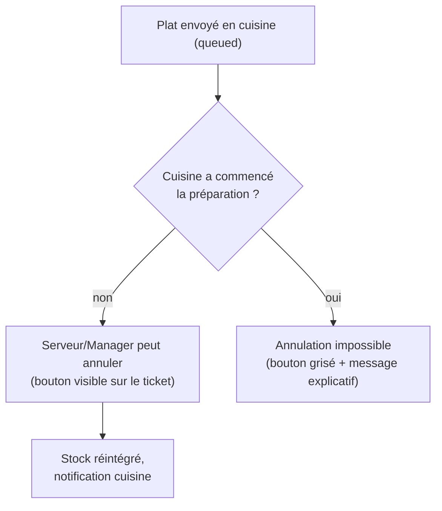

# 36. Architecture de l'information & Parcours utilisateurs

## 36.1 Périmètre et limites de ce document

Ce document définit **quels écrans existent, ce que chacun contient, et dans quel ordre un utilisateur les traverse** — l'architecture de l'information (IA), pas le design visuel. Il sert de socle à un designer UI/UX (ou à l'équipe elle-même) pour produire les maquettes réelles (Figma ou équivalent), en s'appuyant sur les fondations déjà posées au doc 11 §11.7 (design system, tokens, accessibilité).

**Ce que ce document couvre** : inventaire d'écrans par rôle, parcours critiques, hiérarchie de l'information par écran clé, architecture de navigation, cibles d'appareils.
**Ce que ce document ne couvre pas** : couleurs de marque, typographie, logo, maquettes pixel-perfect — ce sont des décisions de design visuel qui restent ouvertes (voir §36.6).

## 36.2 Inventaire d'écrans par interface

QuickTable expose **cinq interfaces distinctes**, chacune avec sa propre logique de navigation (doc 03 §3.2, doc 11 §11.4) :

### A. Back-office Admin/Manager (desktop-first, responsive tablette)

| Écran | Accès (RBAC, doc 08) | Contenu principal |
|---|---|---|
| Dashboard | Tous rôles staff | KPIs du jour (CA, commandes, panier moyen), alertes stock, activité temps réel |
| Restaurant (profil) | `restaurants:read/update` | Identité, horaires, logo, coordonnées, pays/devise/langue (doc 35) |
| Employés | `employees:read` | Liste, invitation, rôles, statut |
| Salles & Tables | `rooms:read`, `tables:read` | Plan de salle visuel, statuts en temps réel, QR codes |
| Menu | `menus:read` | Catégories, plats, photos, disponibilité, prix |
| Stock | `stock:read` | Ingrédients, seuils d'alerte, mouvements, fournisseurs |
| Commandes | `orders:read` | Liste filtrable, détail, historique |
| Réservations | `reservations:read` | Calendrier, liste, détection de conflit |
| Clients | `customers:read` | Liste, fiche, historique, fidélité |
| Statistiques | `statistics:view_basic/advanced` | Graphiques CA, top produits/serveurs, tendances |
| Abonnement & Facturation | `subscriptions:read`, `billing:read` | Plan courant, upgrade, factures SaaS |
| Paramètres | `settings:read` | Taxes, notifications, intégrations |
| Journal d'audit | `audit-logs:read` | Historique des actions sensibles (doc 24) |
| Notifications (panneau) | Tous rôles staff | Centre de notifications in-app |

### B. Interface Serveur (mobile/tablette-first, usage une main)

| Écran | Contenu principal |
|---|---|
| Plan de salle | Vue des tables avec statut coloré (libre/occupée/réservée/nettoyage), accès rapide à une table |
| Prise de commande | Sélection catégorie → plat → quantité/notes, panier en cours, envoi en cuisine |
| Suivi de commande | Statuts des plats en temps réel (doc 10), notification "plat prêt" |
| Mes commandes actives | Liste des tables/commandes assignées au serveur connecté |

### C. Kitchen Display System — KDS (tablette murale, plein écran, toujours affiché)

| Écran | Contenu principal |
|---|---|
| File de tickets | Cartes de commandes triées par priorité/heure, une carte = une commande avec ses plats et statuts individuels |
| Détail ticket (optionnel, si non tout affiché en carte) | Zoom sur une commande spécifique |

### D. Interface Caisse (tablette/desktop)

| Écran | Contenu principal |
|---|---|
| File d'attente encaissement | Tables/commandes en attente de paiement (`served`, `partially_paid`) |
| Encaissement | Détail commande, choix mode de paiement, split bill (égal/par article), saisie pourboire |
| Confirmation & reçu | Récapitulatif, envoi/impression du reçu |

### E. Interface Client — QR Code (mobile-first, public, non authentifié)

| Écran | Contenu principal |
|---|---|
| Menu | Catégories, plats avec photos/prix/allergènes, filtre par disponibilité |
| Ma commande (si activée) | Panier, envoi, suivi de statut |
| Suivi de commande | Statut en temps réel, bouton "appeler le serveur", "demander l'addition" |
| Avis | Formulaire de notation post-repas |
| Réservation (si activée) | Formulaire simple (nom, téléphone, date/heure, nombre de personnes) |

### F. Platform Admin — Super Admin (desktop, back-office interne QuickTable)

| Écran | Contenu principal |
|---|---|
| Liste des restaurants | Tous tenants, statut, pays, plan |
| Détail restaurant | Vue support (lecture seule sur les données opérationnelles, doc 06 §6.5) |
| Plans d'abonnement | CRUD complet (prix, essai, limites, features — doc 35 §35.6) |
| Pays de référence | CRUD `countryDefaults` (doc 35 §35.3) |
| Statistiques globales | Cross-tenant, par pays/plan |

## 36.3 Parcours utilisateurs critiques

### Parcours 1 — Onboarding d'un restaurant (Owner)

### Parcours 2 — Service complet (Serveur → Cuisine → Caisse)

### Parcours 3 — Client via QR Code

### Parcours 4 — Annulation d'un plat après envoi en cuisine (règle métier confirmée, doc 21 §21.1)

## 36.4 Hiérarchie de l'information — écrans clés (niveau wireframe)

### Kitchen Display System — carte de commande (l'écran le plus critique en usage continu)

1. **Priorité visuelle maximale** : numéro de table + minuteur écoulé depuis l'envoi (code couleur : vert < 5min, orange 5-10min, rouge > 10min — seuils à valider avec un restaurant pilote).
2. **Corps** : liste des plats avec quantité, notes spéciales mises en évidence (ex. "sans oignon" en gras/couleur).
3. **Statut par plat** : indicateur visuel distinct par état (`queued`/`preparing`/`ready`) — gros boutons tactiles pour changer l'état, pas de menu déroulant (usage tactile rapide en cuisine).
4. **Action secondaire** : bouton d'annulation visible uniquement sur les plats encore `queued` (cohérent avec doc 21 §21.1).

### Prise de commande (Serveur)

1. **Priorité maximale** : catégories de menu en accès rapide (grille de photos, pas de liste texte).
2. **Panier persistant** : toujours visible (barre fixe basse), total en temps réel.
3. **Action principale** : "Envoyer en cuisine" — bouton unique, non ambigu, confirmé avant envoi si le panier contient des articles à fort prix (garde-fou UX, pas de validation systématique bloquante).

### Encaissement (Caisse)

1. **Priorité maximale** : montant total, clairement isolé du détail.
2. **Sélecteur de mode de paiement** : boutons larges (espèces/carte/Mobile Money/mixte), pas un select.
3. **Split bill** : bascule explicite "Paiement unique / Diviser l'addition", avec choix égal vs par article seulement après activation — ne jamais complexifier l'écran par défaut pour le cas simple (majorité des paiements).
4. **Pourboire** : suggestions rapides (10%/15%/20%/montant libre) plutôt qu'une saisie libre par défaut — accélère le geste en caisse.

### Menu client (QR Code)

1. **Priorité maximale** : photo du plat (le visuel vend, cohérent avec l'exigence "interface jolie", doc 01).
2. **Filtre allergènes** accessible en un tap, pas enfoui dans un menu.
3. **Boutons persistants** ("Appeler le serveur", "Demander l'addition") : flottants, toujours accessibles sans scroll — ce sont les actions les plus fréquentes de l'interface publique.

## 36.5 Architecture de navigation par rôle

- **Back-office** : navigation latérale (sidebar) dont les entrées sont **générées dynamiquement à partir des permissions résolues** (doc 08 §8.7, composable `usePermissions()`) — un Caissier ne voit jamais l'entrée "Employés" dans son menu, pas seulement bloquée à l'accès.
- **Serveur (mobile)** : navigation basse à 3-4 icônes maximum (Plan de salle / Mes commandes / Notifications) — pas de sidebar sur mobile, cohérent avec l'usage une main en salle.
- **KDS** : **aucune navigation** — écran unique plein écran, toujours affiché, pas de menu (c'est un affichage d'état, pas une application qu'on "navigue").
- **Caisse** : navigation minimale (File d'attente / Historique du jour).
- **Client QR Code** : pas de navigation traditionnelle — actions contextuelles flottantes (§36.4), pas de menu global (l'utilisateur ne doit jamais se sentir "dans une application" mais dans un service ponctuel).
- **Sélecteur de langue** (doc 35 §35.4) : présent en position constante (coin supérieur) sur toutes les interfaces, y compris l'interface client.

## 36.6 Cibles d'appareils par interface

| Interface | Appareil principal | Orientation | Note |
|---|---|---|---|
| Back-office Admin/Manager | Desktop, dégradé tablette | Paysage | Usage assis, sessions longues |
| Serveur | Mobile ou tablette | Portrait | Usage debout, une main, déplacement constant |
| KDS | Tablette | Paysage, murale fixe | Toujours allumé, lisible à 1-2 mètres |
| Caisse | Tablette ou desktop | Paysage | Poste fixe |
| Client QR Code | Mobile (quasi exclusivement) | Portrait | Réseau potentiellement faible (doc 29 §29.3) |

## 36.7 Ce qui reste ouvert — décisions de design visuel

Ce document ne tranche pas :
1. **Identité de marque** : logo, palette de couleurs précise, typographie — nécessaire avant toute maquette réelle.
2. **Maquettes haute fidélité** (Figma ou équivalent) — à produire par un designer UI/UX en s'appuyant sur ce document + le design system technique (doc 11 §11.7).
3. **Seuils exacts des indicateurs visuels** (ex. couleurs du minuteur KDS §36.4) — à valider avec le restaurant pilote (doc 32 §32.2) plutôt que fixés arbitrairement maintenant.

**Recommandation** : ce document + le doc 11 §11.7 constituent un brief suffisant pour qu'un designer UI/UX externe ou interne démarre les maquettes en parallèle du développement de l'Epic 0/1 — aucune raison d'attendre la fin du backend pour lancer ce travail.
